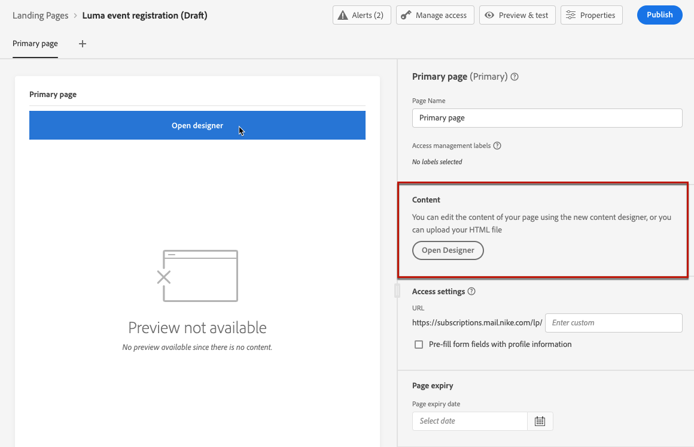

# Design the landing page content {#design-lp}

>[!BEGINSHADEBOX]

**On this page:** Discover how to design your landing page content in the content designer — from scratch, with AI Assistant, with your own HTML, or from a saved template — for an on-brand visitor experience.

>[!ENDSHADEBOX]

To start creating content for your landing [primary page](create-lp.md#configure-primary-page) or [subpage](create-lp.md#configure-subpages), hover the mouse over your page content and click **[!UICONTROL Open Designer]**. You can also click the corresponding button from the right palette.

From there, you can:

* **Design your landing page from scratch** through the content designer's interface, and leverage images from [Adobe Experience Manager Assets](../integrations/assets.md). Learn how to design your content <!--or use built-in templates--> [in this section](../email/content-from-scratch.md).

* **Generate content with AI Assistant** to accelerate landing page creation with AI-generated text and images. [Learn more about AI Assistant](../content-management/generative-full-content.md).

* **Code or paste raw HTML** directly into the content designer. Learn how to code your own content [in this section](../email/code-content.md).

* **Import existing HTML content** from a file or a .zip folder. Learn how to import content [in this section](../email/existing-content.md).

* **Use a saved landing page template** created in [!DNL Journey Optimizer]. [Learn more](lp-templates.md)

Once in the landing page content designer, you can use the same components as for an email and define landing page-specific content using the form component. [Learn how](lp-content.md)

>[!NOTE]
>
>The landing page content designer is mostly similar to the Email Designer. Learn more about [designing content with [!DNL Journey Optimizer]](../email/get-started-email-design.md).
>
>The [European accessibility act](https://eur-lex.europa.eu/legal-content/EN/TXT/?uri=CELEX%3A32019L0882){target="_blank"} states that all digital communications should be accessible. Make sure you follow the specific guidelines listed on [this page](../email/accessible-content.md) when designing content in [!DNL Journey Optimizer].
