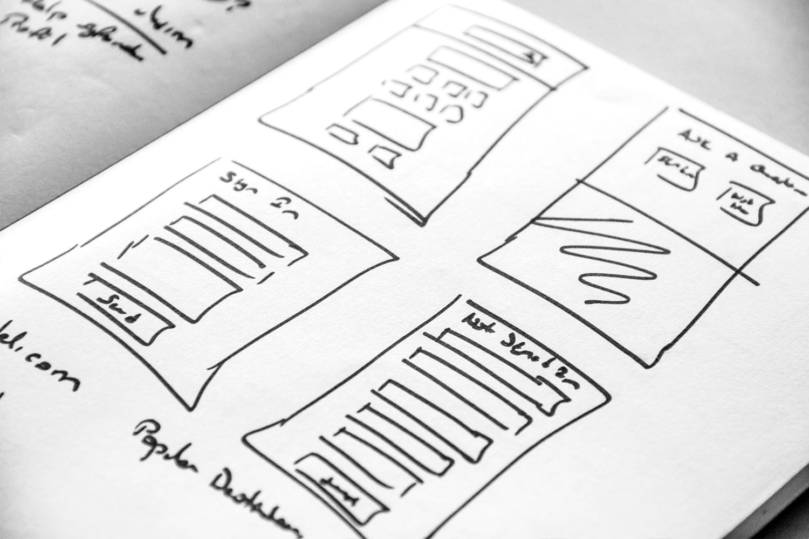

# Get started with landing pages {#get-started-lp}

A landing page is a standalone web page that a user is directed to after clicking through from an email, a website, an ad, or any other digital location.

[!DNL Journey Optimizer] allows you to create and design landing pages to direct your users to online forms where they can opt in or opt out from receiving your communications, or subscribe to a specific service such as a newsletter.

➡️ [Learn more about configuring subscriptions and creating landing pages in this video](#video)

## When to use landing pages {#when-to-use}

Use landing pages when you want to:

* Let customers **opt in or opt out** of marketing communications from a link in an email or campaign
* Allow customers to **subscribe or unsubscribe** from a specific service or newsletter
* **Collect consent** before sending communications, and confirm the action with an automated email
* Redirect users to a **dedicated web form** without building an external page outside of [!DNL Journey Optimizer]

## Before you start {#prerequisites}

Before creating a landing page, complete these setup steps:

1. **Configure a subdomain** — Set up a subdomain dedicated to hosting your landing pages. [Configure landing page subdomains](lp-subdomains.md)
1. **Create a landing page preset** — A preset defines the subdomain and other settings applied to your landing pages. [Create a preset](lp-presets.md#lp-create-preset)
1. **Create a subscription list** (for subscription use cases) — Required if you want customers to subscribe to or unsubscribe from a specific service. [Create a subscription list](subscription-list.md)

## How it works {#how-it-works}

Creating and deploying a landing page follows this sequence:

1. **Create and configure** your landing page — Select a preset, set up the primary page, and add any required subpages. [Create a landing page](create-lp.md)
1. **Design the page** — Build the page content and form using [!DNL Journey Optimizer]'s drag-and-drop editor. [Design a landing page](design-lp.md)
1. **Test and publish** — Preview the page, test form behavior, then publish to make it live. [Manage your landing pages](manage-lp.md)
1. **Link in a message or journey** — Add the landing page URL to an email, campaign, or journey action so customers can reach it.

## Key capabilities {#capabilities}

* Leverage [!DNL Journey Optimizer] content design capabilities to easily build **responsive landing pages**.
* Set up **opt-in and opt-out flows** quickly and seamlessly.
* Create subscription lists to enable users to **subscribe to a service**. [Read more](lp-use-cases.md#subscription-to-a-service)
* Provide your recipients with the **capability to unsubscribe** from receiving your communications. [Read more](lp-use-cases.md#opt-out)
* Send a **confirmation email** upon opt-in or opt-out. [Read more](lp-use-cases.md#send-confirmation-email)

<table style="table-layout:fixed"><tr style="border: 0;">
<td>

<a href="create-lp.md"><strong>Create landing pages</strong>

</td>
<td>

<a href="subscription-list.md"><strong>Create subscription lists</strong></a>

</td>
<td>

<a href="design-lp.md"><strong>Design landing pages</strong></a>

</td>
<td>

<a href="../reports/lp-report-live.md"><strong>Reporting</strong></a>

</td>
</tr></table>

## How-to video{#video}

The video below shows how to create a subscription list, set up landing pages to offer subscriptions to or un-subscriptions from a service, integrate the (un)subscription option to a message and configure relevant journeys.

>[!VIDEO](https://video.tv.adobe.com/v/341280?quality=12&learn=on)
