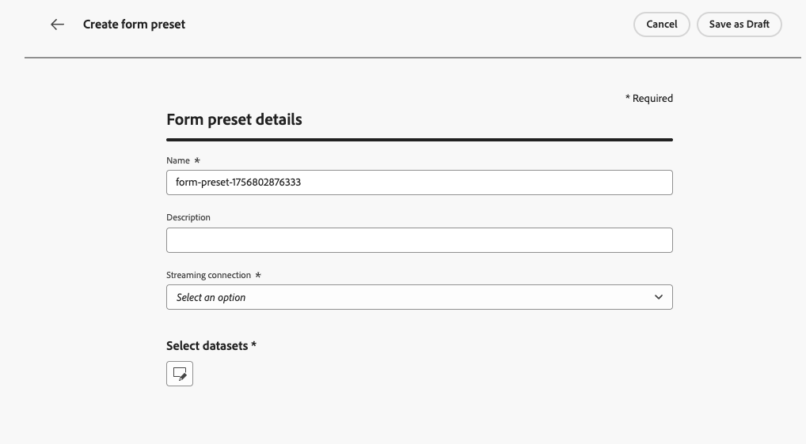
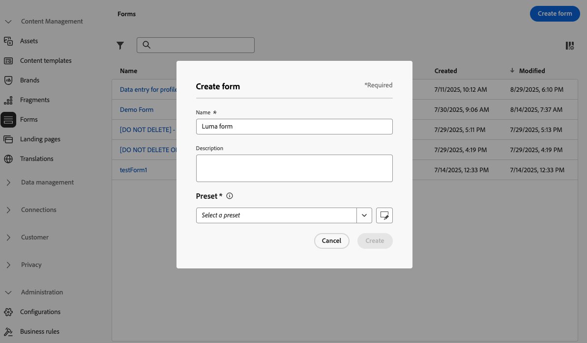
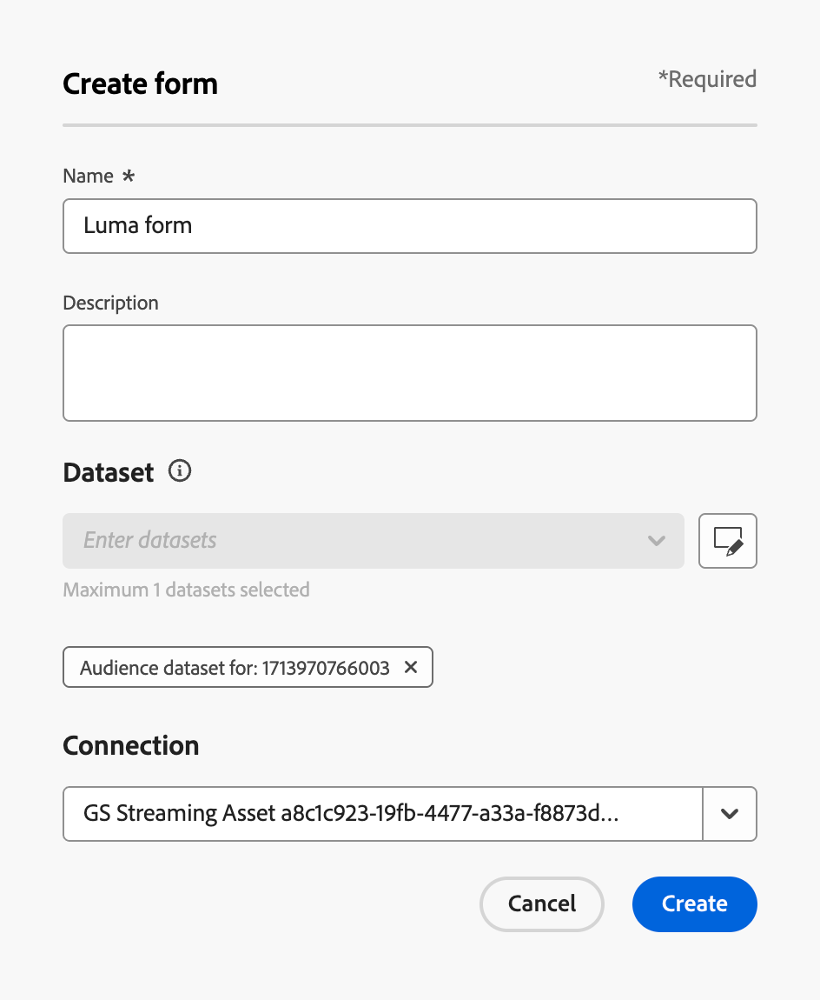
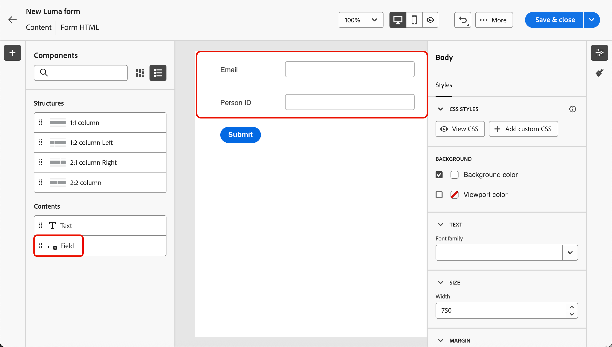
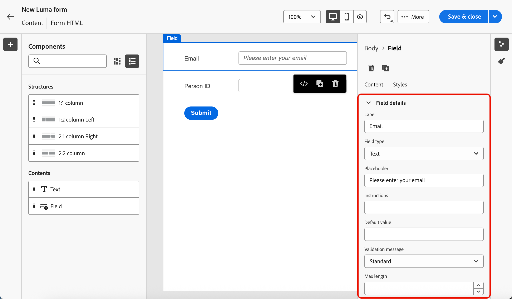
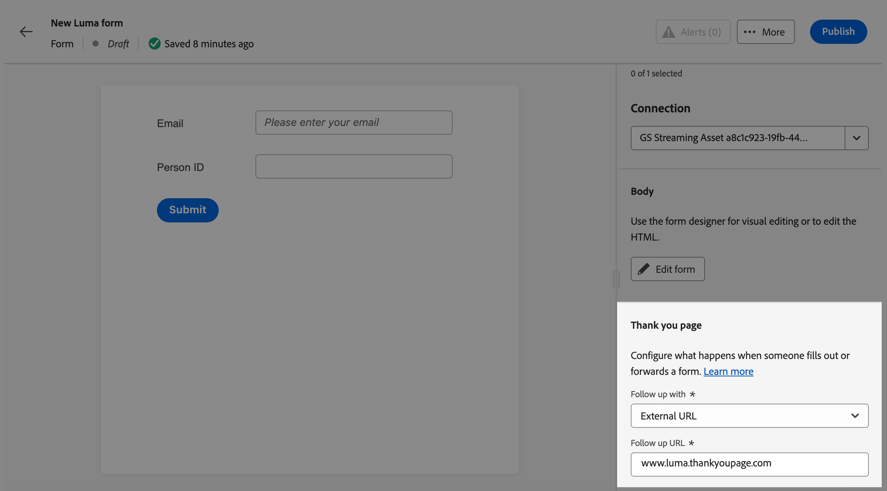
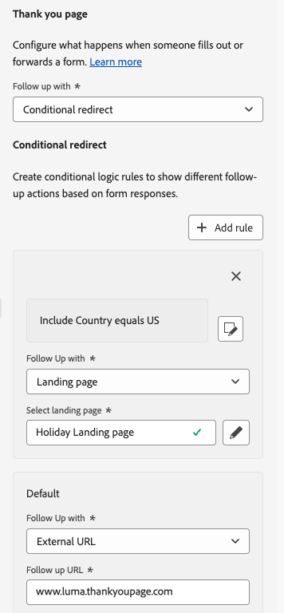
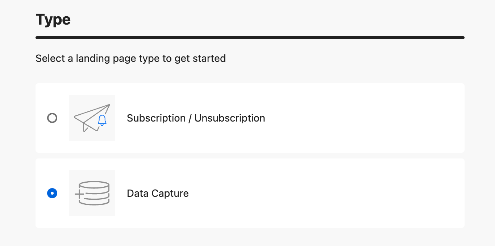
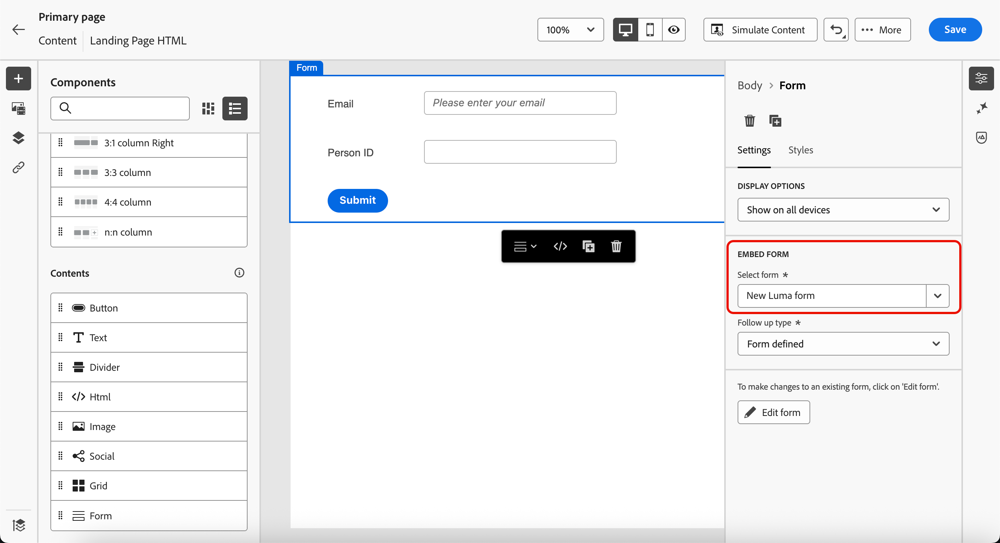

# Use forms in your landing pages {#lp-forms}

>[!AVAILABILITY]
>
>This capability is available in Limited Availability. Contact your Adobe representative to gain access.

To capture profile data with your [!DNL Journey Optimizer] landing pages and enrich your [!DNL Experience Platform] datasets, you can leverage forms in your landing pages.

## Create a form preset {#create-form-preset}

>[!CONTEXTUALHELP]
>id="ajo_lp_form_connection"
>title="Select the endpoint to use"
>abstract="Define the streaming endpoint where data is sent upon submitting the form."
>additional-url="https://experienceleague.adobe.com/en/docs/experience-platform/sources/ui-tutorials/create/streaming/http" text="Create an HTTP API streaming connection"

>[!CONTEXTUALHELP]
>id="ajo_lp_form_dataset"
>title="Select a dataset"
>abstract="Define a dataset where the form responses will be stored and reflected. You can type to search a specific dataset or select it from the list."

Before being able to create a form, you need to create a dedicated preset where you select the connection endpoint where form submission data is sent, and the dataset where the data captured through the form will be stored.

When data lands on the streaming endpoint, it is linked with the dataset information. Using the generated source/target connections and source flow, the data is then pushed into the dataset.

When creating a preset:

* You can set up multiple presets using different combinations of datasets and streaming connections.
* The same dataset or streaming connection can be reused across multiple presets.
* Each streaming connection automatically generates resources such as:
    * **Source connection** – where the data originates.
    * **Target connection** – where the data is stored or consumed.
    * **Source flow** – the pipeline that moves data from the source connection into [!DNL Experience Platform], handling mapping, transformation, and validation.

>[!NOTE]
>
> To access and edit form presets, you must have the **[!UICONTROL Manage form presets]** permission on the production sandbox. Learn more about permissions in [this section](../administration/high-low-permissions.md#administration-permissions).<!--TBC-->

1. To access the **[!UICONTROL Form presets]** inventory, select **[!UICONTROL Administration]** > **[!UICONTROL Channels]** >**[!UICONTROL Form settings]** from the left menu.

1. Click **[!UICONTROL Create form preset]**.

1. Update the name to retrieve it more easily and add a description if needed.

    {width=80%}

1. Select the **[!UICONTROL Streaming connection]** to use for that form. This is the streaming endpoint where data is sent upon submitting the form.

    >[!NOTE]
    >
    >Learn more on creating a streaming source connection in the [Experience Platform documentation](https://experienceleague.adobe.com/en/docs/experience-platform/sources/ui-tutorials/create/streaming/http){target="_blank"}.

1. Select a **[!UICONTROL Dataset]** to link with the form. This is where the form responses will be stored and reflected. You can type to search a specific dataset or select it from the list.

    >[!NOTE]
    >
    >Currently only [!DNL Adobe Experience Platform] datasets are available for selection. Only one dataset can be selected at a time.

1. Click **[!UICONTROL Publish]**. Your preset is now ready to be used in a form.

## Access and manage forms {#access-forms}

To access the form list, select **[!UICONTROL Content Management]** > **[!UICONTROL Forms]** from the left menu.

All the existing forms are displayed. You can filter forms based on their status, creation or modification date.
    
## Create and design a form {#create-form}

To create a form, follow the steps below.

1. From the **[!UICONTROL Forms]** list, click **[!UICONTROL Create form]**.

1. Add a name. You can add a description if needed.

    

1. Select a **[!UICONTROL Preset]** that contains the connection to be used and a predefined dataset for your form. [Learn how to create a form preset](#create-form-preset)

1. Click **[!UICONTROL Create]**.

    <!--{width=50%}-->

1. The form designer opens. Add [components](../email/content-components.md#add-content-components) to build your form content. You can use [Text](../email/content-components.md#text) components and **[!UICONTROL Field]** components.

1. With the **[!UICONTROL Field]** component, you can select attributes based on the selected dataset schema.

    >[!NOTE]
    >
    >To map the collected data with a Profile, select a profile identity field. To identify the identity fields from the attribute list, look for the fields marked as **[!UICONTROL Required]**.<!--Explain-->

    For example, you can set the Email and Person ID. When users fill in these fields, the information entered is saved to the selected dataset.

    

1. You can specify each **[!UICONTROL Field details]** such as instructions, a default value, a validation message, maximum lenght, etc.

    

1. You can adjust the form's layout, styling and dimensions as needed using the **[!UICONTROL Styles]** pane. [Learn more on styling](../email/get-started-email-style.md)

1. Click **[!UICONTROL Save & close]**.

1. Configure the Thank you page. [Learn how](#thank-you-page)

1. **[!UICONTROL Publish]** the form to make it available for selection in landing pages.

### Configure the Thank you page {#thank-you-page}

>[!CONTEXTUALHELP]
>id="ajo_lp_forms_thankyou_page"
>title="Thank you page"
>abstract="Configure what happens when someone fills out or forwards a form."

In the **[!UICONTROL Thank you page]** section, configure what happens when a user fills out the form.

{width=70%}

Set up one of the following actions:

* **[!UICONTROL Stay on page]** - This option keeps the visitor on the same page when the form has been submitted.
* **[!UICONTROL Landing page]** - Select a published [landing page](create-lp.md) to which the user is redirected after submitting the form.
* **[!UICONTROL External URL]** - Enter the full URL you want as the follow-up page. Once the user has submitted the form, they are directed to the URL specified.
* **[!UICONTROL Conditional redirect]** - Set up rules to dynamically show different follow-up actions based on the form responses.

    You can define a rule for each specific audience. For example, you can display a specific landing page for US residents, another page for Canada residents, and so on. Finally, set up a default action for users who do not fall in any rule that you defined.

    >[!NOTE]
    >
    >The conditions defined in a rule are read sequentially.

    {width=40%}

## Leverage the form in a landing page {#leverage-form-in-lp}

You can now embed this form into a landing page in order to capture data corresponding to the attributes you defined in the form and save it into the selected dataset. Follow the steps below.

1. Create a landing page. [Learn how](create-lp.md#create-landing-page)

1. Select **[!UICONTROL Data Capture]** as the landing page type and click **[!UICONTROL Create]**.

    {width=65%}

1. Configure the primary page. [Learn how](create-lp.md#configure-primary-page)

1. Open the [landing page designer](design-lp.md).

1. Drag and drop a **[!UICONTROL Structure component]** into your content. Drag and drop a **[!UICONTROL Form]** component into that structure.

    >[!NOTE]
    >
    >Only published forms can be selected in a landing page.

1. In the **[!UICONTROL Embed form]** section, select the form that you created.

    

    >[!NOTE]
    >
    >You can update the selected form using the **[!UICONTROL Edit form]** button. The form opens in a new tab. The steps to edit the form content are the same as described in [this section](#create-form).

1. In the **[!UICONTROL Follow up type]** section, configure what happens when a user fills out the form:

    * Choose **[!UICONTROL Form defined]** to select the action that was defined in the embeded form. [Learn more](#thank-you-page)

    * You can also select a published [landing page](create-lp.md) to which the user is redirected after submitting the form.

    * Or define an **[!UICONTROL External URL]** as the follow-up page where users are directed when they submit the form.

1. Save and test your landing page. [Learn how](create-lp.md#test-landing-page)

Once your landing page is [published](create-lp.md#publish-landing-page) and used in a journey, when users fills in the form, the information entered is ingested into the selected dataset.

>[!NOTE]
>
>If you unpublish a form that is used in a landing page, edit this form and publish it again, the landing page is always using the latest published version of the form.
