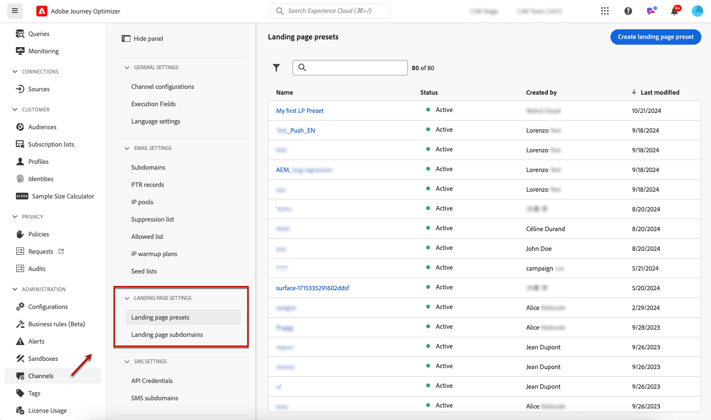
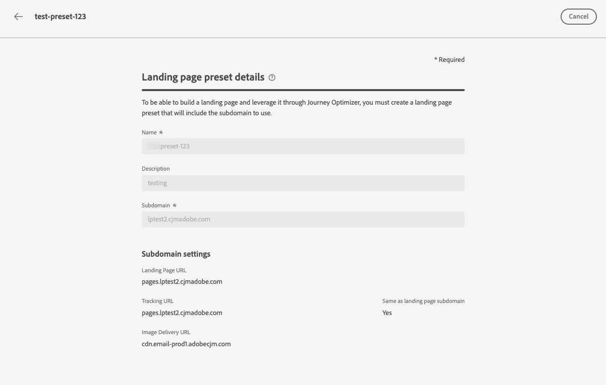
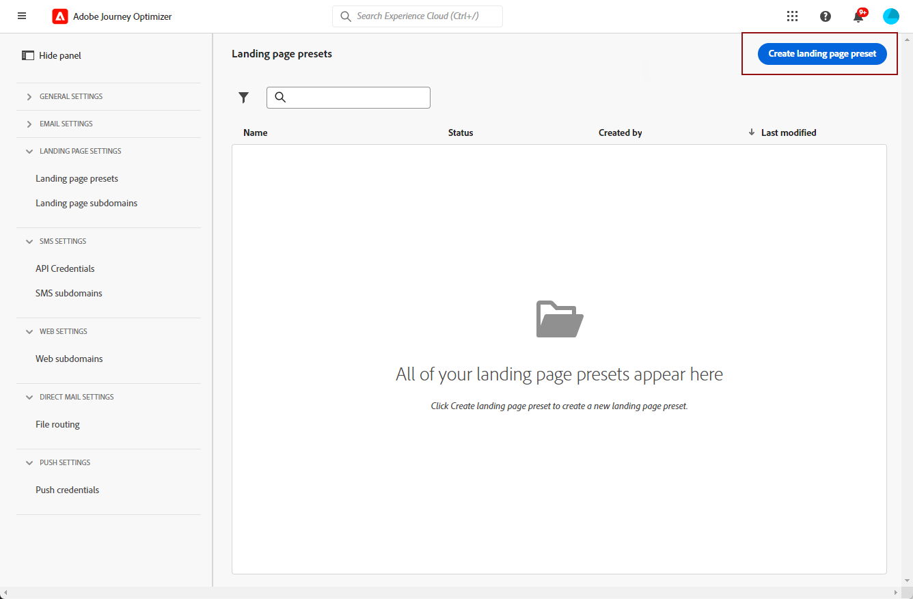
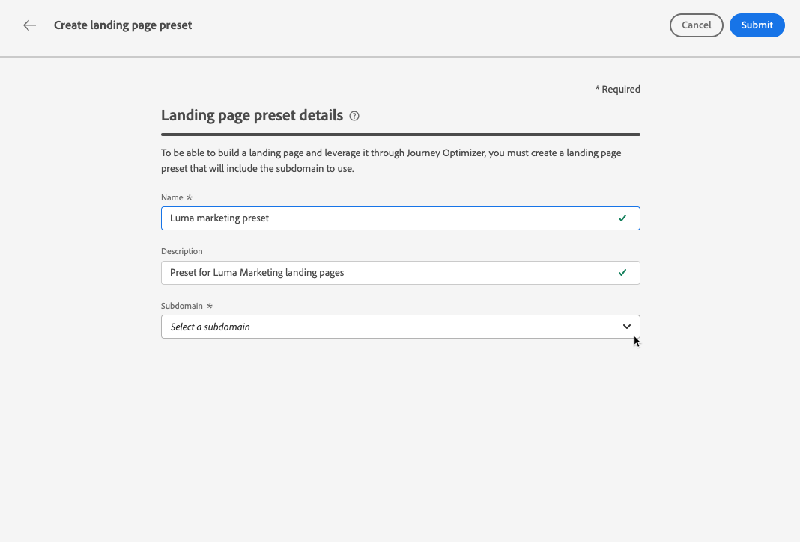
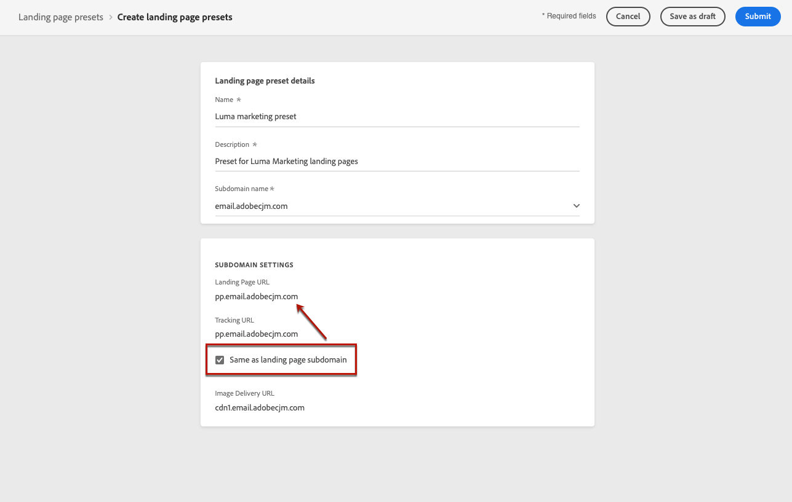
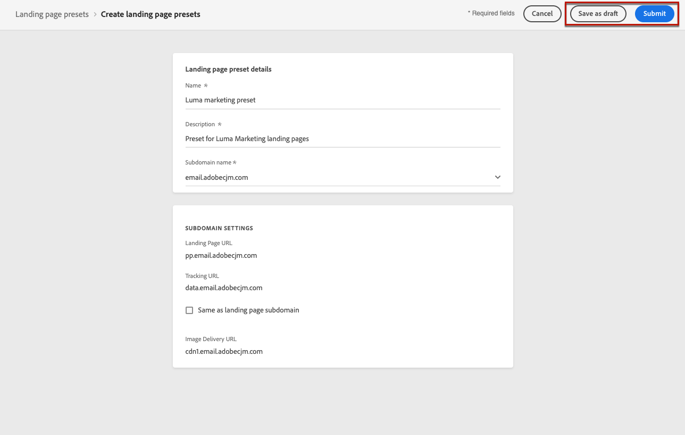

# Define landing page presets {#lp-presets}

>[!CONTEXTUALHELP]
>id="ajo_admin_config_lp_subdomain_header"
>title="Create a landing page preset"
>abstract="In order to build a landing page and leverage it through Journey Optimizer, you must create a landing page preset that includes the subdomain to use."

## Get started with landing page presets {#gs-lp-presets}

When [creating a landing page](../landing-pages/create-lp.md#create-lp), you must select a landing page preset to be able to build the landing page and leverage it through **[!DNL Journey Optimizer]**. The preset includes the subdomain to use for the landing pages based on this preset.

Before creating a preset, ensure you have previously configured at least one landing page subdomain. [Learn how to create a landing page subdomain](lp-subdomains.md).

## Access landing page presets {#access-lp-presets}

To access landing page presets, follow the steps below:

1. Access the **[!UICONTROL Administration]** > **[!UICONTROL Channels]** menu.

1. Select **[!UICONTROL Landing page settings]** > **[!UICONTROL Landing page presets]**.

    

1. Click any preset label to access the landing page preset details.

    

## Create a landing page preset {#lp-create-preset}

To create a landing page preset, follow the steps below:

1. Browse the **[!UICONTROL Administration]** > **[!UICONTROL Channels]** menu, then select **[!UICONTROL Landing page settings]** > **[!UICONTROL Landing page presets]**.

1. Select **[!UICONTROL Create landing page preset]**.

    

1. Enter a name and a description for the preset.
    
    Names must begin with a letter (A-Z), and only contain alpha-numeric characters, underscore `_`, dot`.` and hyphen `-` characters.

1. Select a landing page subdomain from the drop-down list.

    

    >[!NOTE]
    >
    >To be able to select a subdomain, ensure you have previously configured at least one landing page subdomain. [Learn how](lp-subdomains.md)

    The settings corresponding to the selected subdomain display.

1. You can select the landing page subdomain for the **[!UICONTROL Tracking URL]** by checking the **[!UICONTROL Same as landing page subdomain]** option. [Learn more about tracking](../email/message-tracking.md)

    

    For example, if the landing page URL is 'pages.mail.luma.com', and the tracking URL is 'data.mail.luma.com', you can choose 'pages.mail.luma.com' to be used as the tracking subdomain.

    >[!CAUTION]
    >
    >The selected landing page subdomain is used to specify the **[!UICONTROL Tracking URL]** <!--and **[!UICONTROL Image Delivery URL]** -->if that subdomain was created using an [existing subdomain](lp-subdomains.md#lp-use-existing-subdomain).
    >
    >If the subdomain was created using the [Add your own domain](lp-subdomains.md#lp-configure-new-subdomain) option, the primary subdomain (i.e., the first delegated subdomain) is used instead.

1. Click **[!UICONTROL Submit]** to confirm the landing page preset creation. <!--You can also save the preset as draft and resume its configuration later on.-->

   <!---->

1. Once the landing page preset has been created, it displays in the list with the **[!UICONTROL Active]** status. It is ready to be used for your landing pages.

You are now ready to [create landing pages](../landing-pages/create-lp.md) in [!DNL Journey Optimizer].

<!--
>[!NOTE]
>
>Learn how to create channel configurations for push notifications and emails in [this section](channel-surfaces.md).
-->

**Related topics**:

* [Get started with landing pages](../landing-pages/get-started-lp.md)
* [Create a landing page](../landing-pages/create-lp.md#create-lp)
