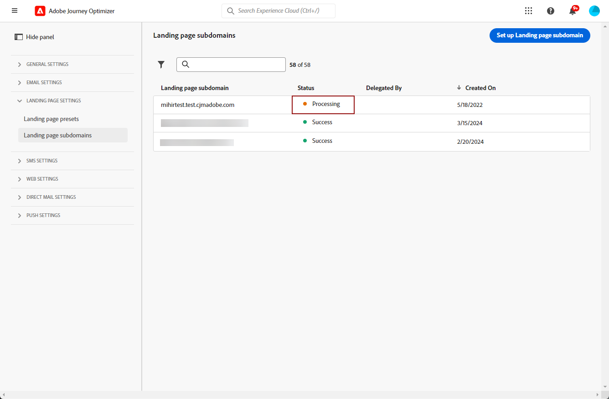

# Configure landing page subdomains {#lp-subdomains}

>[!CONTEXTUALHELP]
>id="ajo_admin_subdomain_lp_header"
>title="Delegate a landing page subdomain"
>abstract="You will be setting up your subdomain for a landing page use. You can use a subdomain that is already delegated to Adobe or configure another subdomain."

>[!CONTEXTUALHELP]
>id="ajo_admin_subdomain_lp"
>title="Delegate a landing page subdomain"
>abstract="You must configure a subdomain to use for your landing pages, as you will need this subdomain to create a landing page preset. You can use a subdomain already delegated to Adobe or configure a new subdomain."
>additional-url="https://experienceleague.adobe.com/docs/journey-optimizer/using/configuration/lp-configuration/lp-presets.html" text="Create landing page presets"

>[!CONTEXTUALHELP]
>id="ajo_admin_config_lp_subdomain"
>title="Create a landing page preset"
>abstract="To be able to create a landing page preset, make sure you have previously configured at least one landing page subdomain to pick from the Subdomain name list."
>additional-url="https://experienceleague.adobe.com/docs/journey-optimizer/using/configuration/lp-configuration/lp-presets.html" text="Create landing page presets"

To be able to [create landing page presets](lp-presets.md), you  must set up the subdomains you will use for your landing pages.

You can use a subdomain that is already delegated to Adobe, or you can configure another subdomain. Learn more on delegating subdomains to Adobe in [this section](../configuration/delegate-subdomain.md).

>[!CAUTION]
>
>Landing page subdomain configuration is common to all environments. Therefore any modification to a landing page subdomain will also impact the production sandboxes.

Note that capital letters should not be allowed in a subdomain

## Use an existing subdomain {#lp-use-existing-subdomain}

To use a subdomain that is already delegated to Adobe, follow the steps below.

1. Access the **[!UICONTROL Administration]** > **[!UICONTROL Channels]** menu, then select **[!UICONTROL Email configuration]** > **[!UICONTROL Landing page subdomains]**.

    

1. Click **[!UICONTROL Set up subdomain]**.

    

1. Select **[!UICONTROL Use delegated domain]** from the **[!UICONTROL Configuration type]** section.

    

1. Enter the prefix that will display in your landing page URL.

    >[!NOTE]
    >
    >Only alpha-numeric characters and hyphens are allowed.

1. Select a delegated subdomain from the list.

    >[!NOTE]
    >
    >You cannot select a subdomain that is already used as landing page subdomain.
    
    <!--Capital letters are not allowed in subdomains. TBC by PM-->

    

    Note that you cannot use multiple delegated subdomains of the same parent domain. For example, if 'marketing1.yourcompany.com' is already delegated to Adobe for your landing pages, you will not be able to use 'marketing2.yourcompany.com'. However, multi-level subdomains being supported for landing pages, you may proceed using a subdomain of 'marketing1.yourcompany.com' (such as 'email.marketing1.yourcompany.com'), or a different parent domain.

    >[!CAUTION]
    >
    >If you select a domain that was delegated to Adobe using the [CNAME method](../configuration/delegate-subdomain.md#cname-subdomain-delegation), you must create the DNS record on your hosting platform. To generate the DNS record, the process is the same as when you configure a new landing page subdomain. Learn how in [this section](#lp-configure-new-subdomain).

1. Click **[!UICONTROL Submit]**.

1. Once submitted, the subdomain displays in the list with the **[!UICONTROL Processing]** status. For more on subdomains' statuses, refer to [this section](../configuration/about-subdomain-delegation.md#access-delegated-subdomains).<!--Same statuses?-->

    

    >[!NOTE]
    >
    >Before being able to use that subdomain to send messages, you must wait until Adobe performs the required checks, which can take up to 4 hours.<!--Learn more in [this section](delegate-subdomain.md#subdomain-validation).-->

1. Once the checks are successful, the subdomain gets the **[!UICONTROL Success]** status. It is ready to be used to create landing page presets.

## Configure a new subdomain {#lp-configure-new-subdomain}

>[!CONTEXTUALHELP]
>id="ajo_admin_lp_subdomain_dns"
>title="Generate the matching DNS record"
>abstract="To configure a new landing page subdomain, you need to copy the Adobe nameserver information displayed in the Journey Optimizer interface and paste it into your domain-hosting solution to generate the matching DNS record. Once the checks are successful, the subdomain is ready to be used to create landing page presets."

To configure a new subdomain, follow the steps below.

1. Access the **[!UICONTROL Administration]** > **[!UICONTROL Channels]** menu, then select **[!UICONTROL Email configuration]** > **[!UICONTROL Landing page subdomains]**.

1. Click **[!UICONTROL Set up subdomain]**.

1. Select **[!UICONTROL Add your own domain]** from the **[!UICONTROL Configuration type]** section.

    

1. Specify the subdomain to delegate.

    >[!CAUTION]
    >
    >You cannot use an existing landing page subdomain.
    >
    >Capital letters are not allowed in subdomains.
    
    Delegating an invalid subdomain to Adobe is not allowed. Make sure you enter a valid subdomain which is owned by your organization, such as marketing.yourcompany.com.
    
    >[!NOTE]
    >
    >For landing pages, multi-level subdomains are supported. For example, you can use 'email.marketing.yourcompany.com'.

1. The record to be placed in your DNS servers displays. Copy this record, or download a CSV file, then navigate to your domain-hosting solution to generate the matching DNS record.

1. Make sure that DNS record has been generated into your domain-hosting solution. If everything is configured properly, check the box "I confirm...", then click **[!UICONTROL Submit]**.

    

    >[!NOTE]
    >
    >When you configure a new landing page subdomain, it will always point to a CNAME record.

1. Once the subdomain delegation has been submitted, the subdomain displays in the list with the **[!UICONTROL Processing]** status. For more on subdomains' statuses, refer to [this section](../configuration/about-subdomain-delegation.md#access-delegated-subdomains).<!--Same statuses?-->

    >[!NOTE]
    >
    >Before being able to use that subdomain to send messages, you must wait until Adobe performs the required checks, which can take up to 4 hours.<!--Learn more in [this section](#subdomain-validation).-->

1. Once the checks are successful, the subdomain gets the **[!UICONTROL Success]** status. It is ready to be used to create landing page presets.

    Note that the subdomain will be marked as **[!UICONTROL Failed]** if you fail to create the validation record on your hosting solution.
