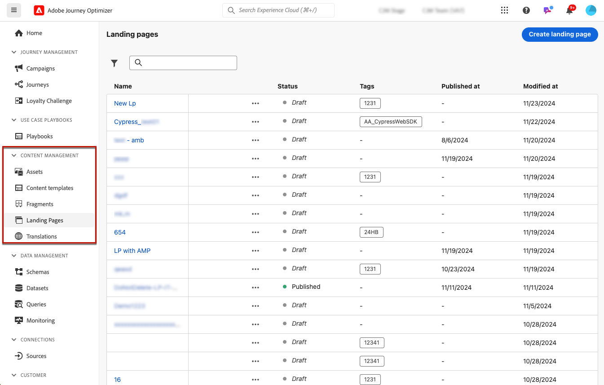
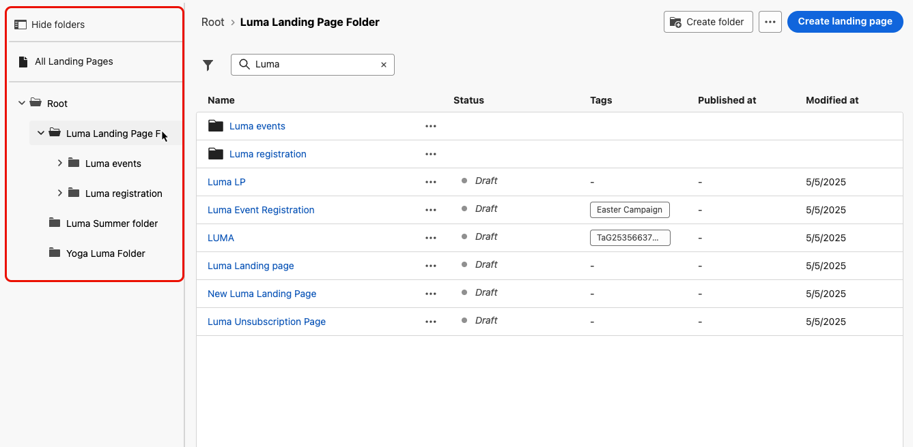
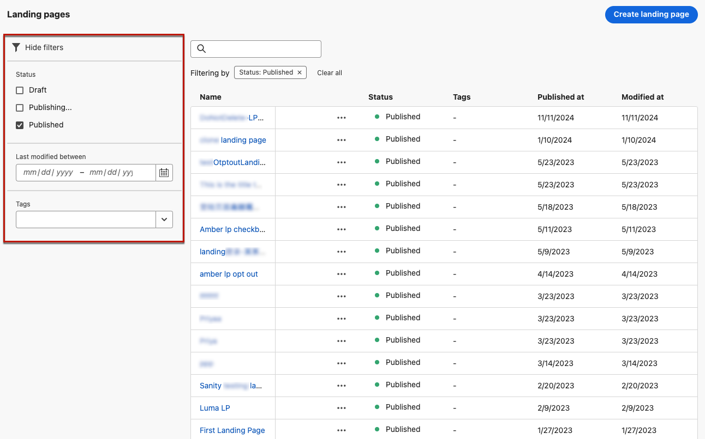
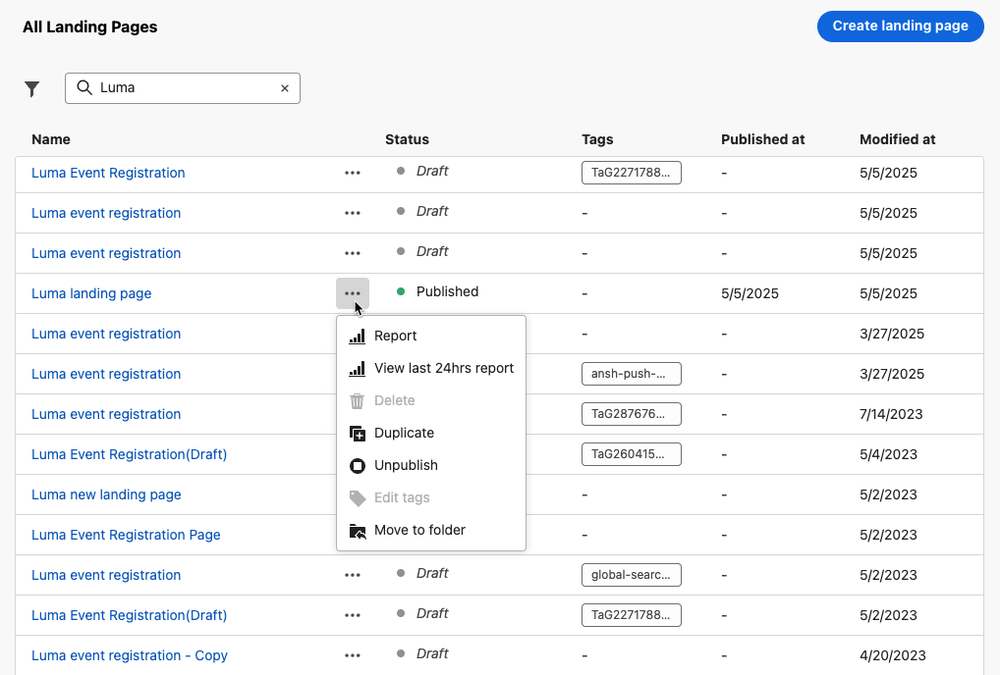
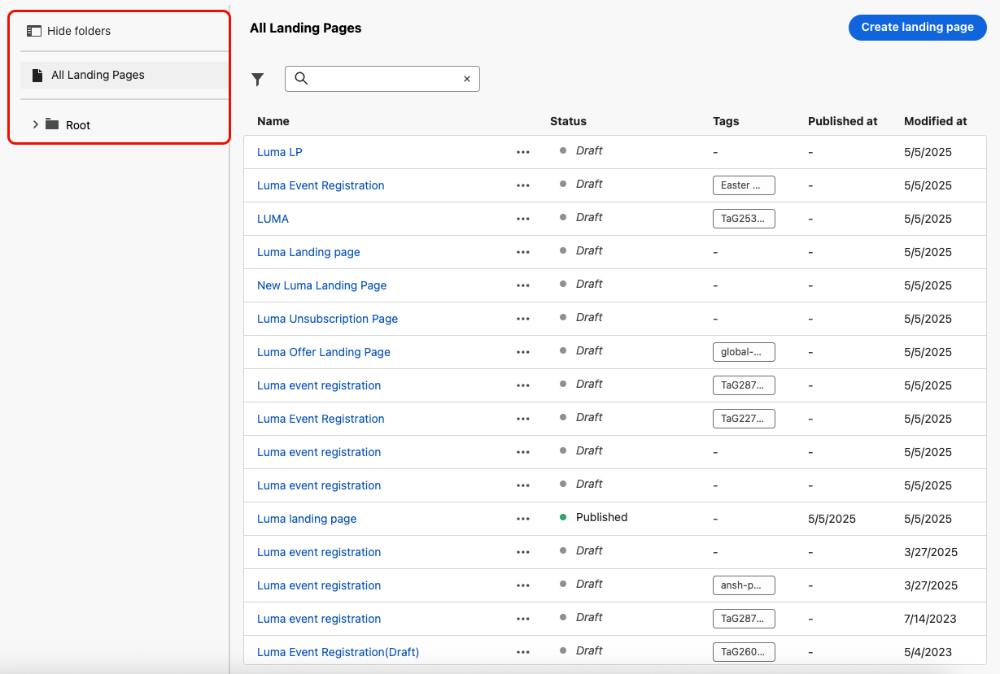
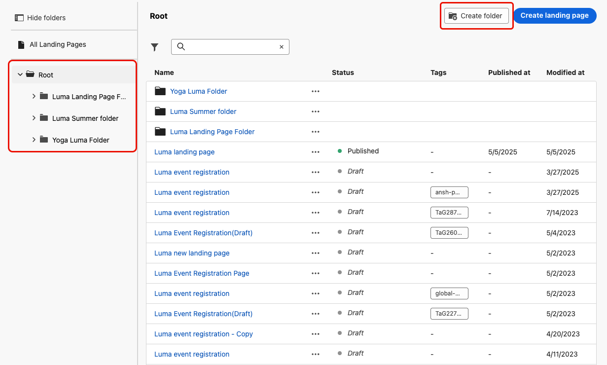
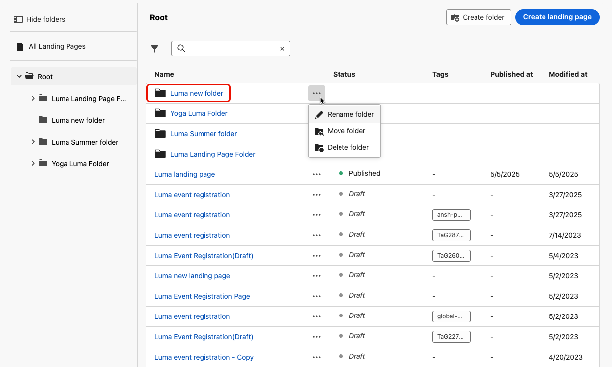
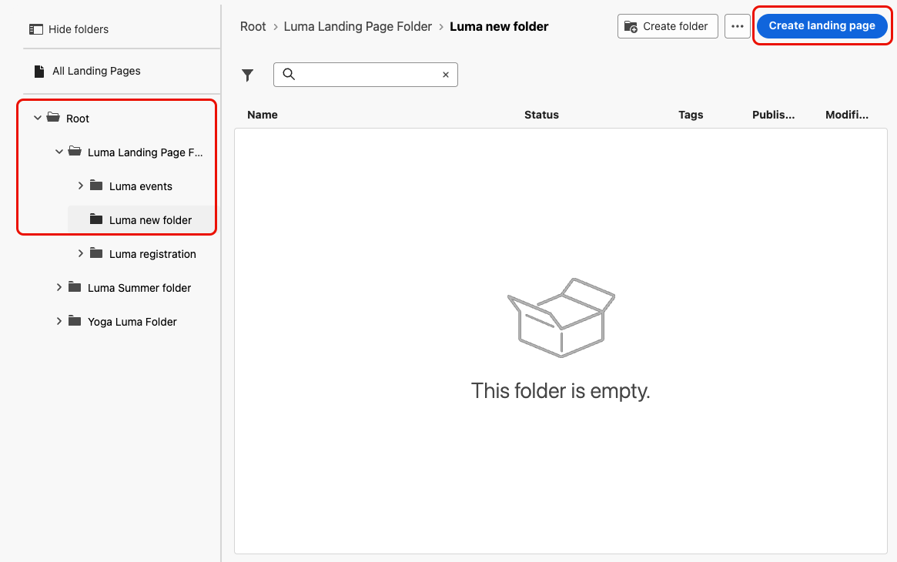

# Manage your landing pages {#manage-lp}

## Access landing pages {#access-landing-pages}

To access the landing page list, select **[!UICONTROL Content Management]** > **[!UICONTROL Landing pages]** from the left menu.

All the existing landing pages are displayed.

The pane on the left allows you to organize landing pages into folders. By default, all items are displayed. When selecting a folder, only the landing pages and folders included in the selected folder are displayed. [Learn more](#folders)

To find a specific item, start typing a name in the search field. When a [folder](#folders) is selected, the search applies to all landing pages or folders in the first level of hierarchy of that folder<!--(not nested items)-->.

You can filter landing pages based on their status, modification date, or tags.

From this list, you can click the three dots next to a landing page and select the desired action:

* For [published](create-lp.md#publish-landing-page) landing pages, access the [landing page report](../reports/lp-report-global-cja.md) and [last 24 hours live report](../reports/lp-report-live.md).

* **Delete** and **Unpublish** a landing page. You cannot delete a [published](create-lp.md#publish-landing-page) landing page. To delete it, you must first unpublish it.

    >[!CAUTION]
    >
    >If you unpublish a landing page which is referenced in a message, the link to the landing page will be broken and users will get an error page if they try to access it.

* **Duplicate** any landing page.

* Edit a landing page's associated [tags](../start/search-filter-categorize.md#tags).

* Move the landing page to a folder. [Learn more](#folders)

## Use folders to manage landing pages {#folders}

>[!CONTEXTUALHELP]
>id="ajo_lp_folders"
>title="Organize your landing pages into folders"
>abstract="Use folders to categorize and manage your landing pages according to your organization needs."

To easily navigate your landing pages, you can use folders to organize them more effectively into a structured hierarchy. This enables you to categorize and manage the items according to your organization needs.

1. Click the **[!UICONTROL All Landing Pages]** button to display all the items previsously created without the folder grouping.

    

1. Click the **[!UICONTROL Root]** folder to display all the folders created.

    >[!NOTE]
    >
    >If you have not created folders yet, all the landing pages are displayed.

1. Click any folder inside the **[!UICONTROL Root]** folder to display its content.

1. Upon clicking the **[!UICONTROL Root]** folder or any other folder, the **[!DNL Create folder]** button displays. Select it.

    

1. Type a name for the new folder and click **[!UICONTROL Save]**. The new folder displays inside the **[!UICONTROL Root]** folder, or inside the folder currently selected.

1. You can click the **[!UICONTROL More actions]** button to rename or delete the folder.

    

1. Using the **[!UICONTROL More actions]** button, you can also move landing pages to another existing folder.

1. Now you can navigate to the folder that you just created. Each new landing page you [create](create-lp.md#create-landing-page.md) from here is saved into the current folder.

    
