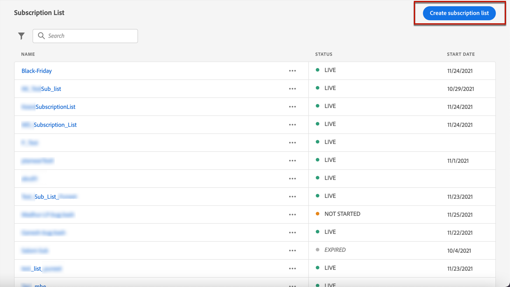
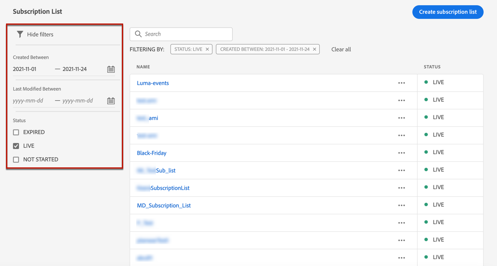

# Subscription lists {#create-subscription-list}

>[!CONTEXTUALHELP]
>id="ajo_subscription_list"
>title="Set up a subscription list"
>abstract="Create a subscription list to gather profiles who have opted in to receive communications on a specific subject or event. "
>additional-url="https://experienceleague.adobe.com/docs/journey-optimizer/using/landing-pages/subscription-list.html#define-subscription-list" text="Create a subscription list"

A subscription service refers to marketing goods and services provided to customers who have opted in to receive communications on a specific subject/event/interest/etc. on an ongoing basis. In [!DNL Journey Optimizer], these opted-in customers are gathered into a subscription list.

A subscription service can be used for:

* a newsletter, for example: "Running series"
* an event, for example: "Summit 2021"
* a webinar, for example: "Learn more about crypto"
* an interest on a particular product/sport/service/etc., for example: "Interested to buy a house in the next 12 months"
* a preference on how to be notified, for example: "Receive new song notifications on email"

The profiles can be added to a subscription list through a [landing page](create-lp.md). An example is presented in [this section](lp-use-cases.md#subscription-to-a-service).

## Create a subscription list {#define-subscription-list}

To create a subscription list, follow the steps below.

1. To access the subscription lists, select **[!UICONTROL Customer]** > **[!UICONTROL Subscription list]**.

    

1. Select the **[!UICONTROL Create subscription list]** button.

    

1. Add a title and a description. These fields are mandatory.

    

    >[!CAUTION]
    >
    >Currently you cannot use spacing or enter a name that already exists for another subscription list in the **[!UICONTROL Title]** field.

1. You can define a start date and end date.

    

1. Select or create Adobe Experience Platform tags from the **[!UICONTROL Tags]** field to categorize your landing page for improved search. [Learn more](../start/search-filter-categorize.md#tags)

1. Click **[!UICONTROL Save]**.

## Use a subscription list {#use-subscription-lists}

 Once the subscription list is created, you can:

* Add profiles to the subscription list

   You can invite persons to **join the list**, by subscribing to a newsletter, or registering to an event. You can also **send personalized messages** to the subscribers.

    For example, to invite an audience to register to an event or subscribe to a newsletter, you can send them a message with a link to a landing page for them to join the event or subscribe. Profiles who opt-in through the landing page form are added to the subscription list that you created for this purpose. 

* Send messages to subscribers

    You can also use subscription lists as audiences when building journeys, and adding personalization.

    For example, when a customer subscribes to a streaming service, it can trigger the immediate dispatch of a welcome email series, encouraging them to log into the app for the first time and set their viewing preferences. 

Learn how to use your subscription list in [this use case](lp-use-cases.md#subscription-to-a-service).

## Browse your subscription lists {#browse-subscription-lists}

The list displays all the subscription lists created. You can filter them based on the creation date or modification date, and their status.

The possible statuses are as follows:

* **[!UICONTROL Not started]**: You defined a start date that is later than the current day. The subscribed profiles will not receive yet communications relating to this subscription list.
* **[!UICONTROL Live]**: The current day is comprised between the subscription list start date and end date, or you did not defined end/start dates, which means the subscription list is always live.
* **[!UICONTROL Expired]**: The end date is passed, thus the subscription list is not valid anymore. Any subscribed profile will not receive any more communications relating to this subscription list.

## Monitor your subscription lists {#monitor-subscription-lists}

You can monitor your subscription list impacts through dedicated reports. You can access:

* Subscription list Live report 

    Live reports, accessible from the Last 24 hrs tab, display events that took place within the past 24 hours, with a minimum time interval of two minutes from the event occurrence. [Learn more](../reports/subscription-report-live.md)

* Subscription list All time reports, with Customer Journey Analytics

    These reports focus on events that occurred at least two hours ago and cover events over a selected time period. The **Subscription report** offers essential insights into profiles' subscriptions and unsubscriptions associated with particular lists, helping you understand the effectiveness of different subscription campaigns and initiatives in driving engagement and conversions. [Learn more](../reports/subscription-report-global-cja.md)
