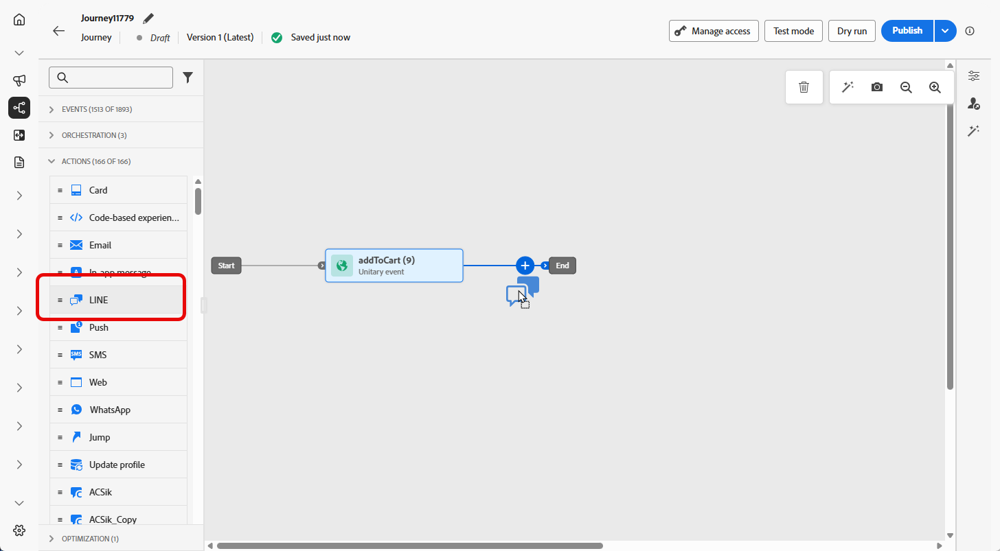
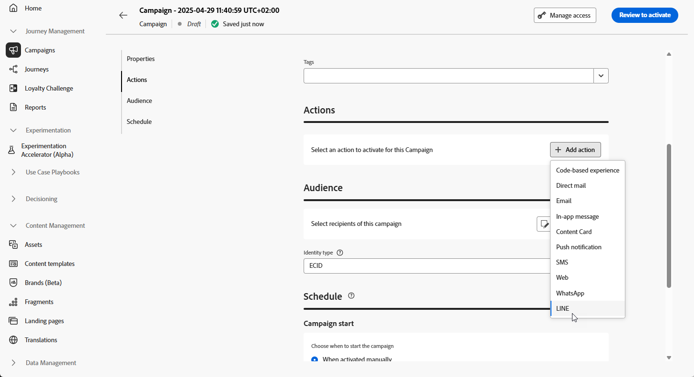

# Create a LINE message {#create-line}

## Add a LINE message {#create-line-journey-campaign}

Browse the tabs below to learn how to add a LINE message in a campaign or a journey.

>[!BEGINTABS]

>[!TAB Add a LINE message to a Journey]

1. Open your journey then drag and drop a **LINE** activity from the **Actions** section of the palette.

    

1. Provide basic information on your message (label, description, category), then choose the message configuration to use.

    For more information on how to configure a journey, refer to [this page](../building-journeys/journey-gs.md)

    The **[!UICONTROL configuration]** field is pre-filled, by default, with the last configuration used for that channel by the user.

You can now start designing the content of your SMS message from the **[!UICONTROL Edit content]** button, as detailed below.

>[!TAB Add a LINE message to a Campaign]

1. Access the **[!UICONTROL Campaigns]** menu, then click **[!UICONTROL Create campaign]**.

1. Select the type of campaign that you want to execute

    * **Scheduled - Marketing**: execute the campaign immediately or on a specified date. Scheduled campaigns are aimed at sending marketing messages. They are configured and executed from the user interface.

    * **API-triggered - Marketing/Transactional**: execute the campaign using an API call. API-triggered campaigns are aimed at sending either marketing, or transactional messages, i.e. messages sent out following an action performed by an individual: password reset, cart purchase etc.

1. From the **[!UICONTROL Properties]** section, edit your Campaign's **[!UICONTROL Title]** and **[!UICONTROL Description]**.

1. Click the **[!UICONTROL Select audience]** button to define the audience to target from the list of available Adobe Experience Platform audiences. [Learn more](../audience/about-audiences.md).

1. In the **[!UICONTROL Identity namespace]** field, choose the namespace to use in order to identify the individuals from the selected audience. [Learn more](../event/about-creating.md#select-the-namespace).

1. In the **[!UICONTROL Actions]** section, choose the **[!UICONTROL LINE]** and select or create a new configuration.

    Learn more about LINE configuration in [this page](line-configuration.md).

    

1. Click **[!UICONTROL Create experiment]** to start configuring your content experiment and create treatments to measure their performance and identify the best option for your target audience. [Learn more](../content-management/content-experiment.md)

1. In the **[!UICONTROL Actions tracking]** section, specify if you want to track clicks on links in your SMS message.

1. Campaigns are designed to be executed on a specific date or on a recurring frequency. Learn how to configure the **[!UICONTROL Schedule]** of your campaign in [this section](../campaigns/create-campaign.md#schedule). 

1. From the **[!UICONTROL Action triggers]** menu, choose the **[!UICONTROL Frequency]** of your SMS message:

    * Once
    * Daily
    * Weekly
    * Month
    
You can now start designing the content of your text message from the **[!UICONTROL Edit content]** button, as detailed below.

>[!ENDTABS]

## Define your LINE content{#line-content}

To configure your LINE content, follow the steps below. 

1. From the journey or campaign configuration screen, click the **[!UICONTROL Edit content]** button to configure the text message content.

1. Click **[!UICONTROL Edit code]** to edit JSON content.

1. Use the personalization editor to define content, add personalization and dynamic content. You can use any attribute, such as the profile name or city for example. You can also define conditional rules. Browse to the following pages to learn more about [personalization](../personalization/personalize.md) and [dynamic content](../personalization/get-started-dynamic-content.md) in the personalization editor.

1. Click **[!UICONTROL Save]** and check your message in the preview.

1. Use the **[!UICONTROL Simulate content]** button to preview your LINE message content and personalized content.

Once you have performed your tests and validated the content, you can send your LINE message to your audience. These steps are detailed in [this page](send-line.md)

Once sent, you can measure the impact of your LINE within the Campaign or Journey reports. For more on reporting, refer to [this section](../reports/campaign-global-report-cja.md).
