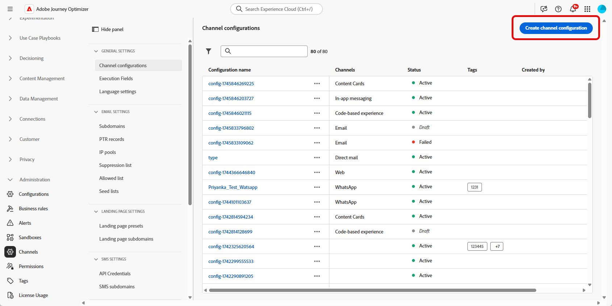
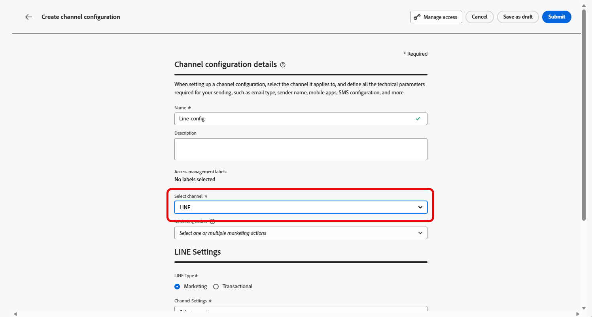

# Configure LINE channel in Journey Optimizer {#line-configuration}

1. Access the **[!UICONTROL Channels]** > **[!UICONTROL General settings]** > **[!UICONTROL Channel configurations]** menu, then click **[!UICONTROL Create channel configuration]**.

    

1. Enter a name and a description (optional) for the configuration, then select the channel to configure.

    >[!NOTE]
    >
    > Names must begin with a letter (A-Z). It can only contain alpha-numeric characters. You can also use underscore `_`, dot`.` and hyphen `-` characters.

1. To assign custom or core data usage labels to the configuration, you can select **[!UICONTROL Manage access]**. [Learn more on Object Level Access Control (OLAC)](../administration/object-based-access.md).

1. Select **LINE** channel.

    

1. Select **[!UICONTROL Marketing action]**(s) to associate consent policies to the messages using this configuration. All consent policies associated with the marketing action are leveraged in order to respect the preferences of your customers. [Learn more](../action/consent.md#surface-marketing-actions)

1. Select the type of message for the configuration: 

    * **Marketing**: For promotional messages, such as weekly promotions for a retail store. These messages require user consent and should comply with LINE's policy regarding user opt-ins.
    * **Transactional**: For non-commercial messages, such as order confirmations, password reset notifications, or delivery updates. These messages can be sent even to users who have unsubscribed from marketing communications but are strictly limited to specific transactional contexts.

1. Select your **[!UICONTROL Channel settings]**.

    Reach out to your Adobe representative to set up your **[!UICONTROL Channel settings]**.

    

1. Select your **[!UICONTROL LINE user ID]** you want to map. This is the identifier used to link messages to individual users within your LINE channel.

1. Type-in your **[!UICONTROL Sender Name]**, such as your brand's name.

1. Submit your changes.

You can now select your configuration when creating your LINE message.

## Configure the LINE Channel settings API {#line-api}

This API sets up channel settings that store the necessary authorization and configuration details for connecting to the LINE Messaging API. These settings enable Adobe Journey Optimizer to authenticate and send messages through LINE using the provided credentials.

**Endpoint**

```
POST https://platform.adobe.io/journey/imp/config/channel-settings
```

| Header Name | Description |
|-|-|
|Authorization| User token from your technical account|
|x-api-key| Client ID from Adobe Developer Console|
|x-gw-ims-org-id| Your IMS Organization ID|
|x-sandbox-name| Sandbox name, e.g., prod|
|Content-Type| Must be application/json|


**Request Body**

```json
{
    "name": "your_defined_name",
    "channelRegistryId": "line",
    "channel": "line",
    "channelSettings": {
        "channelId": "your_line_channel_id",
        "channelSecret": "your_line_channel_secret"
    }
}
```

**Channel Settings Response**

```json
{
"id": "3603ed66-ae86-42b8-8a90-d4b4e54e7c3b",
"name": "your_defined_name",
"channelRegistryId": "line",
"channel": "line",
"channelSettings": {
    "channelId": "your_line_channel_id",
    "channelSecret": "your_line_channel_secret"
    },
    "channelPublicationId": "v1_line",
    "createdAt": "2025-07-30T12:00:00.000Z",
    "modifiedAt": "2025-07-30T12:00:00.000Z",
    "isFromLatestVersion": true,
    "_etag": "\"eab98d24-18af-48ae-90f9-e59d4f8cfb2b\""
}
```
