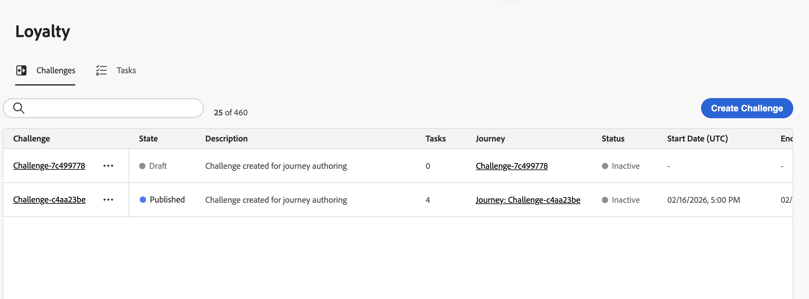
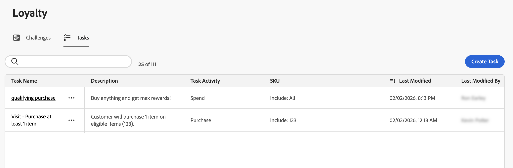

# Access Loyalty Challenges {#access-loyalty-challenges}

>[!BEGINSHADEBOX]

**Loyalty Challenges documentation:**

* [Get started with Loyalty Challenges](get-started.md) - Overview, workflow, prerequisites
* **Access Loyalty Challenges** ◀︎ **You are here** - Inventory and filtering
* [Create challenges](create-challenges.md) - Build and configure challenges
* [Create tasks](create-tasks.md) - Define challenge tasks
* [Manage challenges](manage-challenges.md) - Edit, monitor, optimize

>[!ENDSHADEBOX]

>[!AVAILABILITY]
>
>This feature is currently in **private beta** and may not be available in your environment. To request access, contact your Adobe representative. Learn more about [availability labels](../rn/releases.md#availability-labels).

To access Loyalty Challenges, navigate to Journey Optimizer and select **[!UICONTROL Loyalty Challenge (Beta)]** under the **[!UICONTROL Journey management]** section.

## Overview {#overview}

The Loyalty Challenges interface provides a centralized location to view, manage, and organize all your challenges and tasks. You can access two main inventories:

* **Challenges inventory**: View and manage all loyalty challenges, monitor their status, and perform quick actions
* **Tasks inventory**: Browse reusable tasks that can be used across multiple challenges

## Challenges inventory {#challenges-tab}

The **[!UICONTROL Challenges]** tab displays all challenges sorted by last modified date, with the most recently modified challenges appearing first.

Key information displayed:

* **[!UICONTROL Challenge]**: Challenge name
* **[!UICONTROL State]**: Current state of the challenge (Draft or Published). [Learn more on status transitions](manage-challenges.md#challenge-lifecycle)
* **[!UICONTROL Tasks]**: Number of tasks configured in the challenge
* **[!UICONTROL Journey]**: Link to the auto-generated journey associated with the challenge
* **[!UICONTROL Status]**: Current status of the associated journey (Draft, Live, Stopped, etc.)
* **[!UICONTROL Start/End Date (UTC)]**: When the challenge becomes active and when it expires

From the Challenges tab, you can perform quick actions on challenges:

* **View challenge details**: Select the challenge name to open its details page and/or edit the challenge
* **Duplicate a challenge**: Select the  icon and choose **[!UICONTROL Duplicate]**
* **Delete a draft challenge**: Select the  icon and choose **[!UICONTROL Delete]**

[Learn how to manage challenges after creation](manage-challenges.md).

## Tasks inventory {#tasks-tab}

The Tasks tab displays all reusable tasks that can be used across multiple challenges. Tasks created here become available for selection when creating or editing any challenge.

Key information displayed:

* **[!UICONTROL Task Name]**: The name you assigned to the task
* **[!UICONTROL Description]**: Brief description of what the task requires
* **[!UICONTROL Task Activity]**: Type of activity (Purchase, Spend)
* **[!UICONTROL SKU]**: Eligible and/or excluded items

From the Tasks tab, you can perform quick actions on tasks:

* **View task details**: Select the task name to view full configuration and/or edit the task
* **Duplicate a task**: Select the  icon and choose **[!UICONTROL Duplicate]**
* **Delete a task**: Select the  icon and choose **[!UICONTROL Delete]**

[Learn how to manage tasks after creation](manage-challenges.md).

## Next steps {#next-steps}

Now that you know how to access and navigate the Loyalty Challenges inventory:

* [Create challenges](create-challenges.md) - Learn how to build your first challenge and configure tasks
* [Create tasks](create-tasks.md) - Learn how to define reusable tasks for challenges
* [Manage challenges](manage-challenges.md) - Learn how to edit, monitor, and optimize challenges
