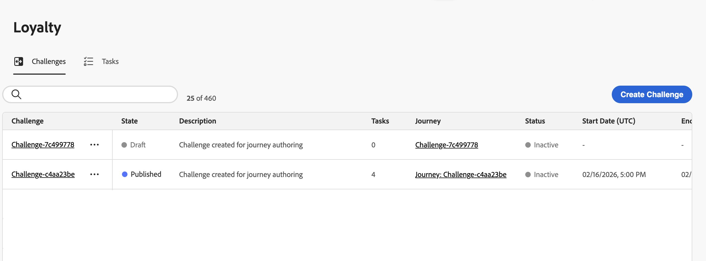
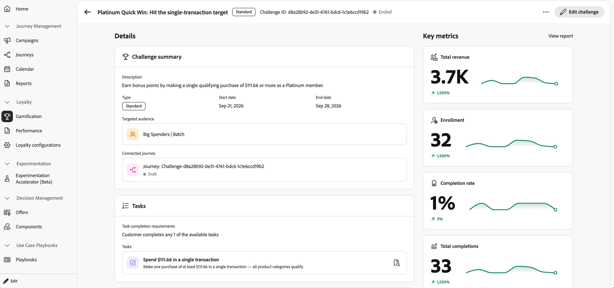
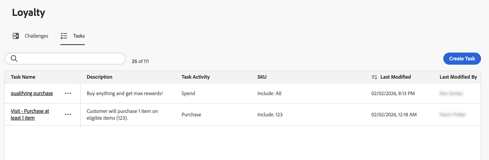

# Access & manage challenges and tasks {#access-loyalty-challenges}

>[!BEGINSHADEBOX]

**On this page:** Learn how to access Loyalty Challenges, review the Challenges and Tasks inventories, explore a challenge's details and performance, and manage existing challenges and reusable tasks.

>[!ENDSHADEBOX]

## Access & manage challenges and tasks

To access Loyalty Challenges, navigate to Journey Optimizer and select **[!UICONTROL Loyalty Challenge]** under the **[!UICONTROL Journey management]** section. The Loyalty Challenges interface provides a centralized location to view, manage, and organize all your challenges and tasks.

The interface provides access to two main inventories:

* **Challenges**: View and manage all loyalty challenges, monitor their status, and perform quick actions such as viewing, editing, duplicating, or deleting challenges
* **Tasks**: Browse reusable tasks that can be used across multiple challenges, and manage task definitions independently

## Challenges inventory {#challenges-tab}

The **[!UICONTROL Challenges]** tab displays all challenges sorted by last modified date, with the most recently modified challenges appearing first.

Key information displayed:

* **[!UICONTROL State]**: Current state of the challenge (Draft or Published)
* **[!UICONTROL Tasks]**: Number of tasks configured in the challenge
* **[!UICONTROL Journey]**: Link to the auto-generated journey associated with the challenge
* **[!UICONTROL Status]**: Current status of the auto-generated journey that delivers the challenge.
* **[!UICONTROL Start/End Date (UTC)]**: When the challenge becomes active and expires

From the Challenges tab, you can perform actions on challenges:

* **View challenge**: Select the challenge name to open its [details page](#challenge-details).
* **Duplicate a challenge**: Select the  icon and choose **[!UICONTROL Duplicate]**. A copy is created with all tasks, content, and messaging intact.
* **Delete a challenge**: Select the  icon and choose **[!UICONTROL Delete]**.

  >[!IMPORTANT]
  >
  >You can delete a challenge even when it is published. Consider the impact before deleting.

* **Edit a challenge**: Select the challenge name to open its details page and make the desired changes.

  When you open a published challenge for editing, you first need to revert it to Draft state. Any customizations made directly to the auto-generated journey will be lost. After making your changes, save and publish the challenge again, then publish the associated journey. [Learn how to launch a challenge](create-challenges.md#launch)

  >[!IMPORTANT]
  >
  >Reverting a published challenge to draft cannot be undone. Consider the impact on your active journey before proceeding.

## Challenge details {#challenge-details}

Select a challenge name in the **[!UICONTROL Challenges]** inventory to open its details page. This page brings together the challenge configuration and performance so you can review a specific challenge without opening its editor.

The header displays the challenge name, type, ID, and status. Select **[!UICONTROL Edit challenge]** to modify the challenge.

The **[!UICONTROL Details]** area contains the following sections:

* **[!UICONTROL Challenge summary]**: Review the challenge description, type, start and end dates, targeted audience, and connected journey, including the journey's status.
* **[!UICONTROL Tasks]**: Review the task completion requirements and the name and description of each task. Select the details icon next to a task to review that individual task.
* **[!UICONTROL Rewards]**: Review details about the reward associated to the challenge.

The **[!UICONTROL Key metrics]** area displays total revenue, enrollment, completion rate, and total completions, with trend sparklines and percentage changes. Select **[!UICONTROL View report]** to explore challenge performance in more detail. [Learn more about loyalty performance reports](loyalty-performance.md#reports-view).

>[!NOTE]
>
>The **View Loyalty Insights** permission (`loyalty-insights.read`) controls access to the **[!UICONTROL Key metrics]** and **[!UICONTROL Trends]** sections. These sections are shown only to users with this permission. [Learn more about Loyalty Challenges permissions](loyalty-permissions.md#loyalty-permissions).

## Tasks inventory {#tasks-tab}

The **[!UICONTROL Tasks]** tab displays all reusable tasks that can be used across multiple challenges. Tasks created here become available for selection when creating or editing any challenge.

Key information displayed:

* **[!UICONTROL Description]**: Brief description of what the task requires
* **[!UICONTROL Task Activity]**: Type of activity (Purchase, Spend)
* **[!UICONTROL SKU]**: Eligible and/or excluded items
* **[!UICONTROL Used in challenges]**: Number of challenges currently using this task

From the Tasks tab, you can perform actions on tasks:

* **View/Edit a task**: Select the task name to view the full configuration and edit the task
* **Duplicate a task**: Select the  icon and choose **[!UICONTROL Duplicate]**
* **Delete a task**: Select the  icon and choose **[!UICONTROL Delete]**.

  >[!IMPORTANT]
  >
  >You can delete a task even when it is used in one or more challenges. Consider the impact on challenges that reference the task before deleting.

{{$include /help/_includes/do-not-localize/loyalty-challenges/ai-augmented-access-loyalty-challenges.md}}

