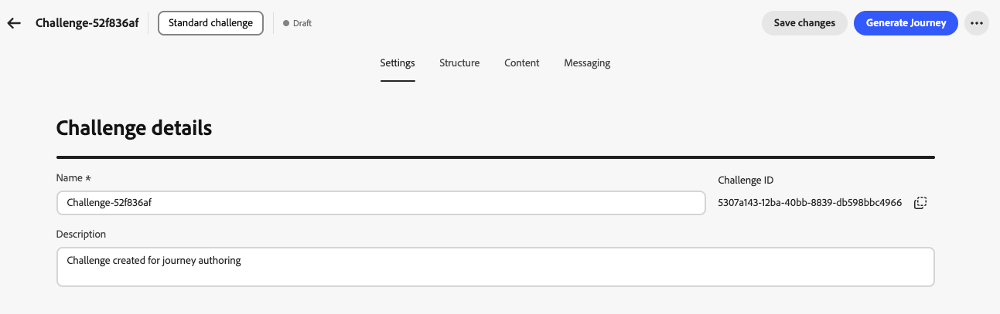
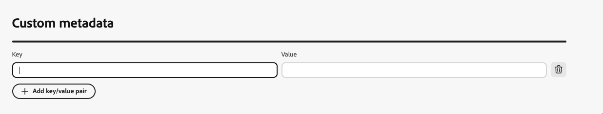

# Create challenges {#create-challenges}

>[!BEGINSHADEBOX]

**Table of contents**

[Get started with Loyalty Challenges](get-started.md)

<table style="table-layout:fixed">
<tr style="border: 0;">
<td style="vertical-align:top;">

**Create and manage challenges**

* [Access & manage challenges and tasks](access-loyalty-challenges.md)
* **Create challenges** ◀︎ **You are here**
* [Create tasks](create-tasks.md)
* [Monitor loyalty challenge performance](loyalty-reporting.md)

</td>
<td style="vertical-align:top;">

**Configure and integrate**

* [Configure loyalty challenges](loyalty-admin.md)
* [Reward Definition guide](reward-definition-guide.md)
* [Event Transformer guide](event-transformer-guide.md)
* [Loyalty data and datasets](loyalty-data-and-datasets.md)
* [Loyalty Challenges API reference](https://developer.adobe.com/journey-optimizer-apis/references/loyalty-challenges){target="_blank"}

</td>
</tr>
</table>

>[!ENDSHADEBOX]

>[!AVAILABILITY]
>
>This feature is currently in **private beta**. For full details about the release cycle and availability phases, see [Journey Optimizer release cycle](../rn/releases.md).

This page covers the complete process of creating a loyalty challenge, from selecting the challenge type and configuring settings, structure, content, and messaging to generating and publishing the journey that delivers the challenge to your customers.

## Create the challenge {#create-the-challenge}

1. Navigate to **[!UICONTROL Loyalty Challenges (Beta)]** in Journey Optimizer.

1. Select the **[!UICONTROL Challenges]** tab and select **[!UICONTROL Create Challenge]**.

   

1. Choose the challenge type:

   * **[!UICONTROL Standard]**: Customers complete any specified number of tasks in any order  
     *Example: Complete 3 out of 5 available tasks*

   * **[!UICONTROL Streak]**: Customers complete the same task multiple times consecutively  
     *Example: Make a purchase on 7 consecutive days*

   * **[!UICONTROL Sequential]**: Customers complete tasks in a defined order  
     *Example: Purchase → Review → Share (must be completed in this sequence)*

   * **[!UICONTROL Bring your own data]**: Select **[!UICONTROL Bring your own data]** when you want the challenge framework such as tasks and rewards to be assembled from your Loyalty Challenges data integration. When this type is selected, the **[!UICONTROL Structure]** tab is read-only. Configure **[!UICONTROL Settings]**, **[!UICONTROL Content]**, and **[!UICONTROL Messaging]** the same way as other challenge types.

      >[!AVAILABILITY]
      >
      >The **[!UICONTROL Bring your own data]** challenge type is currently available to a restricted set of organizations and will be made available more broadly in a future release.

   After selecting a challenge type, the challenge editor opens with these tabs: **[!UICONTROL Settings]**, **[!UICONTROL Structure]**, **[!UICONTROL Content]**, and **[!UICONTROL Messaging]**. Start with **[!UICONTROL Settings]** to define challenge details, audience, schedule, and rules. Then configure **[!UICONTROL Structure]** (tasks and rewards) for all types except **[!UICONTROL Bring your own data]**.

## Configure challenge settings {#settings}

In the **[!UICONTROL Settings]** tab, configure challenge-level properties: who can participate, when the challenge runs, how members opt in and earn progress, and optional metadata.

### Challenge details {#challenge-details}

>[!CONTEXTUALHELP]
>id="ajo_loyalty_challenge_properties"
>title="Challenge details"
>abstract="Set the challenge name and description. The Challenge ID is assigned automatically when the challenge is created and can be copied for API or integration use."

1. In the **[!UICONTROL Challenge details]** section, define the following:

   * **[!UICONTROL Name]**: Enter a descriptive name for your challenge. This name appears in the challenges inventory.
   * **[!UICONTROL Challenge ID]**: A unique identifier assigned when the challenge is created. Use the copy control to reference this ID in APIs or external systems.
   * **[!UICONTROL Description]**: Enter a description that explains the challenge's purpose and goals.

   

### Audience {#audience}

>[!CONTEXTUALHELP]
>id="ajo_loyalty_challenge_audience"
>title="Audience"
>abstract="Choose who can participate in the challenge. Add an Adobe Experience Platform audience, or leave audience empty so all loyalty members are eligible. Optionally require completion of other challenges as prerequisites."

Define who can participate in your loyalty challenge.

1. In the **[!UICONTROL Audience]** section, select **[!UICONTROL Add audience]** to limit the challenge to a specific Adobe Experience Platform audience. [Learn how to work with audiences](../audience/about-audiences.md).

   

1. Under **[!UICONTROL Challenge prerequisites]**, select **[!UICONTROL Require challenge completion]** to restrict eligibility to members who have already completed one or more selected challenges.

### Schedule {#schedule}

>[!CONTEXTUALHELP]
>id="ajo_loyalty_challenge_schedule"
>title="Challenge schedule"
>abstract="Set when the challenge is live using start and end date and time and a time zone. In the task completion window, choose when customers can complete tasks during the challenge period."

Configure when your challenge runs:

1. In the **[!UICONTROL Schedule]** section, set:

   * **[!UICONTROL Start date and time]**: When the challenge becomes available to customers.
   * **[!UICONTROL End date and time]**: When the challenge expires and no longer accepts new completions.
   * **[!UICONTROL Time zone]**: The time zone used for the challenge schedule.

   

1. Under **[!UICONTROL Task completion window]**, choose when customers can complete tasks:

   * **[!UICONTROL Any time during challenge]**: Customers can complete tasks at any time between the challenge start and end dates.
   * **[!UICONTROL During specific hours of the day]**: Restrict task completion to specific daily hours by setting **[!UICONTROL Start Time]** and **[!UICONTROL End Time]**.

### Rules {#rules}

Configure how members opt in, when task progress counts toward the challenge, and how many times the challenge can be completed.

* **[!UICONTROL Opt-in trigger]**:

  * **[!UICONTROL Opt-in method]**: Choose whether customers join the challenge manually or through an event trigger.
  * **[!UICONTROL Event]**: For event-based opt-in, select the event that triggers opt-in. Administrators can click the  button to create an event definition. [Learn how to configure event definitions](loyalty-admin.md#event-definitions)

* **[!UICONTROL Start tracking progress]**:

   * **[!UICONTROL Task progress tracking starts]**: Choose when task completions count toward challenge progress. For example, select **[!UICONTROL When challenge starts (after opt-in)]** so progress begins after the member opts in and the challenge is active.

      You can decouple when a challenge is visible to members from when progress is tracked. For example, a challenge card can appear and accept opt-ins before task completions start counting toward progress on a later date.

   * **[!UICONTROL Start]**: When you choose a custom start option, set the date and time when progress tracking begins.

* **[!UICONTROL Repeat limits]**:

   * **[!UICONTROL Challenge can be completed]**: Choose whether the challenge can be completed once or multiple times. For example, **[!UICONTROL Once]** or a defined number of completions.

   * **[!UICONTROL Number of times it can be completed]**: When repeat is enabled, specify how many times a member can complete the challenge.

* **[!UICONTROL Completion requirements]** *(Standard challenges only)*:

   * **[!UICONTROL Complete in a single transaction]**: When enabled, customers must complete all tasks within a single transaction. When disabled, tasks can be completed across separate transactions.

### Custom metadata {#custom-metadata}

In the **[!UICONTROL Custom metadata]** section, select **[!UICONTROL Add key/value pair]** to add custom metadata. Use metadata for tracking or integration with external systems.

## Configure the challenge structure {#structure}

In the **[!UICONTROL Structure]** tab, define the tasks customers must complete and the rewards they earn. This tab is not used for **[!UICONTROL Bring your own data]** challenges.

### Add tasks {#add-tasks}

>[!CONTEXTUALHELP]
>id="ajo_loyalty_challenge_tasks"
>title="Tasks"
>abstract="Select tasks to perform to complete the challenge. Next, configure how the challenge is completed - the available options depend on your challenge type (Standard, Streak, or Sequential)."

Tasks define the specific actions customers must complete to earn rewards. You can configure task types (purchase, spend, or custom event), quantities, product filters, and other attributes.

To add tasks to your challenge, follow these steps:

1. In the **[!UICONTROL Tasks]** section, select **[!UICONTROL Add task]**.

   

1. The **[!UICONTROL Tasks Inventory]** opens. Select one or more tasks from the list and select **[!UICONTROL Add]**. To create a new task, select **[!UICONTROL New]**. [Learn how to create and configure tasks](create-tasks.md).

1. Specify when the challenge is considered completed. Available settings depend on the challenge type:

   +++Standard challenges

   In the **[!UICONTROL Task completion requirement]** drop-down, choose between:

      * **[!UICONTROL Customer chooses 1 task to complete]** - *Customers can select and complete any single task to earn rewards*
      * **[!UICONTROL Customer completes a specific number of tasks]** - *Customers must complete a defined number of tasks. Specify the required number of tasks to complete.*

   +++

   +++Streak challenges

   In the **[!UICONTROL Streak type]** drop-down, choose between:

      * **Consecutive**: Customers must complete the task on consecutive days without breaks. *Example: Purchase on Monday, Tuesday, Wednesday—missing a day breaks the streak.*

      * **Non-consecutive**: Customers can complete the task with gaps between completions. *Example: Complete 7 purchases over 30 days, with breaks allowed.*

   In the **[!UICONTROL Streak length]** field, specify how many times the task must be completed. *Example: Set to 7 for a "7-day purchase streak."*

   +++

   +++Sequential challenges

   In the **[!UICONTROL Task completion requirement]** drop-down, choose between:

   * **[!UICONTROL Customer chooses 1 task to complete]** - *Customers can select and complete any single task to earn rewards*
   * **[!UICONTROL Customer completes a specific number of tasks]** - *Customers must complete a defined number of tasks in the exact order you define. Missing or skipping a task breaks the sequence. Specify the required number of tasks to complete*

   +++

1. By default, standard and sequential challenges allow customers to complete tasks across multiple transactions. To require all tasks to be completed in a single transaction, open the task options menu and toggle on the single-transaction option.

   

After adding tasks to your challenge, configure the rewards customers will earn for completing them.

### Configure rewards {#rewards}

>[!CONTEXTUALHELP]
>id="ajo_loyalty_challenge_rewards"
>title="Rewards"
>abstract="Choose when customers earn points: when they complete the whole challenge, or at task milestones as they progress. Select your reward provider (your loyalty solution that manages points and rewards), then set amounts: a single total for full completion, or per-task values for milestones, turning rewards on only for the tasks you want to pay out."

Rewards are the loyalty points or benefits customers receive for completing challenges.

To configure when and how rewards are delivered:

1. In the **[!UICONTROL Reward delivery]** drop-down menu, choose when to deliver rewards:

   * **[!UICONTROL Deliver rewards when challenge is completed]**: Award rewards when customers complete the entire challenge  
     *Example: Award 100 points after completing all 5 tasks*

   * **[!UICONTROL Deliver rewards at task completion milestones as challenge progress is made]**: Award rewards incrementally as customers complete individual tasks (only available for challenges requiring more than one task)  
     *Example: Award 10 points after task 1, 20 points after task 2, and 50 points after task 3*

1. Select your reward provider. This is your loyalty solution that manages customer points and rewards. Reward providers are created in the **[!UICONTROL Loyalty admin]** menu before you author challenges. [Learn how to configure reward providers](loyalty-admin.md#reward-providers)

   

1. Configure the reward amounts based on your selected delivery method:

   +++Deliver rewards when challenge is completed

   Specify the total reward amount to give when customers complete the entire challenge.

   *In the example below, customers are awarded 100 points when completing the challenge.*

   

   +++

   +++Deliver rewards at task completion milestones

   Specify reward amounts for task completion milestones. This option allows you to create progressive rewards that increase customer motivation as they progress through the challenge.

   For any task where you want to deliver a reward, toggle on the reward option and specify how many points to award when customers complete that specific task. You can choose to reward only certain task completions—for example, if you have 10 tasks, you might reward only tasks 1, 5, and 10.

   *In the example below, customers are awarded 10 points when completing the first task, then 50 additional points after completing the second task.*

   

   +++

After configuring the challenge structure with tasks and rewards, you can optionally configure how the challenge is represented to customers. If you do not need challenge content, skip this step and proceed directly to [Configure messaging](#configure-messaging).

## Configure challenge content (optional) {#configure-content-cards}

>[!CONTEXTUALHELP]
>id="ajo_loyalty_challenge_content"
>title="Content"
>abstract="Configure how your challenge is represented in locations where loyalty members access challenges and track their progress. Use Add action to choose Content card to display a card-style experience, or Code-based experience to deliver content through your own custom implementation."

The **[!UICONTROL Content]** tab controls how the challenge is represented in locations where loyalty members access challenges and track their progress.

To configure challenge content:

1. Navigate to the **[!UICONTROL Content]** tab and click **[!UICONTROL Add action]**.

1. Choose the action type:

   * **[!UICONTROL Content card]**: Displays the challenge as a card-style experience on customer devices. Select a **[!UICONTROL Channel configuration]** and click **[!UICONTROL Edit content]** to design and personalize the card. [Learn more about content cards](../content-card/create-content-card.md).
   * **[!UICONTROL Code-based experience]**: Delivers challenge content through your own custom implementation using Journey Optimizer's code-based channel. Select a **[!UICONTROL Channel configuration]** and click **[!UICONTROL Edit content]** to define the content. [Learn more about code-based experiences](../code-based/create-code-based.md).

   

   You can add multiple actions to represent the challenge across different surfaces.

After configuring the content, set up messaging to engage customers throughout the challenge lifecycle.

### Configure messaging {#configure-messaging}

>[!CONTEXTUALHELP]
>id="ajo_loyalty_challenge_messaging"
>title="Messaging"
>abstract="Messaging helps engagement across the challenge lifecycle. On the Messaging tab, add messages for each stage: Launch (when the challenge starts), In-progress (reminders and progress updates), and Completion (celebrate success and confirm rewards). For each stage, add a message, choose the channel, select a channel configuration, then select Edit to design the message content."

Set up multi-channel messages to engage customers at key stages of the challenge lifecycle. Messaging is optional but recommended to maximize customer engagement.

1. Navigate to the **[!UICONTROL Messaging]** tab and configure messages for each lifecycle stage:

   * **Launch** message: Notify customers when the challenge starts
   * **In-progress** message: Keep customers engaged with reminders and progress updates
   * **Completion** message: Celebrate success and confirm reward allocation

1. For each stage, click the add message button to create a message for that stage.

1. Choose your desired channel: **[!UICONTROL In-app]**, **[!UICONTROL Email]**, or **[!UICONTROL Push notification]** and select the associated channel configuration.

1. Select the  icon and choose **[!UICONTROL Edit]** to design your message content.

   

Learn how to create messages for specific channels in these sections: [In-app messages](../in-app/get-started-in-app.md) - [Email messages](../email/get-started-email.md) - [Push notifications](../push/get-started-push.md)

Your challenge is now fully configured with its settings, structure, content, and messaging. To launch it, you must publish the challenge and its associated journey.

## Launching the challenge {#launch}

Launching a challenge requires **three steps**: (1) publish the challenge, (2) generate the journey, (3) publish the journey. All three must be completed for the challenge to be delivered to customers.

1. Review your challenge configuration to ensure all required fields are completed.

1. Click the  icon and select **[!UICONTROL Publish]**.

   

1. Select **[!UICONTROL Generate Journey]** to create the journey that will orchestrate your challenge delivery.

   

1. Journey Optimizer automatically creates a journey in "Draft" status. The journey appears in your journey inventory with the name format *"Journey: [Challenge Name]"*. [Learn more about the journey inventory](../building-journeys/journey-ui.md).

   

1. Open the journey and publish it. The journey will start automatically on your specified challenge start date and deliver content and messages according to your configuration. [Learn how to publish a journey](../building-journeys/publish-journey.md).

1. Once your challenge is live, monitor program KPIs, challenge results, and task-level metrics in the [loyalty challenge reports](loyalty-reporting.md). You can also monitor message delivery in the [journey report](../reports/journey-global-report-cja.md).

>[!NOTE]
>
>The auto-generated journey can be customized to add additional logic or messaging. However, changes made directly to the journey do not sync back to the challenge configuration. If you edit the challenge later, any journey customizations will be lost when the journey is regenerated.
