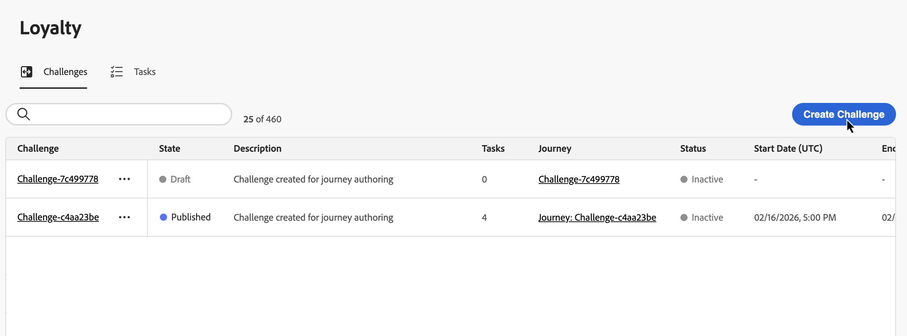
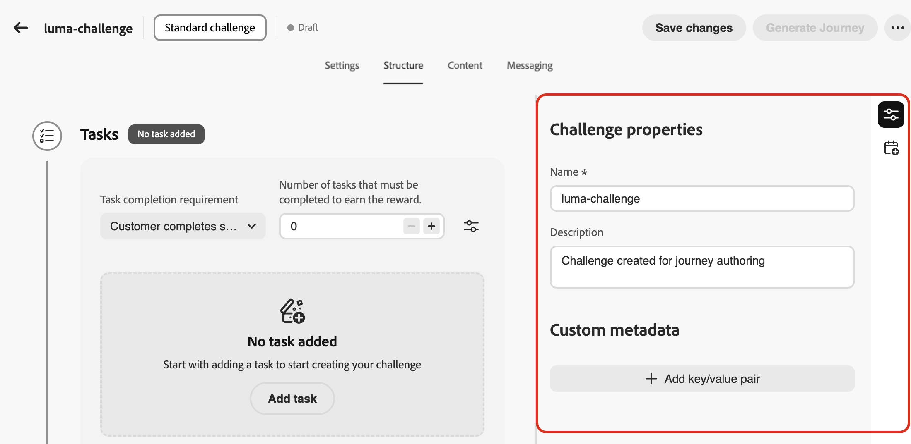
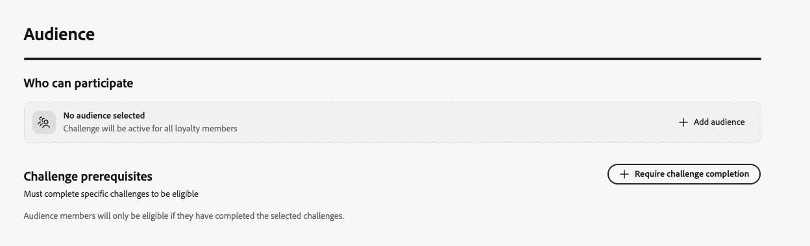

# Create challenges {#create-challenges}

>[!BEGINSHADEBOX]

**Loyalty Challenges documentation:**

* [Get started with Loyalty Challenges](get-started.md)
* [Access & manage challenges and tasks](access-loyalty-challenges.md)
* **Create challenges** ◀︎ **You are here**
* [Create tasks](create-tasks.md)
* [Loyalty Challenges API reference](https://developer.adobe.com/journey-optimizer-apis/references/loyalty-challenges/){target="_blank"}

>[!ENDSHADEBOX]

>[!AVAILABILITY]
>
>This feature is currently in **private beta**. For full details about the release cycle and availability phases, see [Journey Optimizer release cycle](../rn/releases.md).

This page covers the complete process of creating a loyalty challenge, from selecting the challenge type and configuring its properties to generating and publishing the journey that will deliver the challenge to your customers.

## Create the challenge {#create-the-challenge}

1. Navigate to **[!UICONTROL Loyalty Challenges (Beta)]** in Journey Optimizer.

1. Select the **[!UICONTROL Challenges]** tab and select **[!UICONTROL Create Challenge]**.

   

1. Choose the challenge type:

   * **[!UICONTROL Standard]**: Customers complete any specified number of tasks in any order  
     *Example: Complete 3 out of 5 available tasks*

   * **[!UICONTROL Streak]**: Customers complete the same task multiple times consecutively  
     *Example: Make a purchase on 7 consecutive days*

   * **[!UICONTROL Sequential]**: Customers complete tasks in a defined order  
     *Example: Purchase → Review → Share (must be completed in this sequence)*

   After selecting a challenge type, the challenge creation interface opens with multiple configuration tabs. Start by configuring the challenge structure.

## Configure the challenge structure {#structure}

In the **[!UICONTROL Structure]** tab, define how your challenge is organized: its properties, schedule, tasks to complete, and rewards to deliver.

### Define the challenge properties and use custom metadata {#properties}

>[!CONTEXTUALHELP]
>id="ajo_loyalty_challenge_properties"
>title="Challenge properties"
>abstract="In the Challenge properties pane, set the challenge name and description and add custom key/value metadata for tracking or external integrations."

1. In the **[!UICONTROL Challenge properties]** pane, define global settings for the challenge:

   * **[!UICONTROL Name]**: Enter a descriptive name for your challenge. This name appears in the challenges inventory.
   * **[!UICONTROL Description]**: Enter a description that explains the challenge's purpose and goals.

1. Use the **[!UICONTROL Custom metadata]** section to add custom metadata using key/value pairs. This metadata can be used for tracking or integration with external systems.

   

### Schedule the challenge {#schedule}

>[!CONTEXTUALHELP]
>id="ajo_loyalty_challenge_schedule"
>title="Challenge schedule"
>abstract="Use the schedule to define when the challenge is live: set the start date and time when it becomes available to customers, and the end date and time when it stops accepting completions. Pick a time zone, and choose when customers can complete tasks in the **[!UICONTROL Task completion window section]**."

Configure when your challenge runs:

1. Select the **[!UICONTROL Open schedule]** icon:

   

1. Configure the following scheduling options:

   * **[!UICONTROL Start date and time]**: Set when the challenge becomes available to customers.
   * **[!UICONTROL End date and time]**: Set when the challenge expires and no longer accepts new completions.
   * **[!UICONTROL Time zone]**: The challenge uses the recipient's local time zone by default.
   * **[!UICONTROL Tasks must be completed]**: Choose when customers can complete tasks:

      * **[!UICONTROL Any time during challenge]**: Customers can complete tasks at any time between the challenge start and end dates.
      * **[!UICONTROL During specific hours of the day]**: Restrict task completion to specific daily hours by setting the **[!UICONTROL Start Time]** and **[!UICONTROL End Time]**.

The challenge schedule is now configured. Next, add the tasks that customers need to complete.

### Add tasks {#add-tasks}

>[!CONTEXTUALHELP]
>id="ajo_loyalty_challenge_tasks"
>title="Tasks"
>abstract="Select tasks to perform to complete the challenge. Next, configure how the challenge is completed - the available options depend on your challenge type (Standard, Streak, or Sequential)."

Tasks define the specific actions customers must complete to earn rewards. You can configure task types (purchase, spend), quantities, product filters, and other attributes.

To add tasks to your challenge, follow these steps:

1. In the **[!UICONTROL Tasks]** section, select **[!UICONTROL Add task]**.

   

1. The **[!UICONTROL Tasks Inventory]** opens. Select one or more tasks from the list and select **[!UICONTROL Add]**. To create a new task, select **[!UICONTROL New]**. [Learn how to create and configure tasks](create-tasks.md).

1. Specify when the challenge is considered completed. Available settings depend on the challenge type:

   +++Standard challenges

   In the **[!UICONTROL Task completion requirement]** drop-down, choose between:

      * **[!UICONTROL Customer chooses 1 task to complete]** - *Customers can select and complete any single task to earn rewards*
      * **[!UICONTROL Customer completes a specific number of tasks]** - *Customers must complete a defined number of tasks. Specify the required number of tasks to complete.*

   +++

   +++Streak challenges

   In the **[!UICONTROL Streak type]** drop-down, choose between:

      * **Consecutive**: Customers must complete the task on consecutive days without breaks. *Example: Purchase on Monday, Tuesday, Wednesday—missing a day breaks the streak.*

      * **Non-consecutive**: Customers can complete the task with gaps between completions. *Example: Complete 7 purchases over 30 days, with breaks allowed.*

   In the **[!UICONTROL Streak length]** field, specify how many times the task must be completed. *Example: Set to 7 for a "7-day purchase streak."*

   +++

   +++Sequential challenges

   In the **[!UICONTROL Task completion requirement]** drop-down, choose between:

   * **[!UICONTROL Customer chooses 1 task to complete]** - *Customers can select and complete any single task to earn rewards*
   * **[!UICONTROL Customer completes a specific number of tasks]** - *Customers must complete a defined number of tasks in the exact order you define. Missing or skipping a task breaks the sequence. Specify the required number of tasks to complete*

   +++

1. By default, standard and sequential challenges allow customers to complete tasks across multiple transactions. To require all tasks to be completed in a single transaction, select the **[!UICONTROL Settings]** icon and toggle on the option below.

   

After adding tasks to your challenge, configure the rewards customers will earn for completing them.

### Configure rewards {#rewards}

>[!CONTEXTUALHELP]
>id="ajo_loyalty_challenge_rewards"
>title="Rewards"
>abstract="Choose when customers earn points: when they complete the whole challenge, or at task milestones as they progress. Select your reward provider (your loyalty solution that manages points and rewards), then set amounts: a single total for full completion, or per-task values for milestones, turning rewards on only for the tasks you want to pay out."

Rewards are the loyalty points or benefits customers receive for completing challenges.

To configure when and how rewards are delivered:

1. In the **[!UICONTROL Reward delivery]** drop-down menu, choose when to deliver rewards:

   * **[!UICONTROL Deliver rewards when challenge is completed]**: Award rewards when customers complete the entire challenge  
     *Example: Award 100 points after completing all 5 tasks*

   * **[!UICONTROL Deliver rewards at task completion milestones as challenge progress is made]**: Award rewards incrementally as customers complete individual tasks (only available for challenges requiring more than one task)  
     *Example: Award 10 points after task 1, 20 points after task 2, and 50 points after task 3*

1. Select your reward provider. This is your loyalty solution that manages customer points and rewards.

   

1. Configure the reward amounts based on your selected delivery method:

   +++Deliver rewards when challenge is completed

   Specify the total reward amount to give when customers complete the entire challenge.

   *In the example below, customers are awarded 100 points when completing the challenge.*

   

   +++

   +++Deliver rewards at task completion milestones

   Specify reward amounts for task completion milestones. This option allows you to create progressive rewards that increase customer motivation as they progress through the challenge.

   For any task where you want to deliver a reward, toggle on the reward option and specify how many points to award when customers complete that specific task. You can choose to reward only certain task completions—for example, if you have 10 tasks, you might reward only tasks 1, 5, and 10.

   *In the example below, customers are awarded 10 points when completing the first task, then 50 additional points after completing the second task.*

   

   +++

After configuring the challenge structure with tasks and rewards, design the content cards to display the challenge to customers.

## Configure content cards {#configure-content-cards}

>[!CONTEXTUALHELP]
>id="ajo_loyalty_challenge_content"
>title="Content"
>abstract="Configure the content card that represents your challenge on customer devices and shows challenge information, progress, and rewards. Enter a name for the card, select a channel configuration so delivery uses the right technical settings (for example headers, subdomain, or mobile apps), then select Edit content to design and personalize the card experience."

Content cards visually represent your challenge on customer devices, displaying challenge information, progress, and rewards. [Learn more about content cards](../content-card/create-content-card.md).

To configure content cards for your challenge:

1. Navigate to the **[!UICONTROL Content]** tab and enter a **[!UICONTROL Name]** for the content card.

1. Select the **[!UICONTROL Channel configuration]**. Channel configurations contain all the technical parameters for sending messages, such as header parameters, subdomain, mobile apps, etc. [Learn more about channel configurations](../configuration/channel-surfaces.md).

1. Select **[!UICONTROL Edit content]** to design your content card. [Learn how to design and personalize content cards](../content-card/design-content-card.md).

   

After configuring the content card, set up messaging to engage customers throughout the challenge lifecycle.

### Configure messaging {#configure-messaging}

>[!CONTEXTUALHELP]
>id="ajo_loyalty_challenge_messaging"
>title="Messaging"
>abstract="Messaging helps engagement across the challenge lifecycle. On the Messaging tab, add messages for each stage: Launch (when the challenge starts), In-progress (reminders and progress updates), and Completion (celebrate success and confirm rewards). For each stage, add a message, choose the channel, select a channel configuration, then select Edit to design the message content."

Set up multi-channel messages to engage customers at key stages of the challenge lifecycle. Messaging is optional but recommended to maximize customer engagement.

1. Navigate to the **[!UICONTROL Messaging]** tab and configure messages for each lifecycle stage:

   * **Launch** message: Notify customers when the challenge starts
   * **In-progress** message: Keep customers engaged with reminders and progress updates
   * **Completion** message: Celebrate success and confirm reward allocation

1. For each stage, click the add message button to create a message for that stage.

1. Choose your desired channel: **[!UICONTROL In-app]**, **[!UICONTROL Email]**, or **[!UICONTROL Push notification]** and select the associated channel configuration.

1. Select the  icon and choose **[!UICONTROL Edit]** to design your message content.

   

Learn how to create messages for specific channels in these sections: [In-app messages](../in-app/get-started-in-app.md) - [Email messages](../email/get-started-email.md) - [Push notifications](../push/get-started-push.md)

After completing the messaging configuration, define which customers are eligible to participate in the challenge.

## Select the challenge audience {#audience}

>[!CONTEXTUALHELP]
>id="ajo_loyalty_challenge_audience"
>title="Audience"
>abstract="On the Audience tab, choose who can participate in the challenge from the available Adobe Experience Platform audiences."

Define which customers can participate in your loyalty challenge.

1. Navigate to the **[!UICONTROL Audience]** tab and click the **[!UICONTROL Select audience]** button.

   

1. In the audience selection dialog, select your target audience from the list of available Adobe Experience Platform audiences and select **[!UICONTROL Add audience]**. [Learn how to work with audiences](../audience/about-audiences.md).

Your challenge is now fully configured with its structure, content, messaging, and target audience. To launch it, you must publish the challenge and its associated journey.

## Launching the challenge {#launch}

Launching a challenge requires **three steps**: (1) publish the challenge, (2) generate the journey, (3) publish the journey. All three must be completed for the challenge to be delivered to customers.

1. Review your challenge configuration to ensure all required fields are completed.

1. Click the  icon and select **[!UICONTROL Publish]**.

   

1. Select **[!UICONTROL Generate Journey]** to create the journey that will orchestrate your challenge delivery.

   

1. Journey Optimizer automatically creates a journey in "Draft" status. The journey appears in your journey inventory with the name format *"Journey: [Challenge Name]"*. [Learn more about the journey inventory](../building-journeys/journey-ui.md).

   

1. Open the journey and publish it. The journey will start automatically on your specified challenge start date and deliver content and messages according to your configuration. [Learn how to publish a journey](../building-journeys/publish-journey.md).

1. Once your challenge is live, monitor performance and message delivery in the [journey report](../reports/journey-global-report-cja.md).

>[!NOTE]
>
>The auto-generated journey can be customized to add additional logic or messaging. However, changes made directly to the journey do not sync back to the challenge configuration. If you edit the challenge later, any journey customizations will be lost when the journey is regenerated.
