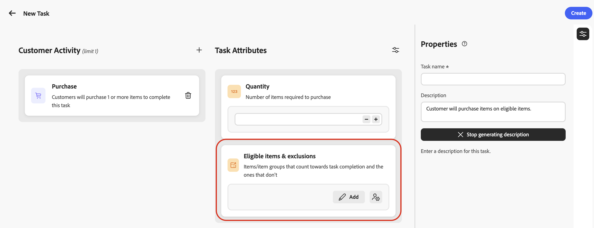
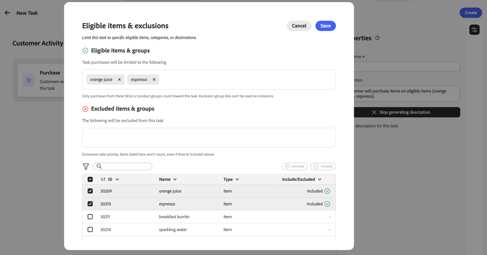
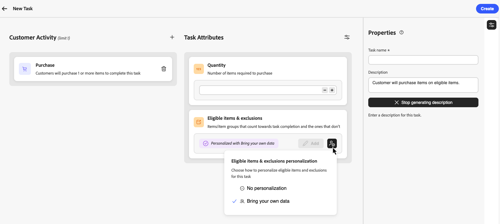

# Create tasks {#create-tasks}

Tasks define the specific actions or milestones that customers must complete to earn rewards in a loyalty challenge. You can configure purchase and spend tasks, or **[!UICONTROL Custom event]** tasks that track Adobe Experience Platform experience events your organization already captures.

Each task represents a measurable action that contributes toward challenge completion. Tasks are reusable components that can be created independently and then added to one or more challenges, or created directly within a challenge.

➡️ [Watch how to create tasks](#video)

## Create a task {#create-task}

>[!CONTEXTUALHELP]
>id="ajo_loyalty_task_create"
>title="Create a task"
>abstract="Select a customer activity (Purchase, Spend, or Custom event), then configure activity-specific attributes. In the Properties pane, set the task name and description."

You can create tasks from two entry points. The configuration process is the same regardless of where you start.

>[!BEGINTABS]

>[!TAB From the Tasks inventory]

Select the **[!UICONTROL Tasks]** tab and select **[!UICONTROL Create Task]**. Tasks created from the inventory are saved and available for reuse across multiple challenges.

>[!TAB From within a challenge]

Open an existing challenge or create a new one. Select **[!UICONTROL Add task]** and click the **[!UICONTROL New]** button. Tasks created this way are automatically added to your challenge and also saved to the Tasks inventory for reuse in other challenges.

>[!ENDTABS]

## Choose customer activity {#choose-activity}

Select the type of activity that customers must perform to complete this task:

* **[!UICONTROL Purchase]**: Customers must purchase one or more items to complete this task
* **[!UICONTROL Spend]**: Customers must spend a specified amount to complete this task
* **[!UICONTROL Custom event]**: Customers must perform an activity represented by an Adobe Experience Platform experience event. For example, a hotel check-in, mobile app action, or review submission. The underlying event must already be captured in Experience Platform and mapped through an event definition in the **[!UICONTROL Loyalty configurations]** menu. [Learn how to configure event definitions](loyalty-admin.md#event-definitions)

To select an activity, click the **+** icon and select the customer activity that best aligns with your outcome goals. Each activity type has specific configurable attributes to further define and shape the task requirements.

## Define the task attributes {#define-attributes}

Configure the task attributes based on the selected activity type. Browse the tabs below to see available attributes for each activity type:

>[!BEGINTABS]

>[!TAB Purchase activity]

Available attributes for **Purchase** activities:

* **[!UICONTROL Quantity]**: Enter the number of items that must be purchased to complete this task.
* **[!UICONTROL Eligible items & exclusions]**: Define items or item groups that count toward task completion and those that don't, or choose **[!UICONTROL Bring your own data]** to drive eligibility from your external data. [Learn more](#eligible-items-exclusions)
* **[!UICONTROL Minimum spend value amount]**: Set a minimum purchase amount requirement.
* **[!UICONTROL Maximum number of transactions]**: Limit how many transactions can be used to complete the task.

>[!TAB Spend activity]

Available attributes for **Spend** activities:

* **[!UICONTROL Amount]**: Enter the total spend amount required to complete the task.
* **[!UICONTROL Eligible items & exclusions]**: Define items or item groups that count toward task completion and those that don't. [Learn more on eligible items and exclusions](#eligible-items-exclusions)
* **[!UICONTROL Maximum number of transactions]**: Specify how many transactions are allowed to meet the spend requirement. You can activate this attribute from the parameters icon.

>[!TAB Custom event activity]

Available attributes for **[!UICONTROL Custom event]** activities:

* **[!UICONTROL Custom event values]**: Enter the values for the custom event that customers must complete. Use a comma to separate each value. These values must match event definitions configured in the **[!UICONTROL Loyalty configurations]** menu. [Learn how to configure event definitions](loyalty-admin.md#event-definitions)

>[!ENDTABS]

## Define eligible items and exclusions {#eligible-items-exclusions}

>[!CONTEXTUALHELP]
>id="ajo_loyalty_task_eligible_items_exclusion"
>title="Eligible items & exclusions"
>abstract="For both **Purchase** and **Spend** activities, use the **[!UICONTROL Eligible items & exclusions]** attribute to select which items and groups count toward task completion and which are excluded. Search for items or groups from the product inventory configured by administrators, then include or exclude them as needed."

<!-- SCREENSHOT: Eligible items & exclusions picker showing the item and group table with Include and Exclude actions -->

For **Purchase** and **Spend** activities, you can use the **[!UICONTROL Eligible items & exclusions]** section to define which items and groups are eligible and which are excluded. This allows you to target specific products, categories, or locations to align with your challenge goals.

The items and groups available in the picker are defined by administrator users in the **[!UICONTROL Loyalty configurations]** menu. Administrators upload the product inventory used for eligible items, and configure organization-wide exclusions that are automatically applied when marketers build tasks. [Learn how to configure product inventory](loyalty-admin.md#product-inventory) and [exclusions](loyalty-admin.md#exclusions)

**[!UICONTROL Custom event]** tasks do not use eligible items and exclusions; completion is driven by the **[!UICONTROL Custom event values]** you configure.

For example, you can limit a task to specific product categories, or exclude gift cards or promotional items from counting toward task completion.

### Set eligible items for the task

To define eligible items, select **[!UICONTROL Add]** from the **[!UICONTROL Eligible items & exclusions]** section.

In the picker, select the items or groups that should count toward task completion, then select **[!UICONTROL Include]**. Included items and groups are added to the eligible list.

If no eligible items or groups are selected, purchases are not limited to a specific inventory set unless exclusions are configured.

### Exclude items from the task

To exclude items from the task, select **[!UICONTROL Add]** from the **[!UICONTROL Eligible items & exclusions]** section.

Select the items or groups that should not count toward task completion, then select **[!UICONTROL Exclude]**.

Items from the global exclusions list are automatically added as exclusions. Exclusions take priority over inclusions: items listed as excluded do not count, even if they are also part of an included group.

### Bring your own data for eligibility & exclusions {#byod-personalization}

>[!AVAILABILITY]
>
>The **[!UICONTROL Bring your own data]** option is currently available to a restricted set of organizations and will be made available more broadly in a future release.

In addition to selecting items and groups in Journey Optimizer, you can also drive eligibility from your external Loyalty Challenges data at runtime using the **[!UICONTROL Bring your own data]** option.

When **[!UICONTROL Bring your own data]** is selected, eligibility per participant is resolved at runtime from data synchronized with your Loyalty Challenges environment instead of a list of item IDs.

To use this option, select the personalization icon in **[!UICONTROL Eligible items & exclusions]**, then choose **[!UICONTROL Bring your own data]**.

>[!IMPORTANT]
>
>When assigning this task to a challenge, select **[!UICONTROL Standard]** as the challenge type. Do not select **[!UICONTROL Bring your own data]** at the challenge level, as that option is reserved for fully data-driven challenges where the entire structure, including tasks and rewards, is supplied externally.

## Define task properties {#define-task-properties}

In the task **[!UICONTROL Properties]** pane, configure the basic task information:

* **[!UICONTROL Task name]**: Enter a descriptive name for the task.
* **[!UICONTROL Task description]**: The description is automatically generated based on the configured activity and attributes. To enter a custom description, toggle off the automatic generation option and enter your description in the text field.

After configuring all attributes and properties, select **[!UICONTROL Create]** to save the task. The task is saved to your Tasks inventory and, if created from within a challenge, is automatically added to that challenge.

## How-to video {#video}

Learn how to create and configure tasks with this step-by-step tutorial:

>[!VIDEO](https://video.tv.adobe.com/v/3496442?quality=12)

