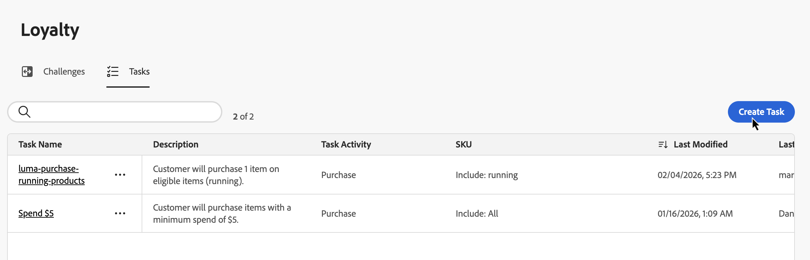
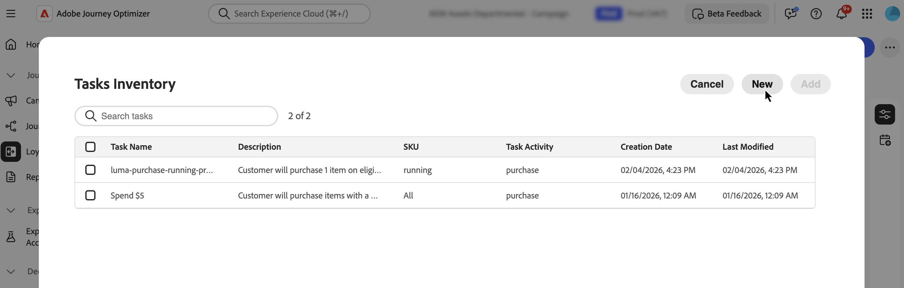
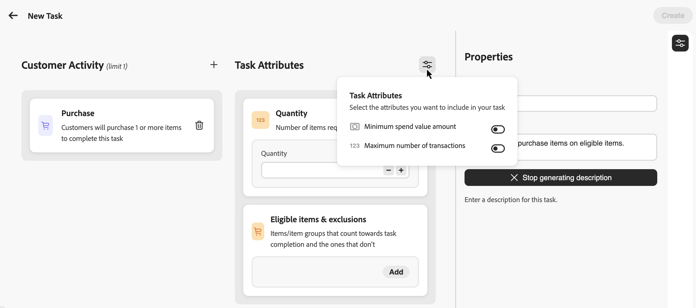
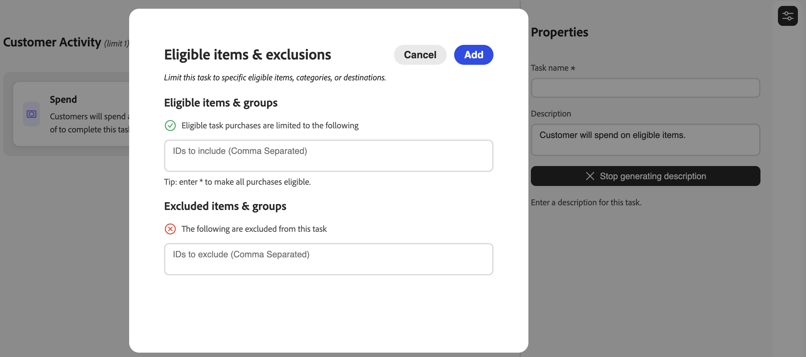
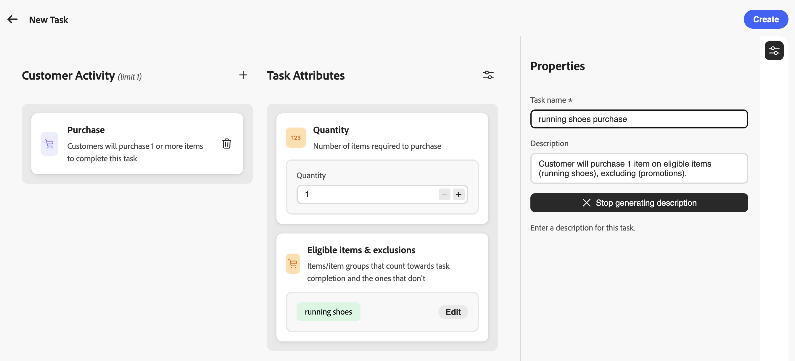

# Create tasks {#create-tasks}

>[!BEGINSHADEBOX]

**Loyalty Challenges documentation:**

* [Get started with Loyalty Challenges](get-started.md)
* [Access & manage challenges and tasks](access-loyalty-challenges.md)
* [Create challenges](create-challenges.md)
* **Create tasks** ◀︎ **You are here**
* [Loyalty Challenges API reference](https://developer.adobe.com/journey-optimizer-apis/references/loyalty-challenges/){target="_blank"}

>[!ENDSHADEBOX]

>[!AVAILABILITY]
>
>This feature is currently in **private beta**. For full details about the release cycle and availability phases, see [Journey Optimizer release cycle](../rn/releases.md).

Tasks define the specific actions or milestones that customers must complete to earn rewards in a loyalty challenge. You can configure task types, quantities, and product requirements to create engaging and personalized loyalty experiences.

Each task represents a measurable action that contributes toward challenge completion. Tasks are reusable components that can be created independently and then added to one or more challenges, or created directly within a challenge.

## Create a task {#create-task}

>[!CONTEXTUALHELP]
>id="ajo_loyalty_task_create"
>title="Create a task"
>abstract="Select a customer activity (Purchase or Spend), then configure activity-specific attributes: quantities or amounts, eligible items and exclusions, and optional limits such as minimum spend or maximum transactions. In the Properties pane, set the task name and description."

You can create tasks from two entry points. The configuration process is the same regardless of where you start.

>[!BEGINTABS]

>[!TAB From the Tasks inventory]

Select the **[!UICONTROL Tasks]** tab and select **[!UICONTROL Create Task]**. Tasks created from the inventory are saved and available for reuse across multiple challenges.

>[!TAB From within a challenge]

Open an existing challenge or create a new one. Select **[!UICONTROL Add task]** and click the **[!UICONTROL New]** button. Tasks created this way are automatically added to your challenge and also saved to the Tasks inventory for reuse in other challenges.

>[!ENDTABS]

## Choose customer activity {#choose-activity}

Select the type of activity that customers must perform to complete this task:

* **[!UICONTROL Purchase]**: Customers must purchase one or more items to complete this task
* **[!UICONTROL Spend]**: Customers must spend a specified amount to complete this task

To select an activity, click the **+** icon and select the customer activity that best aligns with your outcome goals. Each activity type has specific configurable attributes to further define and shape the task requirements.

## Define the task attributes {#define-attributes}

Configure the task attributes based on the selected activity type. Browse the tabs below to see available attributes for each activity type:

>[!BEGINTABS]

>[!TAB Purchase activity]

Available attributes for **Purchase** activities:

* **[!UICONTROL Quantity]**: Enter the number of items that must be purchased to complete this task.
* **[!UICONTROL Eligible items & exclusions]**: Define items or item groups that count toward task completion and those that don't. [Learn more on eligible items and exclusions](#eligible-items-exclusions)
* **[!UICONTROL Minimum spend value amount]**: Set a minimum purchase amount requirement.
* **[!UICONTROL Maximum number of transactions]**: Limit how many transactions can be used to complete the task.

>[!TAB Spend activity]

Available attributes for **Spend** activities:

* **[!UICONTROL Amount]**: Enter the total spend amount required to complete the task.
* **[!UICONTROL Eligible items & exclusions]**: Define items or item groups that count toward task completion and those that don't. [Learn more on eligible items and exclusions](#eligible-items-exclusions)
* **[!UICONTROL Maximum number of transactions]**: Specify how many transactions are allowed to meet the spend requirement. You can activate this attribute from the parameters icon.

>[!ENDTABS]

## Define eligible items and exclusions {#eligible-items-exclusions}

>[!CONTEXTUALHELP]
>id="ajo_loyalty_task_eligible_items_exclusion"
>title="Eligible items & exclusions"
>abstract="For both **Purchase** and **Spend** activities, you can use the **[!UICONTROL Eligible items & exclusions]** attribute to define which items and groups are eligible and which are excluded. This allows you to target specific products, categories, or locations to align with your challenge goals. For example, you can limit a spending task to specific product categories, or exclude gift cards or promotional items from counting toward task completion."

<!-- SCREENSHOT: Eligible items & exclusions popup showing the two sections: "Eligible task purchases are limited to the following" and "The following are excluded from this task" with text input fields -->

For both **Purchase** and **Spend** activities, you can use the **[!UICONTROL Eligible items & exclusions]** attribute to define which items and groups are eligible and which are excluded. This allows you to target specific products, categories, or locations to align with your challenge goals.

For example, you can limit a spending task to specific product categories, or exclude gift cards or promotional items from counting toward task completion.

* To define eligible items, enter specific item IDs, categories, or destination IDs, separated by commas in the **[!UICONTROL Eligible task purchases are limited to the following]** field. If you leave this field empty, all purchases are eligible by default. You can also enter `*` to explicitly make all purchases eligible.

   Example: `SKU001, SKU002, CategoryA`

* To exclude items from the task, enter specific item IDs, categories, or destination IDs in the **[!UICONTROL The following are excluded from this task]** field.

   Example: `CLEARANCE01, GIFTCARD, SALE_CATEGORY`

## Define task properties {#define-task-properties}

In the task **[!UICONTROL Properties]** pane, configure the basic task information:

* **[!UICONTROL Task name]**: Enter a descriptive name for the task.
* **[!UICONTROL Task description]**: The description is automatically generated based on the configured activity and attributes. To enter a custom description, toggle off the automatic generation option and enter your description in the text field.

After configuring all attributes and properties, select **[!UICONTROL Create]** to save the task. The task is saved to your Tasks inventory and, if created from within a challenge, is automatically added to that challenge.
