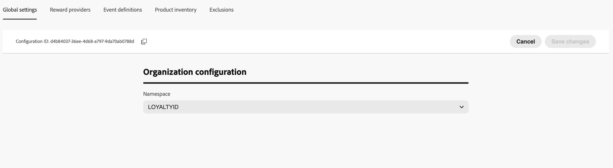
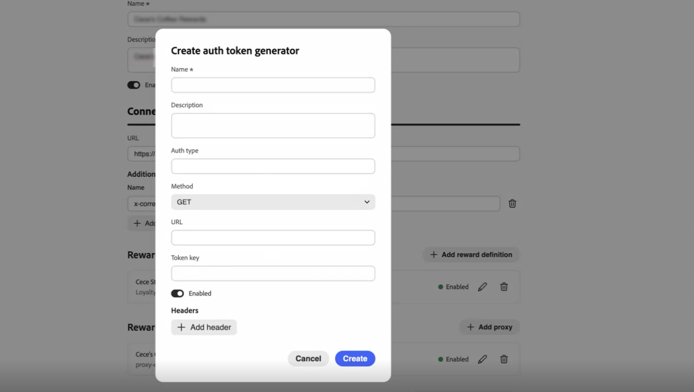
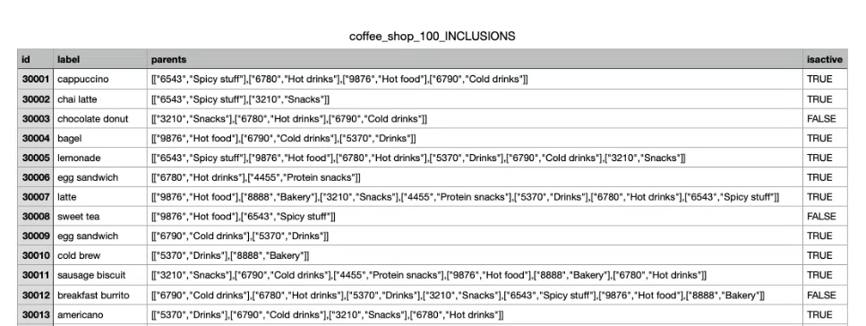
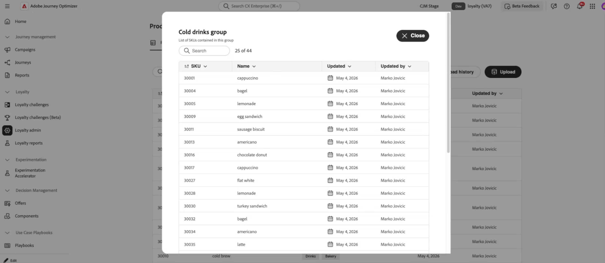

# Configure the loyalty program {#loyalty-admin}

>[!BEGINSHADEBOX]

**Loyalty Challenges documentation:**

* [Get started with Loyalty Challenges](get-started.md)
* [Access & manage challenges and tasks](access-loyalty-challenges.md)
* [Create challenges](create-challenges.md)
* [Create tasks](create-tasks.md)
* [Monitor loyalty challenge performance](loyalty-reporting.md)
* **Configure the loyalty program** ◀︎ **You are here**
* [Loyalty Challenges API reference](https://developer.adobe.com/journey-optimizer-apis/references/loyalty-challenges){target="_blank"}

>[!ENDSHADEBOX]

>[!AVAILABILITY]
>
>This feature is currently in **private beta**. For full details about the release cycle and availability phases in [!DNL Journey Optimizer], see [release cycle](../rn/releases.md).

## Overview {#access-loyalty-admin}

Loyalty program configuration connects [!DNL Journey Optimizer] to your external loyalty systems by setting up reward fulfillment, event mapping, product inventory, and exclusions before marketers author challenges.

>[!NOTE]
>
>Loyalty program configuration requires administrator access to your [!DNL Journey Optimizer] instance, in addition to the permissions needed for Loyalty Challenges. Contact your Adobe administrator to gain access.

To open the configuration interface, navigate to **[!UICONTROL Loyalty]** and select **[!UICONTROL Loyal admin]**. The interface is organized into tabs:

* **Global settings** — Select the Experience Platform identity namespace for your program. [Learn how to configure global settings](#global-settings)
* **Reward providers** — Connect the APIs that fulfill rewards when customers make progress or complete challenges. [Learn how to configure reward providers](#reward-providers)
* **Event definitions** — Map incoming experience events to activities used in **[!UICONTROL Custom AEP event]** tasks. [Learn how to configure event definitions](#event-definitions)
* **Product inventory** — Upload item-to-group mappings for use in task eligibility rules. [Learn how to configure product inventory](#product-inventory)
* **Exclusions** — Upload organization-wide item and group exclusions for task configuration. [Learn how to configure exclusions](#exclusions)

## Global settings {#global-settings}

>[!CONTEXTUALHELP]
>id="ajo_loyalty_admin_global_settings"
>title="Global settings"
>abstract="Select the Adobe Experience Platform identity namespace for your loyalty program."

Open the **[!UICONTROL Global settings]** tab and select the Adobe Experience Platform [identity namespace](https://experienceleague.adobe.com/en/docs/experience-platform/identity/features/namespaces) for your loyalty program in the **[!UICONTROL Namespace]** drop-down. This namespace must match how member profiles are identified in your data.



➡️ [Learn how to work with identity namespaces](https://experienceleague.adobe.com/en/docs/experience-platform/identity/features/namespaces){target="_blank"}

## Reward providers {#reward-providers}

A **reward provider** tells [!DNL Journey Optimizer] where to send fulfillment calls when challenge progress is recorded or a challenge is completed. For example, an API that credits loyalty points or stars to a member account.

To create a reward provider, follow these steps:

1. Open the **[!UICONTROL Reward providers]** tab and select **[!UICONTROL Create reward provider]**.

   

1. Enter a **[!UICONTROL Name]** and **[!UICONTROL Description]**.

1. In the **[!UICONTROL URL]** field, enter the API endpoint that receives fulfillment requests.

1. Add **[!UICONTROL Headers]** as needed for your API (for example, API keys or content types).

1. Configure the resources associated with your reward provider. Expand each section below for field details:

   +++Reward definitions

   Add one entry per reward type your provider supports (for example, program points, stars, or money credit). For each definition:

   * Enter a **[!UICONTROL Name]** and **[!UICONTROL Description]**.
   * Specify whether the definition is **[!UICONTROL Enabled]**.
   * Toggle **[!UICONTROL Default]** to mark one definition as the default for this provider.
   * Define the **payload** sent with fulfillment calls.

   

   +++

   +++Reward proxy

   Route fulfillment calls through an intermediate server instead of sending them directly to your endpoint. On the reward provider and **[!UICONTROL Create proxy]** screens, use the **[!UICONTROL Credentials]** field for proxy authentication.

   * Enter a **[!UICONTROL Name]** and **[!UICONTROL Description]**.
   * Enter **[!UICONTROL Host]** and **[!UICONTROL Port]**.
   * Specify whether the proxy is **[!UICONTROL Enabled]**.
   * In **[!UICONTROL Credentials]**, enter the proxy username and password as JSON. Credentials value typically looks like:

     ```json
     { "userName": "test", "password": "xxxx" }
     ```

   

   +++

   +++Auth token generator

   Use when your API requires a bearer token or similar authentication.

   * Enter a **[!UICONTROL Name]** and **[!UICONTROL Description]**.
   * In **[!UICONTROL Auth type]**, enter the authentication type (for example, Bearer).
   * Select the HTTP method (for example, POST).
   * Enter the token endpoint URL and the **[!UICONTROL Token key]** in the response (for example, `access_token`).
   * Specify whether the auth token generator is **[!UICONTROL Enabled]**.
   * Add any headers required by your token endpoint.

   [!DNL Journey Optimizer] uses this configuration to obtain a fresh token before each call to your reward API.

   

   +++

1. Select **[!UICONTROL Create reward provider]**. The provider and all configured resources are saved together.

After you save, the provider appears in the reward providers list. Marketers can select it when configuring challenge rewards. [Learn how to configure challenge rewards](create-challenges.md#rewards)

To edit a reward provider, open the **[!UICONTROL Reward providers]** tab, select the provider, and update fields in place. Changes to reward definitions, proxies, and auth token generators are automatically saved when you update them.

>[!NOTE]
>
>**[!UICONTROL Bring your own data]** challenges fulfill rewards through your own data integration. Reward providers configured here do not apply to those challenges. [Learn how to create Bring your own data challenges](create-challenges.md#create-the-challenge)

## Event definitions {#event-definitions}

**[!UICONTROL Event definitions]** tell [!DNL Journey Optimizer] which incoming Adobe Experience Platform experience events to process. For example, a purchase or a hotel check-in. Marketers reference these definitions when they create **[!UICONTROL Custom AEP event]** tasks. Events that do not match any definition are ignored.

When your organization sends events in its own JSON format, **[!UICONTROL Schema]** and **[!UICONTROL Transformer]** help [!DNL Journey Optimizer] validate the payload, parse it, and decide whether to track the activity.

To create an event definition, follow these steps:

1. Open the **[!UICONTROL Event definitions]** tab and create a new definition.

   

1. Enter a **[!UICONTROL Name]** for the event (for example, `Coffee purchase`). Marketers see this name when configuring a **[!UICONTROL Custom AEP event]** task.

1. Specify how [!DNL Journey Optimizer] recognizes the event in incoming payloads. Provide an **[!UICONTROL Identifier path]**, an **[!UICONTROL XDM schema ID]**, or both:

   * **[!UICONTROL Identifier path]** — Path to a field in the payload (for example, `data.memberId`). Use this when matching events by values in the payload.
   * **[!UICONTROL Identifier values]** — Values at the identifier path that must be present for this definition to match.
   * **[!UICONTROL XDM schema ID]** — ID of the Experience Platform XDM schema for this event type. Use this when events are captured against a known schema.

1. If needed, paste strings into **[!UICONTROL Schema]** and **[!UICONTROL Transformer]**:

   * **[!UICONTROL Schema]** — Validation string for the incoming payload.
   * **[!UICONTROL Transformer]** — Transformation expression (for example, JSONata) that maps your payload into the format Loyalty Challenges expects.

1. Save the event definition. It appears in the **[!UICONTROL Event definitions]** list and is available when marketers create **[!UICONTROL Custom AEP event]** tasks. [Learn how to create tasks](create-tasks.md#choose-activity)

## Product inventory {#product-inventory}

The **[!UICONTROL Product inventory]** tab groups catalog items so marketers can target them in tasks without entering every item ID. Upload a **CSV file** that maps each item identifier to one or more **product groups** (the same item can belong to several groups). Imported groups are available when configuring task eligibility. [Learn how to create tasks](create-tasks.md)

To upload a product inventory file, follow these steps:

1. Prepare a CSV file that maps each item identifier to one or more product groups. Expand the section below to see an example.

   +++Product inventory CSV example

   

   +++

1. Open the **[!UICONTROL Product inventory]** tab.

1. Select **[!UICONTROL Upload]** and choose your CSV file.

   

1. Review the imported data in the inventory list. The list shows one row per item. The **[!UICONTROL Groups included in]** column shows every product group for that item as a pill, or several pills when the item belongs to multiple groups.

   

1. To see all items in a product group, select that group’s pill in the **[!UICONTROL Groups included in]** column on any row. The group details view lists every item in the group.

   

1. Open **[!UICONTROL Upload history]** to view previous CSV uploads.

## Exclusions {#exclusions}

The **[!UICONTROL Exclusions]** tab defines catalog items and groups that are excluded program-wide, so marketers do not have to list the same exclusions on every task. Upload a **CSV file** that maps each item identifier to one or more **exclusion groups** (the same item can belong to several groups).

After import, excluded items and groups appear in the task builder when marketers configure **[!UICONTROL Eligible items & exclusions]**. [Learn how to define eligible items and exclusions on tasks](create-tasks.md#eligible-items-exclusions)

To upload exclusions, follow these steps:

1. Prepare a CSV file that maps each item identifier to one or more exclusion groups. Expand the section below to see an example.

   +++Exclusions CSV example

   

   +++

1. Open the **[!UICONTROL Exclusions]** tab.

1. Select **[!UICONTROL Upload]** and choose your CSV file.

   

1. Review the imported data in the exclusions list. The list shows one row per item. The **[!UICONTROL Groups included in]** column shows every exclusion group for that item as a pill, or several pills when the item belongs to multiple groups.

<!-- SCREENSHOT: Exclusions list after CSV upload -->

1. To see all items in an exclusion group, select that group’s pill in the **[!UICONTROL Groups included in]** column on any row. The group details view lists every item in the group.

<!-- SCREENSHOT: Exclusion group details -->

1. Open **[!UICONTROL Upload history]** to view previous CSV uploads.
