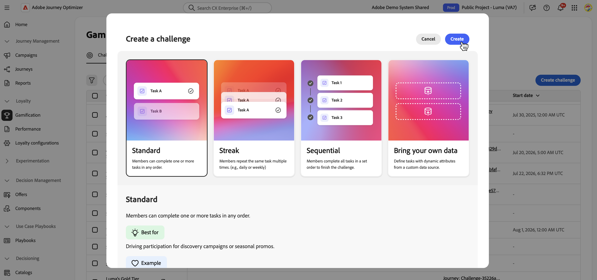

# Interactive demo {#loyalty-challenges-demo}

>[!BEGINSHADEBOX]

**On this page:** Explore an interactive Loyalty Challenges demonstration covering challenge creation, the customer experience, performance and insights, and Loyalty Challenge Management in CX Coworker.

>[!ENDSHADEBOX]

See Loyalty Challenges in action in a self-guided, clickable demo built around "Luma," Adobe's fictional lifestyle retail brand.

The demo covers three flows: the marketer's challenge creation experience (including a Bring your own data challenge and the performance and insights dashboards), the end customer's experience, and Loyalty Challenge Management in CX Coworker.

Click the Luma logo or product name in the top left of any screen to switch between flows.

➡️ [Explore the Loyalty Challenges demo](https://w.adobedemo.com/player?demoId=1893b9c6-a28b-4623-80f0-25e90b2a9193&screenId=5ccf5703-799c-4a8a-ba9c-e86afa1c0d16&showGuide=true&showGuidesToolbar=true&showHotspots=true&openGuidesToolbar=false&guidesToolbarPosition=bottomLeft){target="_blank"}

