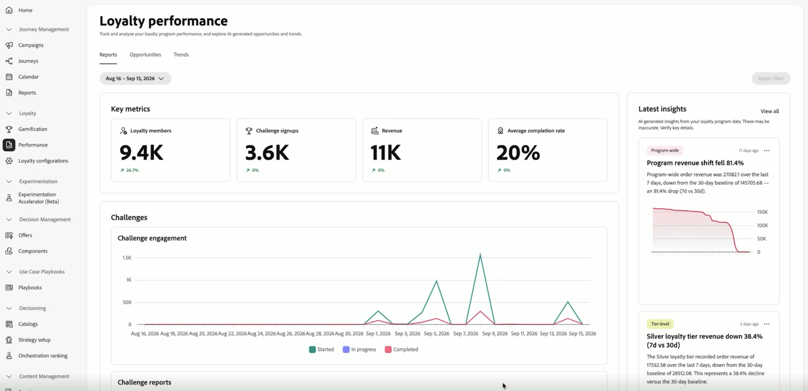
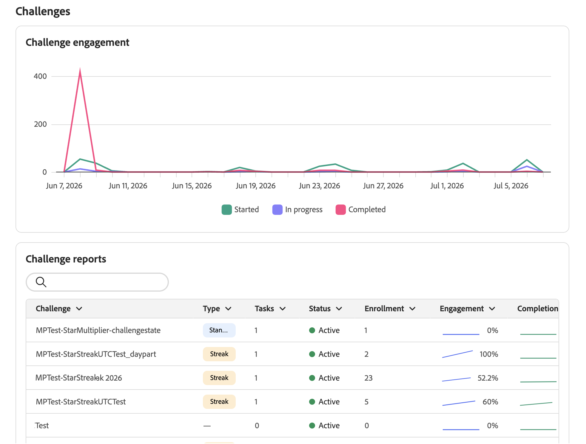
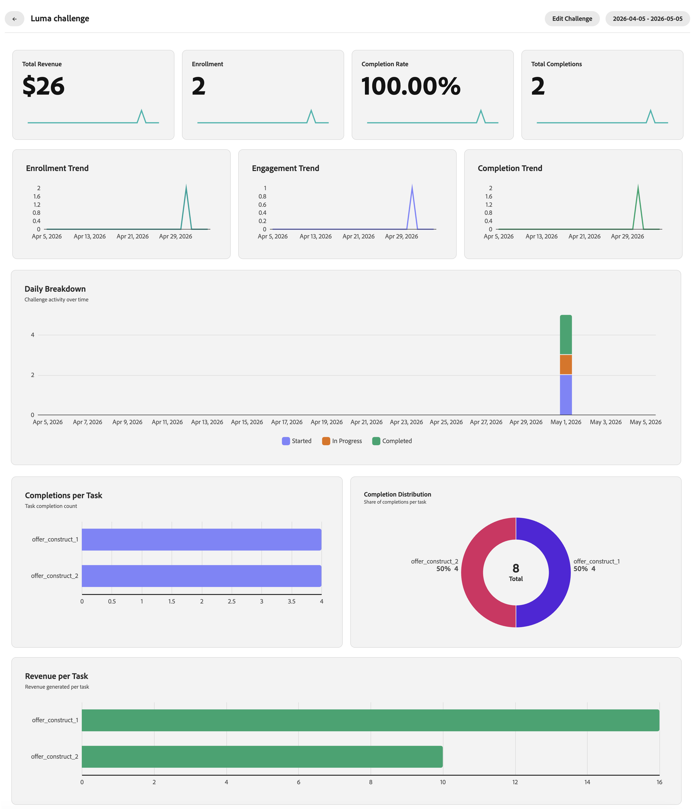
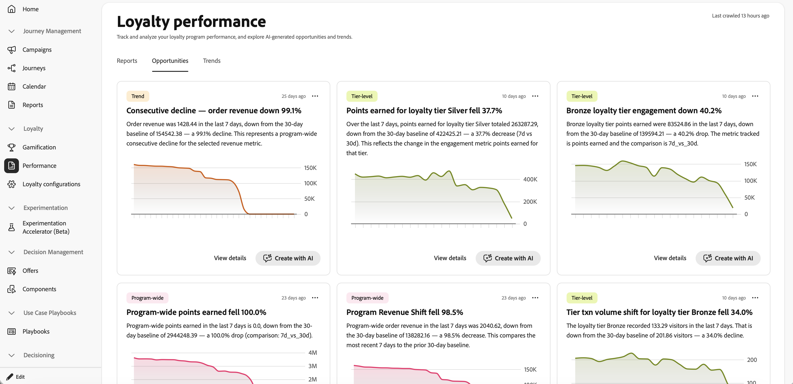
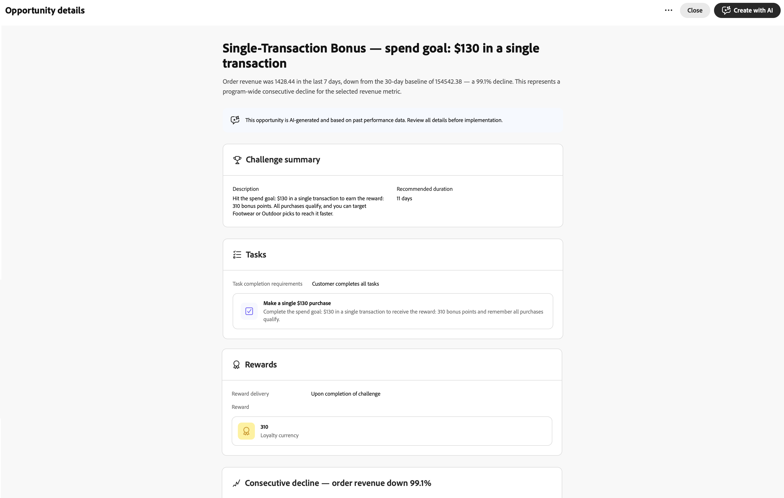
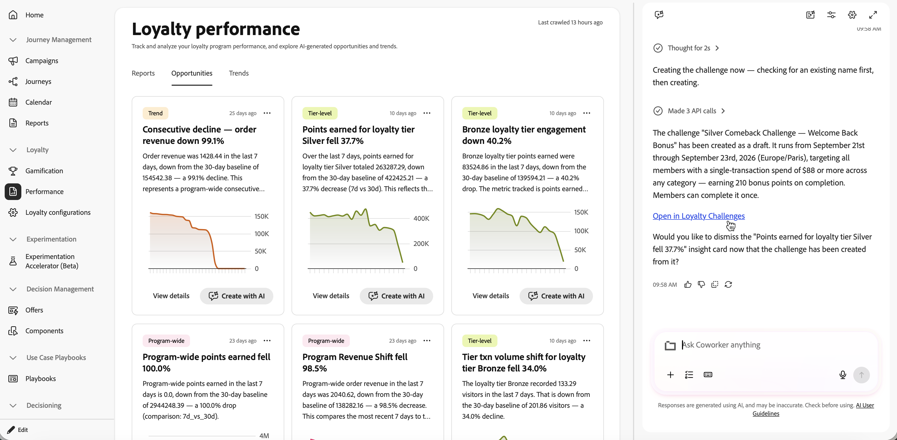
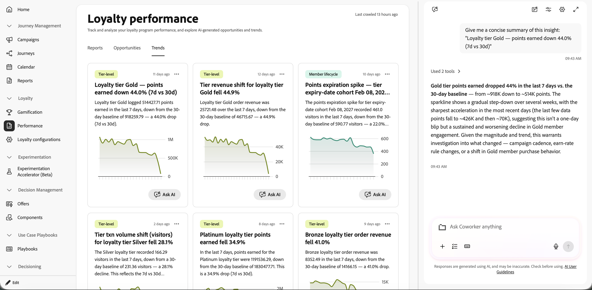

# Explore loyalty performance {#loyalty-performance}

>[!BEGINSHADEBOX]

**On this page:** Learn how to use Loyalty Challenges Reports, Opportunities, and Trends to monitor member activity, challenge performance, reward outcomes, revenue, and program recommendations.

>[!ENDSHADEBOX]

Use Loyalty Challenges reporting to see how your challenges are performing. Check who is signing up, who is completing challenges, and how much revenue your program is generating — all in one place. Data comes from Adobe Customer Journey Analytics.

To open the reporting dashboards, go to **[!UICONTROL Loyalty Challenges]** in Journey Optimizer and select **[!UICONTROL Performance]** in the left navigation.

➡️ [Watch how to measure challenge performance with challenge reports](#video)

The reporting interface has three tabs:

* **[Reports](#reports-view)**: Numbers and charts for your challenges.
* **[Opportunities](#opportunities-view)**: Surfaces grounded, specific challenge recommendations based on loyalty program trends and performance data. View a draft challenge recommendation to solve the issue raised by the opportunity, and create the challenge automatically using Coworker.
* **[Trends](#trends-view)**: Insight cards with an **[!UICONTROL Ask AI]** button that opens Coworker with a request for a concise summary.

## Reports view {#reports-view}

The **Reports** tab gives you an overview of how your program is doing for the selected period. Use the date picker at the top of the page and select the **[!UICONTROL Apply filter]** button to change the reporting period and see updated numbers and charts. 

The **Key metrics** area shows four numbers at a glance. Each metric also displays a percentage change compared to the previous period.

* **Loyalty members**: How many loyalty members were active during the period.
* **Challenge signups**: How many times members enrolled in a challenge.
* **Revenue**: Total revenue tied to challenge activity.
* **Average completion rate**: The percentage of enrolled members who finished at least one challenge.

The **Latest insights** panel on the right shows the most recent insights from your program. Select **[!UICONTROL View all]** to open the **[!UICONTROL Opportunities]** tab.

Below the key metrics, the **Challenges** section gives you two views of challenge activity.

* **Challenge engagement**: A timeline showing how many members started, are in progress, and completed challenges over the period.
* **Challenge reports**: A table of all your challenges with details like type, status, and enrollment numbers. Use the search bar to find a specific challenge. Select a challenge to see its full report with engagement trends and performance details.

    +++Challenge report example

    

    +++

## Opportunities tab {#opportunities-view}

The **[!UICONTROL Opportunities]** tab surfaces grounded, specific challenge recommendations based on loyalty program trends and performance data. Recommendations can focus on increasing member spend, winning back inactive members, improving underperforming challenges, focusing on products or categories, or addressing points expiry.

Opportunities are surfaced only when the analysis identifies a statistically significant trend and a solution that can address it.

Opportunity cards include a category tag that identifies which part of your program the opportunity relates to.

| Category | What it covers |
| --- | --- |
| **Program-wide** | Overall health and performance of your loyalty program |
| **Tier-level** | Earn rates, movement, and distribution across member tiers |
| **Challenge** | Activity, completion rates, and anomalies for a specific challenge or across challenges |
| **Product** | Product catalog performance, including views, redemptions, and catalog-level trends |
| **Member lifecycle** | How members progress through enrollment, engagement, and churn stages |
| **Trend** | Time-based patterns such as weekly cycles, seasonal spikes, or trend reversals |

From the **Opportunities** tab, you can take the following actions on each card:

* **Review the opportunity details** - Select **[!UICONTROL View details]** to open a dialog that previews the AI-drafted challenge, including its summary, tasks, rewards, and the rationale for the recommendation.

  

* **Create or edit a challenge with Coworker** - Select **[!UICONTROL Create with AI]** to open Coworker in the right rail. Use the [Coworker's Loyalty Challenge Management skill](../start/ai-features.md#loyalty-coworker-skills) to create or edit a challenge based on the selected opportunity, provide any missing details, and continue without leaving the reporting page.

  Once the challenge is created, select the **Open in Loyalty Challenges** link in the chat to open the draft challenge and verify the challenge dates, tasks, and other fields before publishing.

  

## Trends tab {#trends-view}

The **[!UICONTROL Trends]** tab displays loyalty insights and performance patterns that ground the recommendations in the **[!UICONTROL Opportunities]** tab.

To explore a trend with AI, select **[!UICONTROL Ask AI]** on a trend card. This opens Coworker in the right rail with a prefilled request to provide a concise summary of the selected insight. You can then ask follow-up questions or explore its implications.

## How-to videos {#video}

➡️ Watch how to measure challenge performance with challenge reports

>[!VIDEO](https://video.tv.adobe.com/v/3497534?quality=12)

{{$include /help/_includes/do-not-localize/loyalty-challenges/ai-augmented-loyalty-performance.md}}
