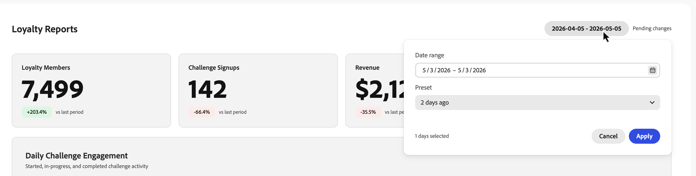
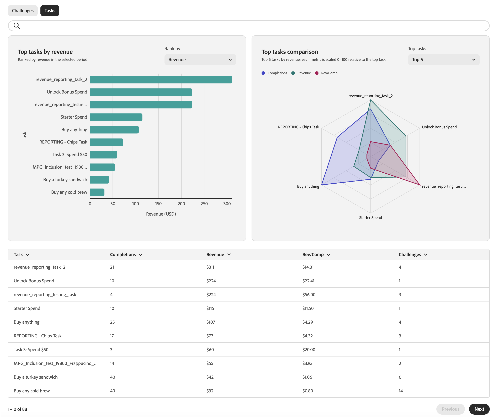

# Monitor loyalty challenge performance {#loyalty-reporting}

>[!BEGINSHADEBOX]

**Table of contents**

[Get started with Loyalty Challenges](get-started.md)

<table style="table-layout:fixed">
<tr style="border: 0;">
<td style="vertical-align:top;">

**Create and manage challenges**

* [Access & manage challenges and tasks](access-loyalty-challenges.md)
* [Create challenges](create-challenges.md)
* [Create tasks](create-tasks.md)
* **Monitor loyalty challenge performance** ◀︎ **You are here**

</td>
<td style="vertical-align:top;">

**Configure and integrate**

<!-- * [Configure loyalty challenges](loyalty-admin.md) -->
* [Loyalty data and datasets](loyalty-data-and-datasets.md)
* [Loyalty Challenges API reference](https://developer.adobe.com/journey-optimizer-apis/references/loyalty-challenges){target="_blank"}

</td>
</tr>
</table>

>[!ENDSHADEBOX]

>[!AVAILABILITY]
>
>This feature is currently in **private beta**. For full details about the release cycle and availability phases, see [Journey Optimizer release cycle](../rn/releases.md).

Loyalty Challenges reporting provides challenge-level dashboards so you can track key metrics such as audience funnel performance, task completion rates, reward issuance, and revenue impact. All data is sourced from Adobe Customer Journey Analytics and presented in a custom, purpose-built interface.

<!--
A direct **Analyze in CJA** button will be added to the reporting interface before the feature reaches general availability.
-->

## Access loyalty reports {#access-reports}

To open the loyalty reporting dashboards, navigate to **[!UICONTROL Loyalty Challenges (Beta)]** in Journey Optimizer and select **[!UICONTROL Loyalty reports]** from the left navigation.

The reporting interface provides three views, each offering a different level of detail. The **[Overview](#overview)** displays a summary across all your active challenges. Below it, two tabs let you switch between more granular views:

* **[Challenges](#challenges-view)**: A per-challenge breakdown with drill-down capability,
* **[Tasks](#tasks-view)**: A task-level view of revenue and completion metrics.

You can adjust the date range for all views using the date picker at the top of the page. Standard date presets are also available.

## Overview {#overview}

The **Overview** page shows metrics aggregated across all active challenges for the selected period.

The top of the page displays the following metrics:

**Loyalty Members** - Number of loyalty program members who were active during the selected period.
**Challenge Signups** - Total number of new challenge enrollments across all challenges.
**Revenue** - Total revenue tied to challenge activity during the period.
**Avg Completion rate** - Percentage of enrolled customers who completed at least one challenge.

Below these metrics, a **Daily Challenge Engagement** timeline shows how challenge participation evolved over the period, plotting three series:

* Customers who **started** a challenge,
* Customers who moved to **in-progress** status,
* Customers who **completed** a challenge.

## Challenges view {#challenges-view}

The **Challenges** tab breaks down performance by individual challenge. Each challenge is listed with key columns such as Type, Status, Enrollment, Completion, and more. The list is sorted by last modification date and displays ten challenges at a time. Use the **Next** button at the bottom to browse further.

Select any challenge from the list to open its detail view. The report includes several metric blocks such as Total Revenue, Enrollment, Completion Rate, and trend charts, as well as a Daily Breakdown.

+++Challenge report example

+++

## Tasks view {#tasks-view}

The **Tasks** tab provides a cross-challenge view of task performance. You can toggle between top tasks by revenue and top tasks by completions to focus on the metric most relevant to you.

The tab also highlights the top 6 tasks by revenue, giving a quick view of which tasks drive the most value.

Below the radar graph, a task list displays every task with key columns such as Completions, Revenue, and the challenges each task belongs to. The list is sorted by revenue and shows ten tasks at a time. Use the **Next** button to browse further.

