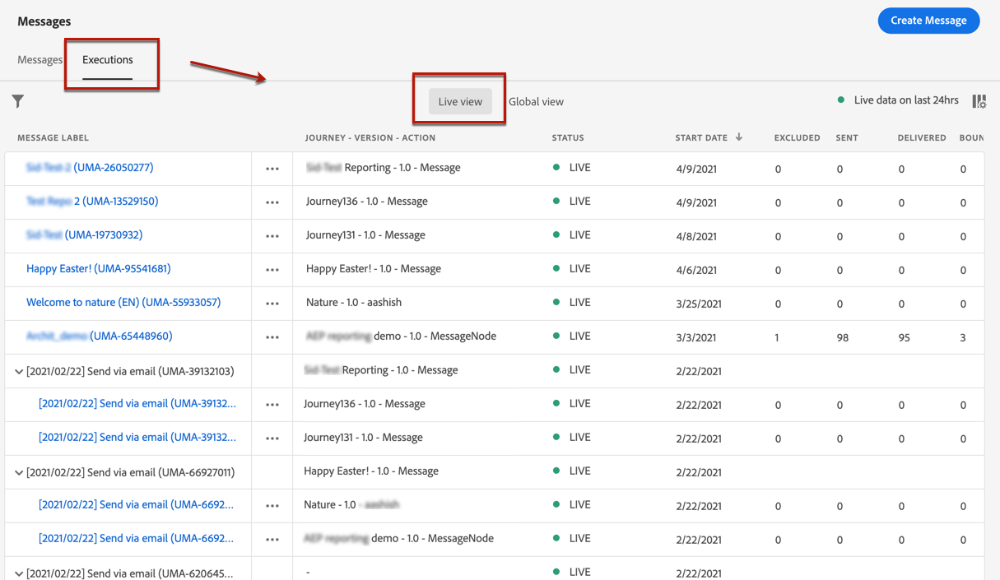
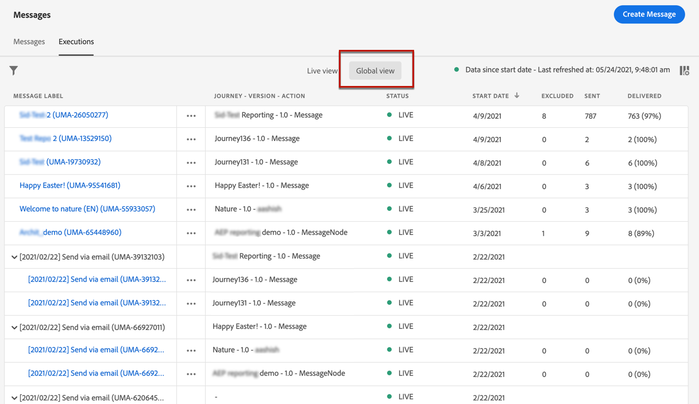
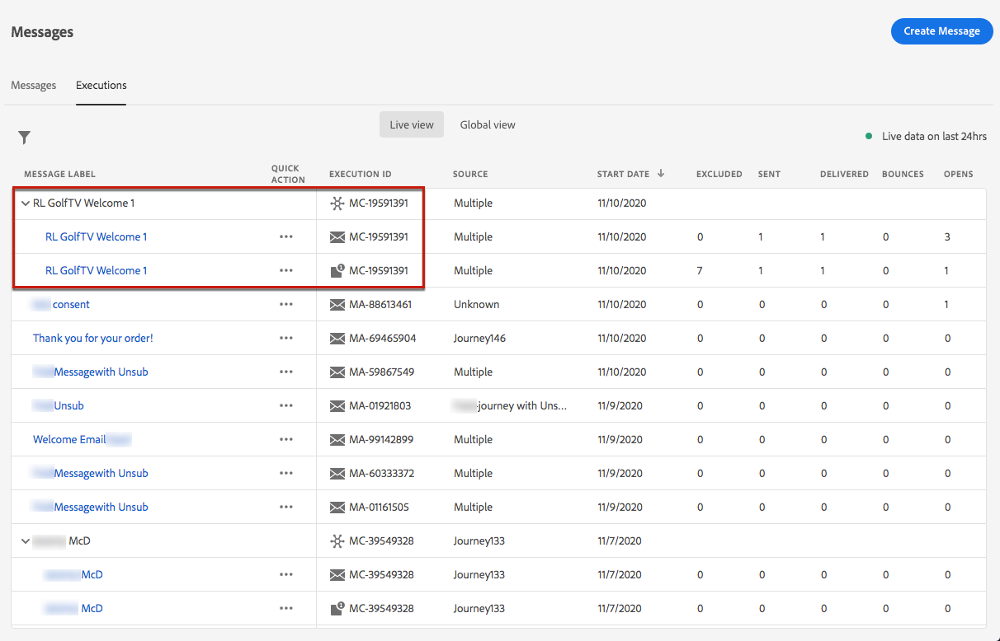
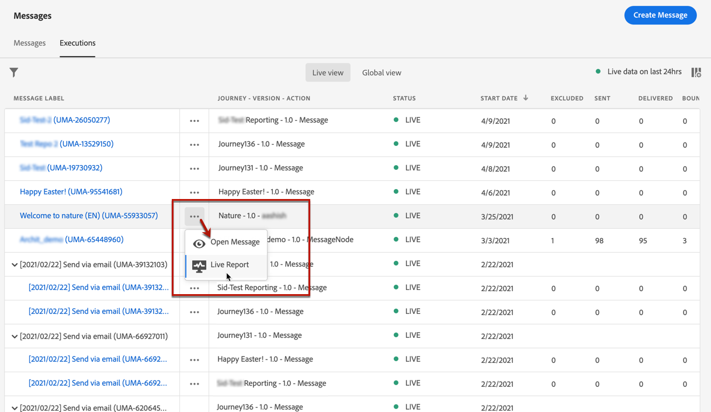

# Message monitoring {#monitor-message-execution}

To make sure your messages are successfully executed, sent and delivered, [!DNL Journey Optimizer] offers capabilities to monitor the messages that are currently published and triggered. You can see how your messages are performing across journeys <!--and APIs--> in real-time from the **[!UICONTROL Executions]** list.

To access this list, from the **[!DNL Journey Optimizer]** home page, select **[!UICONTROL Messages]**, and click the **[!UICONTROL Executions]** tab.

This tab provides two views: **[!UICONTROL Live view]** and **[!UICONTROL Global view]**.

* The **[!UICONTROL Live view]** tab provides a **real-time overview of all the executed messages** triggered by one or more [journeys](building-journeys/journey.md) **over the last 24 hours only**.

  

  This list auto-refreshes every sixty seconds. If no execution occurred in the last 24 hours for a specific message, all columns will display null values (0) for that message.

* The **[!UICONTROL Global view]** tab provides an **overview of all the executed messages** triggered by one or more [journeys](building-journeys/journey.md) **since the message start date**.

  

  This list auto-refreshes every ninety minutes. The data are aggregated over time since each message start date.

If a message is published but not triggered yet by a journey, it it not listed in any of the tabs. Only the following elements are listed:
* Messages that have been triggered, but not yet started (pending).
* Messages that have been triggered and that are currently running (in progress).

<!--For multichannel messages, one row per channel is displayed for each message. STILL VALID? looks like NOT-->

>[!NOTE]
>
>If a message has been used in several journeys, one row per journey is displayed for each execution.

<!---->

<!--If a message has been used in several journeys, the **[!UICONTROL Source]** column displays **[!UICONTROL Multiple]**.-->

By default, the messages are displayed starting from the most recent execution date. Click the **[!UICONTROL Filters]** icon to search the messages according to the channel, the start date, and/or the end date.

The <!--**[!UICONTROL Quick action]**-->second column enables to open the corresponding [message](create-message.md) and to access the [Live Report](reports/live-report.md) if you are in the **[!UICONTROL Live view]**, or the [Global Report](reports/global-report.md) if you are in the **[!UICONTROL Global view]**.

For each message execution, a number of indicators are displayed:

* **[!UICONTROL Message label]**: Message title that you defined upon [creating the message](create-message.md). The execution ID, which is automatically generated, is displayed in parentheses.

  <!--**[!UICONTROL Execution ID]**: Automatically generated identifier.
  **[!UICONTROL Source]**: Name of the journey leveraging that message.-->

* **[!UICONTROL Journey - Version - Action]**: Name of the journey leveraging the message, version of the journey, and label of the action leveraging the message in the journey.

* **[!UICONTROL Status]**: Message execution status. <!--List all the possible statuses? For now only Live status? The user cannot stop or cancel the execution. TBC by Fred-->

* **[!UICONTROL Start date]**: Date and time when the message has been executed from the journey.

  <!--Targeted: Number of targeted profiles for each message execution. To come?-->

* **[!UICONTROL Excluded]**: Number of profiles that have been excluded from the initial target due to exclusion rules.

* **[!UICONTROL Sent]**: Number of messages that have been sent.

* **[!UICONTROL Delivered]**: Number of messages successfully delivered in the recipient's mailbox (email) or device (push) without generating a bounce or any other delivery error.

* **[!UICONTROL Bounces]**: Number of messages that cannot be delivered because of a delivery failure. [Learn more on bounces](suppression-list.md).

* **[!UICONTROL Opens]**: Number of messages that have been opened.

* **[!UICONTROL Clicks]**: Number of clicks on links in an email.

  >[!NOTE]
  >
  >Clicks do not exist for push notifications: when a user clicks a push notification, it opens the app, which can only be considered as an open.

* **[!UICONTROL Errors]**: Number of messages that cannot be sent because of a technical failure.

* **[!UICONTROL Spam complaints]**: Number of messages that were marked as spam by recipients. [Learn more on complaints](https://experienceleague.adobe.com/docs/deliverability-learn/deliverability-best-practice-guide/metrics-for-deliverability/complaints.html#metrics-for-deliverability).

Clicking each hyperlink will open the corresponding message summary view. [Learn more on messages](create-message.md).
