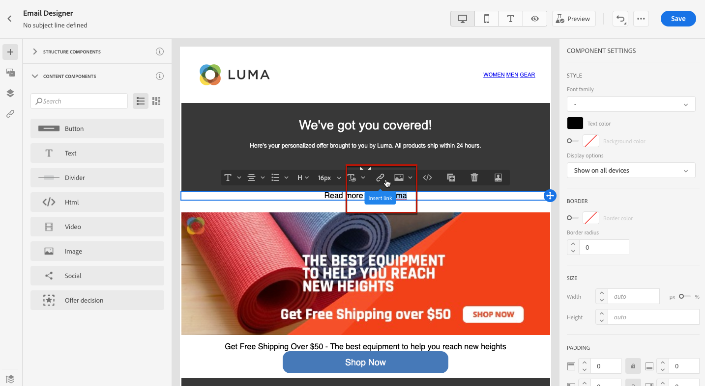
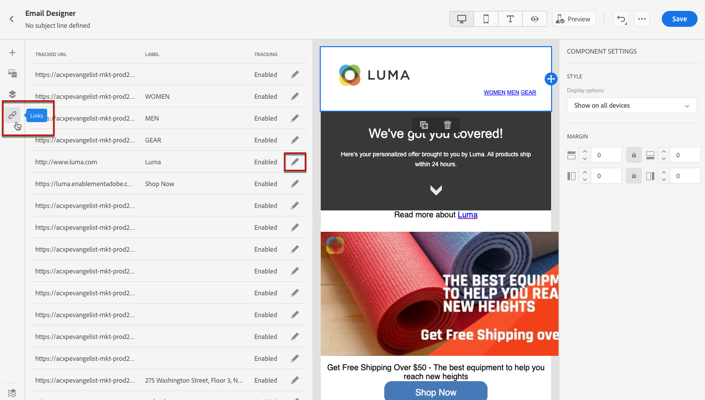
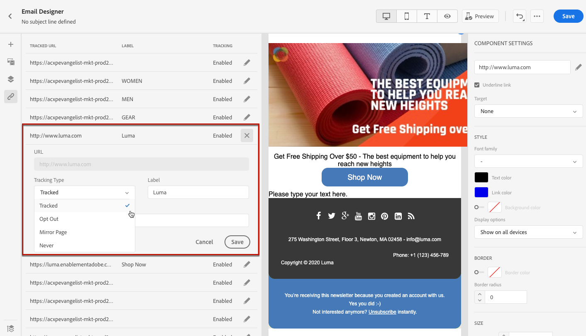

# Add links and track messages {#tracking}

Use [!DNL Journey Optimizer] to add links to your content and track the messages sent in order to monitor the behavior of your recipients.

## Enable tracking {#enable-tracking}

You can enable tracking at the message level by checking the **[!UICONTROL Open Tracking for email]** and/or **[!UICONTROL Click Tracking for email]** options when [creating your message](create-message.md).

>[!NOTE]
>
>Both options are enabled by default.

This will let you track the behavior of your recipients through:
* **[!UICONTROL Open Tracking for email]**: Messages that have been opened.
* **[!UICONTROL Click Tracking for email]**: Clicks on links in an email.

## Insert links {#insert-links}

When designing a message, you can add links to your content.

>[!NOTE]
>
>When [tracking is enabled](#enable-tracking), all links included in the message content are tracked.

To insert links into your email content, follow the steps below:

1. Select an element and click **[!UICONTROL Insert link]** from the contextual toolbar.

    

1. Choose the type of link you want to create:

    * **[!UICONTROL External link]**: Insert a link to an external URL.

    * **[!UICONTROL Unsubscription link]**: Insert a link to unsubscribe from receiving communications from your brand. Learn more on opt-out management in [this section](consent.md#opt-out-management).

    * **[!UICONTROL Mirror page]**: Insert a link to display the email content in a web browser. Learn more in [this section](#mirror-page).

    * **[!UICONTROL Opt-out]**: Insert a link to enable users to quickly unsubscribe from your communications without the need to confirm opting out. Learn more in [this section](#one-click-opt-out-link).

    

1. You can personalize your links. Learn more on personalized URLs in [this section](personalization/personalization-syntax.md).

1. Save your changes.

1. Once the link is created, you can still modify it from the **[!UICONTROL Component settings]** pane on the right. 

    * Click the pencil icon to edit the link.
    * You can choose to underline the link or not by checking the corresponding option.

    

## Link to a mirror page {#mirror-page}

The mirror page is an HTML page accessible online via a web browser. Its content is identical to the content of your email.

To add a link to a mirror page in your email, [insert a link](#insert-links) and select **[!UICONTROL Mirror page]** as the type of link.

The mirror page is automatically created.

>[!NOTE]
>
>You cannot edit the auto-generated link.

Once the email is sent, when the recipients click the mirror page link, the content of the email is displayed in their default web browser.

>[!NOTE]
>
>In the [proof](preview.md#send-proofs) sent to the test profiles, the link to the mirror page is not active. It is only activated in the final messages.

The retention period for a mirror page is 60 days. After that delay, the mirror page will no longer be available.

## One-click opt-out link {#one-click-opt-out-link}

To enable your recipients to quickly unsubscribe from receiving communications from your brand, you can insert a one-click opt-out link into your email content. This capacity prevents users from being redirected to a landing page where they need to confirm their choice, which speeds up the unsubscribe process.

To add an opt-out link in your email, follow the steps below.

1. [Insert a link](#insert-links) and select **[!UICONTROL Opt-out]** as the type of link.

    

1. Select how you want to apply the opting out: at the channel, profile ID, or subscription level.

    

1. Enter the URL of the landing page where the user will be redirected once unsubscribed. This page is only here to confirm that opting out was successful.

    

1. Click **[!UICONTROL Save]**.

Once your message is sent, if a recipient clicks the opt-out link, he is immediately opted out.

## Manage tracking {#manage-tracking}

The [Email Designer](create-email-content.md) allows you to manage the tracked URLs, such as editing the tracking type for each link.

1. Click the **[!UICONTROL Links]** icon from the left pane to display the list of all the URLs of your content that will be tracked.

    This list enables you to have a centralized view and to locate each URL in the email content.

1. To edit a link, click the corresponding pencil icon.

    

1. You can modify the **[!UICONTROL Tracking Type]** if needed:

   

    For each tracked URL, you can set the tracking mode to one of these values:

    * **[!UICONTROL Tracked]**: Activates tracking on this URL.
    * **[!UICONTROL Opt out]**: Considers this URL as an opt-out or unsubscription URL.
    * **[!UICONTROL Mirror page]**: Considers this URL is a mirror page URL.
    * **[!UICONTROL Never]**: Never activates tracking of this URL. <!--This information is saved: if the URL appears again in a future message, its tracking is automatically deactivated.-->

The number of messages that have been opened and the number of links that have been clicked are listed in the [Executions tab](message-monitoring.md).

Reporting on openings and clicks is available in the [Email Live report](reports/email-live-report.md) and in the [Email Global report](reports/email-global-report.md).

