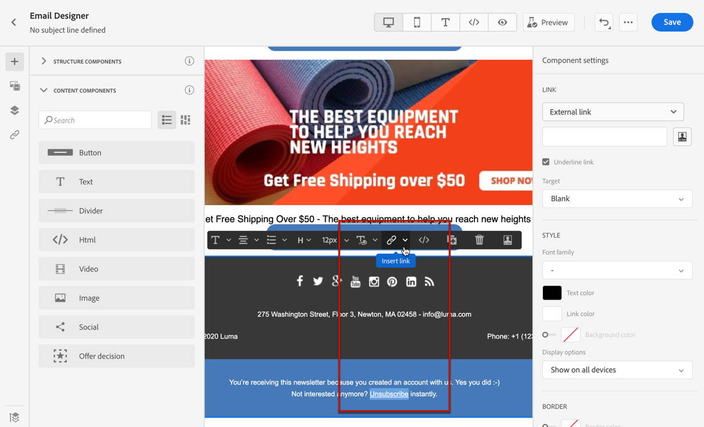
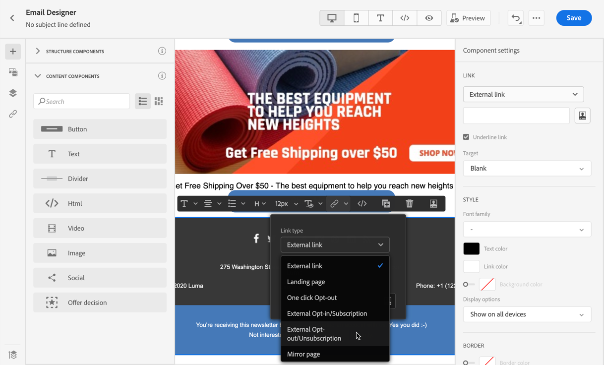
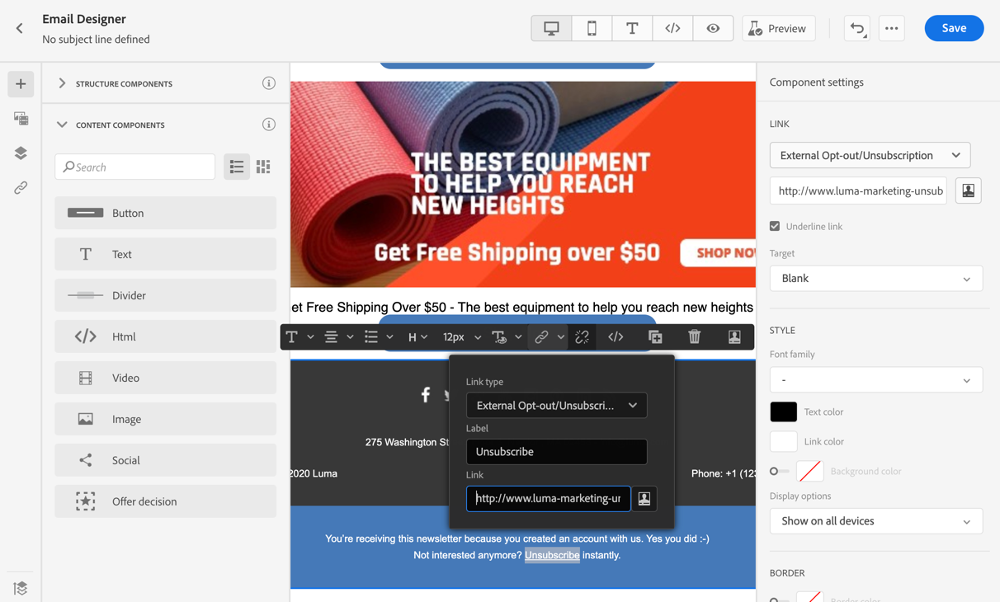

# Manage consent {#consent}

Use [!DNL Journey Optimizer] to track your recipients' consent for communication and understand how they want to engage with your brand by managing their preferences and subscriptions.

Regulations such as GDPR state that you must comply with specific requirements before being able to use information from Data Subjects. Moreover, Data Subjects should be able to modify their consent at any time.

**Why is it important?**

* Failing to comply with these regulations introduces regulatory legal risks for your brand.
* It helps you avoid sending unsolicited communications to your recipients, which could make them mark your messages as spam and harm your reputation.

Learn more on managing Privacy and the applicable regulations in the [Experience Platform documentation](https://experienceleague.adobe.com/docs/experience-platform/privacy/home.html){target="_blank"}.

>[!NOTE]
>
>In [!DNL Journey Optimizer], consent is handled by the Experience Platform [Consent schema](https://experienceleague.adobe.com/docs/experience-platform/xdm/field-groups/profile/consents.html){target="_blank"}. By default, the value for the consent field is empty and treated as consent to receive your communications. You can modify this default value while onboarding to one of the possible values listed [here](https://experienceleague.adobe.com/docs/experience-platform/xdm/data-types/consents.html#choice-values){target="_blank"}.

## Opt-out management {#opt-out-management}

Providing the capability to recipients to unsubscribe from receiving communications from a brand is a legal requirement. Learn more about the applicable legislation in the [Experience Platform documentation](https://experienceleague.adobe.com/docs/experience-platform/privacy/regulations/overview.html#regulations){target="_blank"}.

Therefore, you must always include an **unsubscribe link** in every email sent out to recipients:

* Upon clicking this link, the recipients will be directed to a landing page to confirm opting out.
* After confirming their choice, the profiles' data will be updated with this information.

### Add an unsubscribe link {#add-unsubscribe-link}

You first need to add an unsubscribe link into a message. To do this, follow the steps below:

1. Build your own unsubscription landing page.

1. Host it on the third-party system of your choice.

1. [Create a message](create-message.md) in [!DNL Journey Optimizer].

1. Select text in your content and [insert a link](message-tracking.md#insert-links) using the contextual toolbar.

    

1. Select **[!UICONTROL External Opt-out/Unsubscription]** from the **[!UICONTROL Link type]** drop-down list.

    

1. In the **[!UICONTROL Link]** field, paste the link to your third-party landing page.

    

1. Click **[!UICONTROL Save]**.

1. Save your content and [publish your message](publish-manage-message.md).

### Implement an API call for opt-out {#opt-out-api}

To have your recipients opted out when they submit their choice from the landing page, you must implement a **Subscription API call** through Adobe I/O to update the corresponding profiles' preferences.

This Adobe I/O POST call is as follows:

Endpoint: platform.adobe.io/journey/imp/consent/preferences

Query parameters:

* **params**: contains the encrypted payload
* **sig**: signature
* **pid**: encrypted profile ID

These three parameters will be included into the third-party landing page URL sent to your recipient:


Header requirements:

* x-api-key
* x-gw-ims-org-id
* x-sandbox-name 
* authorization (user token from your technical account)

Request body:

```
{
   "marketing": [
       {
            "type": "email",           
            "choice": "no",          
            "scope": "channel"       
        }
    ],
 
}
```

[!DNL Journey Optimizer] will use these parameters to update the corresponding profile's choice through the Adobe I/O call.

### Send the message with the unsubscribe link {#send-message-unsubscribe-link}

Once you configured the unsubscribe link to your landing page and implemented the API call, your message is ready to be sent.

1. Send the message including the link through a [journey](../building-journeys/journey.md).

1. Once the message is received, if the recipient clicks the unsubscribe link, your landing page is displayed.

    

1. If the recipient submits the form (here, by hitting the **Unsubscribe** button in your landing page), the profile data is updated through the [Adobe I/O call](#opt-out-api).

1. The opted-out recipient is then redirected to a confirmation message screen indicating that opting out was successful.

    

    As a result, this user will not receive communication from your brand unless subscribed again.

1. To check that the corresponding profile's choice has been updated, go to Experience Platform and access the profile by selecting an identity namespace and a corresponding identity value. Learn more in the [Experience Platform documentation](https://experienceleague.adobe.com/docs/experience-platform/profile/ui/user-guide.html#getting-started){target="_blank"}.

    

    In the **[!UICONTROL Attributes]** tab, you can see the value for **[!UICONTROL choice]** has changed to **[!UICONTROL no]**.

## One-click opt-out {#one-click-opt-out}

As many customers look for an easier process to unsubscribe, you can also add a one-click opt-out link into your email content. This link will enable your recipients to quickly unsubscribe from your communications, without being redirected to a landing page where they need to confirm opting out.

Learn how to add an opt-out link to your message content in [this section](message-tracking.md#one-click-opt-out-link).

Once your message is sent through a [journey](../building-journeys/journey.md), if a recipient clicks the opt-out link, their profile is immediately opted out.

## Unsubscribe link in header {#unsubscribe-email}

If the recipients' email client supports displaying an unsubscribe link in the email header, emails sent with [!DNL Journey Optimizer] automatically include this link.

For example, the unsubscribe link will display like this in Gmail:


Depending on the email client, clicking the unsubscribe link from the header will have one of the following impacts:

* The corresponding profile is immediately opted out and this choice is updated in Experience Platform. Learn more in the [Experience Platform documentation](https://experienceleague.adobe.com/docs/experience-platform/profile/ui/user-guide.html#getting-started){target="_blank"}.

* It has the same effect as clicking the unsubscribe link from the email content: the recipient is redirected to a landing page including a button to confirm opting out. Learn more on opt-out management in [this section](#opt-out-management).

## Push opt-out management {#push-opt-out-management}

Push recipients can unsubscribe through their devices themselves.

For example, upon downloading or when using your app, they can select to stop notifications. Similarly, they can change the notification settings through the mobile operating system.
