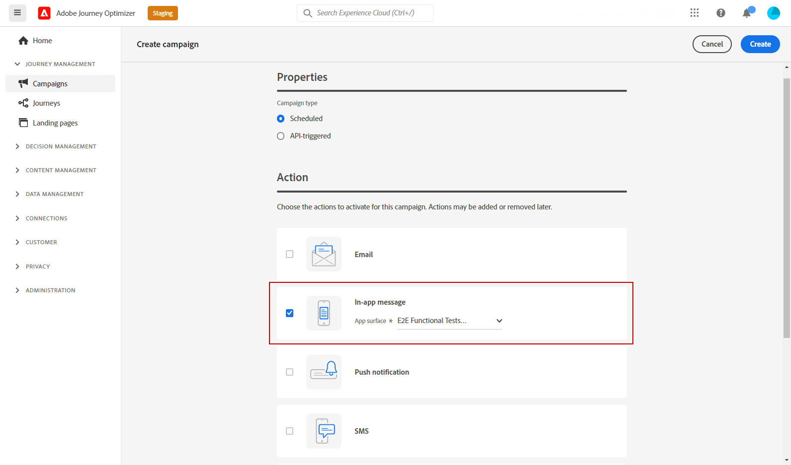
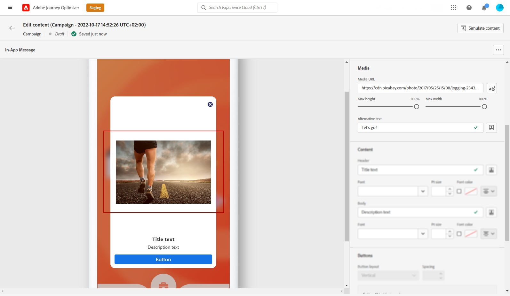
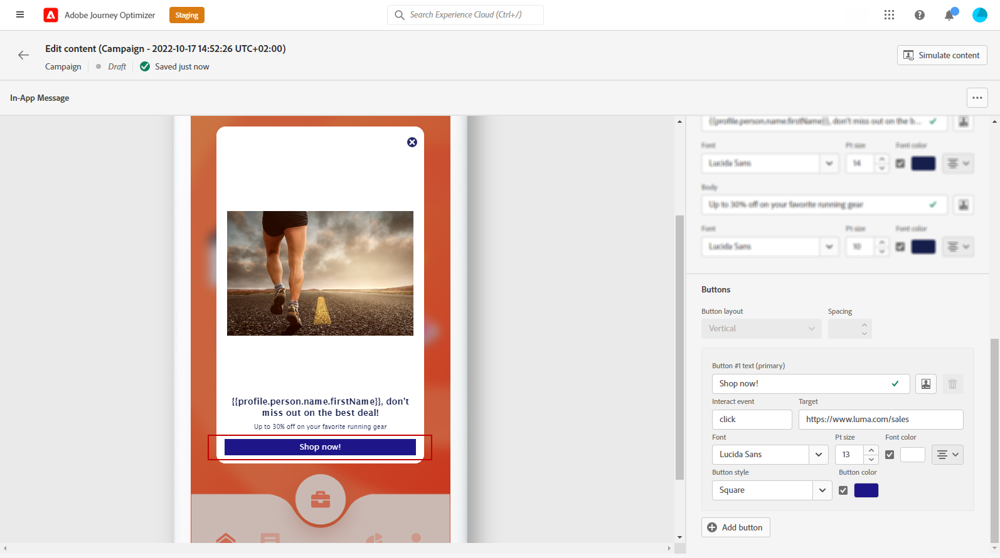
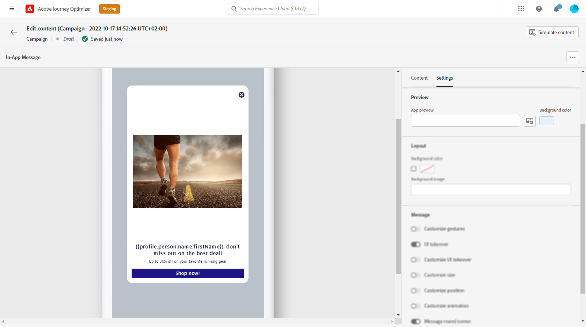
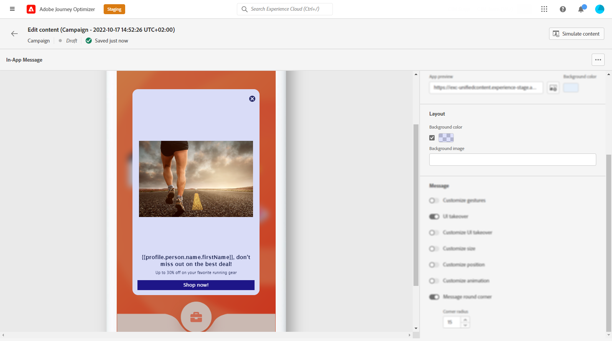
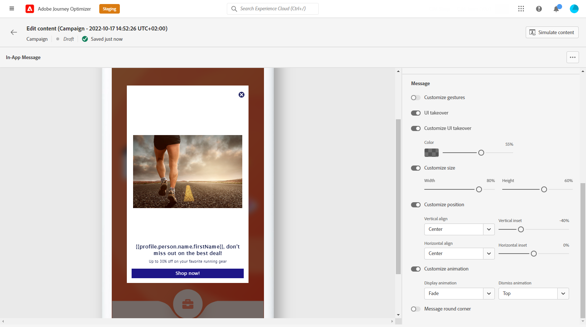

# Create an In-app message {#create-in-app}

## Create a campaign and an In-app message{#create-in-app-in-a-campaign}

To create an In-app message, follow the steps below:

1. Access the **[!UICONTROL Campaigns]** menu, then click **[!UICONTROL Create campaign]**.

1. In the **[!UICONTROL Properties]** section, specify when you want to execute the campaign. [Learn more](../campaigns/create-campaign.md#create).

1. In the **[!UICONTROL Actions]** section, choose the **[!UICONTROL In-app message]** and the **[!UICONTROL App surface]** previously configured for your In-app message. Then, click **[!UICONTROL Create]**. 

    [Learn more on In-app configuration](../configuration/inapp-configuration.md).

    

1. From the **[!UICONTROL Properties]** section, edit your Campaign's **[!UICONTROL Title]** and **[!UICONTROL Description]**.

1. To assign custom or core data usage labels to the landing page, select **[!UICONTROL Manage access]**. [Learn more](../administration/object-based-access.md).

1. Click the **[!UICONTROL Select audience]** button to define the audience to target from the list of available Adobe Experience Platform segments. [Learn more](../segment/about-segments.md).

    

1. In the **[!UICONTROL Identity namespace]** field, choose the namespace to use in order to identify the individuals from the selected segment. [Learn more](../event/about-creating.md#select-the-namespace).

1. Choose the frequency of your trigger when your In-app message is active:

    * **[!UICONTROL Show every time]**
    * **[!UICONTROL Show once]**
    * **[!UICONTROL Show until click through]**

1. Choose the event that triggers your message from the **[!UICONTROL Mobile app trigger]**
drop-down. 
    
    By choosing a trigger, you choose which user action causes the In-app message to display.

    

1. To execute your campaign on a specific date or on a recurring frequency, configure the **[!UICONTROL Schedule]** section. [Learn more](../campaigns/create-campaign.md#schedule).

1. You can now start designing your content with the **[!UICONTROL Edit content]** button. 

    

## Design your In-app content {#design-content}

Edit the In-app content to configure experience options, including the message layout and display, text, and button options.

You can preview the experience directly from your browser.

To configure the message content, click the **[!UICONTROL Edit content]** button.

Use the options on the left section of the screen to design your In-app message content.

The **[!UICONTROL Advanced formatting]** toggle activates additional options to customize the experience.

Once your In-app message is created, and its content defined and personalized, you can review and activate it. Notifications will then be sent according to the campaign schedule. Learn more in [this page](send-in-app.md).

### Message layout {#message-layout}

From the **[!UICONTROL Message Layout]** section, select one of the four different layout options to choose from depending on your messaging needs. 

* **[!UICONTROL Fullscreen]**: This type of layout covers the entire screen of your audience devices.
    
    It supports media (image, video), text and button components.

* **[!UICONTROL Modal]**: This layout appears in a large alert-style window, your application is still visible in the background.

    It supports media (image, video), text and button components.

* **[!UICONTROL Banner]**: This type of layout appears as a native OS alert message.

    You can only add a **[!UICONTROL Header]** and a **[!UICONTROL Body]** to your message.

* **[!UICONTROL Custom]**: The custom message mode allows you to directly import and edit one of your pre-configured HTML messages.

    * Select **[!UICONTROL Compose]** to enter or paste your raw HTML code.
    
        Use the left pane to leverage Journey Optimizer personalization capabilities. For more on this, refer to [this section](../personalization/personalize.md).
    
    * Select **[!UICONTROL Import]** to import the HTML or .zip file containing your HTML content.

### Content tab {#content-tab}

From the **Content** tab, you can define and personalize: the content of the notification and the style of the **Close** button. You can also add a media to your In-app notification, and add action buttons from this tab.

#### Close button {#close-button}

Choose the **[!UICONTROL Style]** of your **[!UICONTROL Close button]**.

Available styles are:

* **[!UICONTROL Simple]**
* **[!UICONTROL Circle]**
* **[!UICONTROL Custom image]** from a Media URL or your Assets.

+++More options with advanced formatting

If the **[!UICONTROL Advanced formatting mode]** is switched on, you can check the **[!UICONTROL Color]** option to choose the color and opacity of your button.

+++

#### Media {#add-media}

The **[!UICONTROL Media]** field allows you to add media to your In-app message to create a compelling experience for end user.

Type-in your Media URL or click the **[!UICONTROL Select Assets]** icon to directly add assets stored in your Assets library to your In-app message. [Learn more about asset management](../design/assets-essentials.md).
You can also add an **[!UICONTROL Alternative text]** for screen reading applications.

+++More options with advanced formatting

If the **[!UICONTROL Advanced formatting mode]** is switched on, you can customize the **[!UICONTROL Max height]** and **[!UICONTROL Max width]** of your media. 

+++

#### Header and Body {#title-body}

To compose your message, enter the content in the **[!UICONTROL Header]** and **[!UICONTROL Body]** fields.

Use the **[!UICONTROL Personalization]** icon to add personalization. Learn more about personalization in Adobe Journey Optimizer Expression Editor [in this section](../personalization/personalize.md).

+++More options with advanced formatting

If the **[!UICONTROL Advanced formatting mode]** is switched on, you can choose for your **[!UICONTROL Header]** and **[!UICONTROL Body]**:

* the **[!UICONTROL Font]**
* the **[!UICONTROL Pt size]**
* the **[!UICONTROL Font Color]**
* the **[!UICONTROL Alignment]**

+++

#### Buttons {#add-buttons}

Add buttons for users to interact with your In-app message.

To personalize your button:

1. Edit the Button #1 text (primary) field. You can also use the **[!UICONTROL Personalization]** icon to define content and personalization data.

1. Choose your **[!UICONTROL Interact event]** which defines your button's action after users interacted with it.

1. Enter your web URL or deeplink in the **[!UICONTROL Target]** field.

1. To add multiple buttons, click **[!UICONTROL Add button]**.

+++More options with advanced formatting

If the **[!UICONTROL Advanced formatting mode]** is switched on, you can choose for your **[!UICONTROL Buttons]**:

* the **[!UICONTROL Font]**
* the **[!UICONTROL Pt size]**
* the **[!UICONTROL Font Color]**
* the **[!UICONTROL Alignment]**
* the **[!UICONTROL Button style]**
* the **[!UICONTROL Radius]**
* the **[!UICONTROL Button color]**

+++

### Settings tab {#settings-tab}

From the **Settings** tab, you can define the message layout and preview your In-app message. You can also access advanced formatting options.

#### Preview {#preview-tab}

The **[!UICONTROL App Preview]** allows you to add a background behind your In-app message:

* A media from an URL link.

* An asset from your Assets library.

* A background color.

#### Layout {#layout-options}

The **[!UICONTROL App Preview]** allows you to add a background to your In-app message:

* A media from an URL link.

* A background color.

#### Message {#message-tab}

The UI takeover option, enabled by default, allows you to darken the background behind your In-app message to emphasize the focus on your content.

+++More options with advanced formatting

If the **[!UICONTROL Advanced formatting mode]** is switched on, you can further personalize your message with the following options:

* **[!UICONTROL Customize gestures]**: allows you to personalize how your users can dismiss your In-app message, e.g. swiping down or left.

* **[!UICONTROL Customize UI takeover]**: allows you to select a color to display in the background and its opacity.

* **[!UICONTROL Customize size]**: allows you to adjust your In-app notification's width and height.

* **[!UICONTROL Customize position]**: allows you to customize the position of your In-app messages on your users' screen. You can change the Vertical and Horizontal alignments.

* **[!UICONTROL Customize animation]**: allows you to customize your Display and Dismiss animations, e.g. if you In-app notification appears from the left or top of your user's device.

* **[!UICONTROL Message round corner]**: allows you to add round corner to your In-app notification by changing the **[!UICONTROL Corner radius]**.

+++

### Preview on device {#preview-device}

You can preview the In-app notification in a specific device.

1. Click **[!UICONTROL Preview on device]**.

1. From the **[!UICONTROL Connect to device]** window, click **[!UICONTROL Start]**.

1. Type in the base URL of your application and click **[!UICONTROL Next]**.

1. Scan the QR code with your device and enter the PIN code displayed. 

Your In-app message is now displayed directly on your device allowing you to preview you message to better increase your user engagement.

