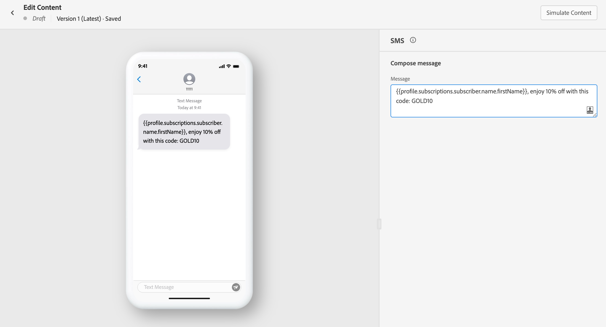

# Create an SMS message {#create-sms}

>[!CONTEXTUALHELP]
>id="ajo_message_sms"
>title="SMS creation"
>abstract="Add your text message and start personalizing it with the Expression editor."

Use [!DNL Journey Optimizer] to send text messages to your customers on their mobile devices. You can create, personalize, and preview messages in text format from the SMS editor.

SMS deliveries can be created:

* In a **Journey**: Once you added an SMS activity in your journey, and defined basic settings, use the **[!UICONTROL Actions: SMS]** right pane to create the content for the SMS message. 

    For more information on how to configure your journey, refer to this [page](../building-journeys/journey-gs.md).

* In a **Campaign**: Once you created a campaign, select SMS as your action and define basic settings. 

    For more information on how to configure your campaign, refer to this [page](../campaigns/create-campaign.md#configure).

If this is your first time creating an SMS message, make sure the SMS channel has been configured. [Learn more](../configuration/sms-configuration.md).

## Define your SMS content{#sms-content}

To start personalizing your SMS message, follow these steps:

1. Click the **[!UICONTROL Message]** field to open the Expression editor.

    

1. Use the Expression editor to define content. You can use any attribute to personalize content, such as the profile name or city. Learn more about personalization in the Expression editor in [this section](../personalization/personalize.md).

1. Click **[!UICONTROL Save]** and check your message in the preview.

    

## Validate your SMS{#sms-preview}

>[!NOTE]
>
> For better deliverability, you should always use the phone numbers in the formats supported by the provider. For example, Twilio and Sinch only support phone numbers in E.164 format.

Once your message content has been defined, you can use test profiles to preview and test it. If you inserted [personalized content](../personalization/personalize.md), you can check how this content is displayed in the message, leveraging test profile data.

To visualize how your SMS message displays on mobile devices, click the **[!UICONTROL Simulate content]** tab. Learn more about content simulation in [this section](../design/preview.md).

You must also check alerts in the upper section of the editor.  Some of them are simple warnings, but others can prevent you from using the message. Learn more in [this section](alerts.md).

## Opt-in and opt-out{#sms-opt-in-out}

For all marketing messages, the SMS must contain a way for the recipients to easily unsubscribe. Once unsubscribed, the profiles are automatically removed from the audience of future marketing messages. Adding an unsubscription link is not mandatory for transactional messages.

SMS recipients can reply with opt-in and opt-out keywords. In accordance with the industry standards and regulations, Adobe Journey Optimizer automatically processes the following keywords in incoming messages: START, STOP, and UNSTOP. These keywords trigger automatic standard replies from the SMS provider.

To learn more on how native inbound keyword support (start, stop and unstop) works for SMS, refer to the following video.

>[!VIDEO](https://video.tv.adobe.com/v/344026?quality=12)

<!--
## How-to video

Learn how to configure, author, and include SMS messaging into your customer journeys.

>[!VIDEO](https://video.tv.adobe.com/v/344460?quality=12)
-->
**Related topics**

* [Configure SMS channel](../configuration/sms-configuration.md)
* [SMS report](../reports/journey-global-report.md#sms-global)
* [Create a new message](get-started-content.md)
* [Add a message in a journey](../building-journeys/journeys-message.md)
