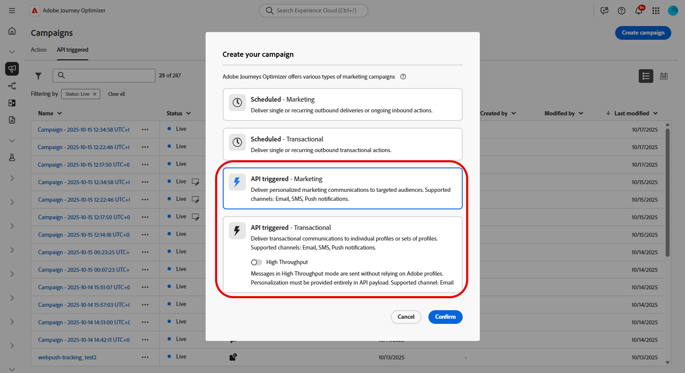
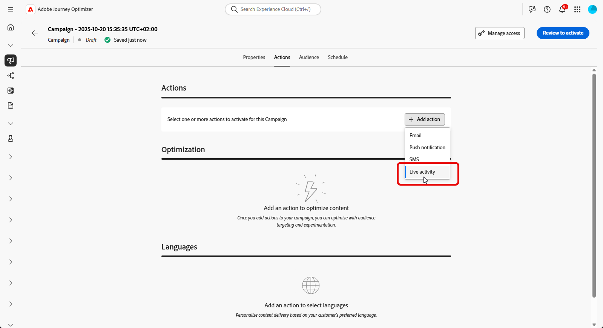
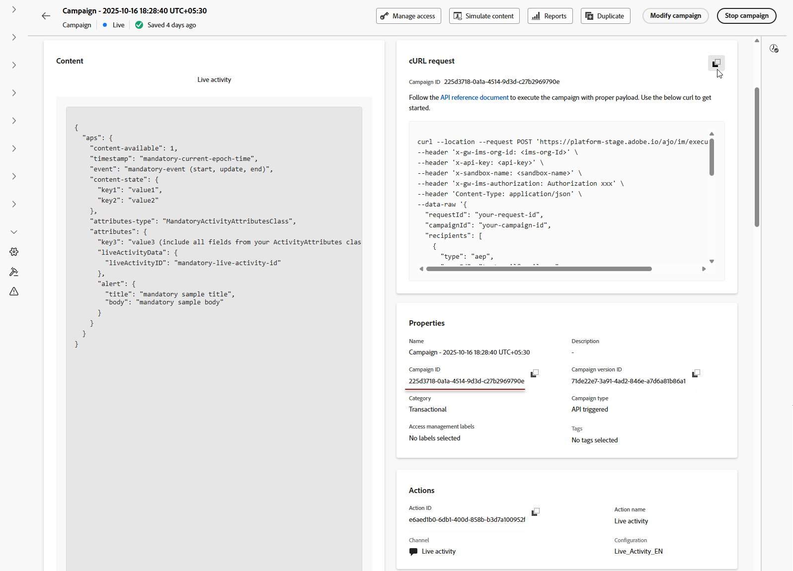

# Create a Live activity {#create-mobile-live}

>[!BEGINSHADEBOX]

**On this page:** Build an API-triggered campaign in Journey Optimizer so you can remotely start, update, and end Live activities for individual users or audiences.

>[!ENDSHADEBOX]

After configuring your mobile configuration and implement your Adobe Experience Platform mobile SDK, you can start creating your Live activity in Journey Optimizer:

1. Access the **[!UICONTROL Campaigns]** menu, then click **[!UICONTROL Create campaign]**.

1. Select the **API triggered** campaign type.

    * Select **API-triggered Marketing** for audience-based campaigns

    * Select **API-triggered Transactional** for individual campaigns.

    >[!IMPORTANT]
    >
    > Note that for **API-triggered Transactional**, **[!UICONTROL High Throughput]** option should not be enabled.

    

1. From the **[!UICONTROL Properties]** section, edit your Campaign's **[!UICONTROL Title]** and **[!UICONTROL Description]**.

1. In the **[!UICONTROL Actions]** section, choose **[!UICONTROL Live activity]** and select or create a new configuration.

    Learn more about Live activity configuration on [this page](mobile-live-configuration.md).

    

1. Click **[!UICONTROL Create experiment]** to start configuring your content experiment and create treatments to measure their performance and identify the best option for your target audience. [Learn more](../content-management/content-experiment.md)

1. From the **[!UICONTROL Audience]** tab, choose your **[!UICONTROL Identity type]** [Learn more](../audience/about-audiences.md).

    >[!NOTE]
    >
    >For **API-triggered Marketing** campaigns, you can select an existing audience that acts as the first segmentation before checking APNs channelID subscription from the API payload.

1. Campaigns are designed to be executed on a specific date or on a recurring frequency. Learn how to configure the **[!UICONTROL Schedule]** of your campaign in [this section](../campaigns/create-campaign.md#schedule). 

1. Once configured, click **[!UICONTROL Review to activate]**, then click **[!UICONTROL Activate]**.

1. After the campaign is activated, use the provided **cURL request** as a template to trigger Live activity start, update, or end events. Update the sample payload with your specific data before execution.

    Ensure that you also copy the **[!UICONTROL Campaign ID]** identifiers to include in your payload.

    ➡️ Refer to the [API Triggered Campaigns Documentation](https://developer.adobe.com/journey-optimizer-apis/references/messaging) for authentication requirements, including OAuth tokens and API keys.

    

After designing your Live activity, you can track measuring the impact of your Live activity with [built-in reports](../reports/campaign-global-report-cja-activity.md).

>[!TIP]
>
>If your Live activity is not appearing or updating as expected, see [Troubleshoot Live activities](troubleshoot-mobile-live.md) for step-by-step debugging guidance.

## Payload examples {#payload}

The payload structure depends on the platform iOS uses the Apple Push Notification service (APNs) `aps` object, while Android uses the Firebase Cloud Messaging (FCM) `fcm` object. Use the examples below for your platform and campaign type.

### iOS payload

For iOS, place personalization and lifecycle fields in the APNs `aps` object. Ensure that `attributes-type` matches the name of your app's `LiveActivityAttributes` struct and that `attributes` matches the fields defined in that struct.

**Unitary use cases (API-triggered Transactional campaign)**

This payload example is for individual campaigns using **API-triggered Transactional** campaign type. Note that most of the fields from the following payload example are mandatory, only `requestId`, `dismissal-date` and `alert` are optional.

+++ View sample payload

```json
{
    "requestId": "your-request-id",
    "campaignId": "your-campaign-id",
    "recipients": [
        {
            "type": "aep",
            "userId": "testemail@gmail.com",
            "namespace": "email",
            "context": {
                "requestPayload": {
                    "aps": {
                        "content-available": 1,
                        "timestamp": 1756984054,              // current epoch time
                        "dismissal-date": 1756984084,         // optional – auto remove when event="end"
                        "event": "update",                    // start | update | end

                        // Fields from FoodDeliveryLiveActivityAttributes
                        "content-state": {
                            "orderStatus": "Delivered"
                        },

                        "attributes-type": "FoodDeliveryLiveActivityAttributes",
                        "attributes": {
                            "restaurantName": "Pizza",
                            "liveActivityData": {
                                "liveActivityID": "orderId1"       // customer reference ID
                            }
                        },

                        "alert": {
                            "title": "Order Delivered!",
                            "body": "Your pizza has arrived."
                        }
                    }
                }
            }
        }
    ]
}
```

+++

**Broadcast use cases (API-triggered Marketing campaign)**

This payload example is for audience-based campaigns using **API-triggered Marketing** campaign type.

+++ View sample payload

```json
{
    "requestId": "123400000",
    "campaignId": "d32e6f6c-56df-4a98-a2c0-6db6008f8f32",
    "audience": {
        "id": "508f9416-52d0-4898-ba47-08baaa22e9c7"
    },
    "context": {
        "requestPayload": {
            "aps": {
                "input-push-channel": "V+8UslywEfAAAOq9SbTrLg==",  //apns-channel-id
                "content-available": 1,
                "timestamp": 1770808339,
                "event": "update",   // start | update | end

                // Fields from GameScoreLiveActivityAttributes
                "content-state": {
                    "homeTeamScore": 33,
                    "awayTeamScore": 49,
                    "statusText": "Wingdom keeps scoring!"
                },
                "attributes-type": "GameScoreLiveActivityAttributes",
                "attributes": {
                    "liveActivityData": {
                        "channelID": "V+8UslywEfAAAOq9SbTrLg=="   //apns-channel-id, must match the "input-push-channel" value
                    }
                },
                "alert": {
                    "title": "This is the title for game",
                    "body": "This is the body for body"
                }
            }
        }
    }
}
```

+++

### Android payload

For Android, place Live activity fields in the Firebase Cloud Messaging (FCM) `fcm` object. Define dynamic values in `content_state` using `custom_key_*` keys that your app's style provider is configured to handle.

**Unitary use cases (API-triggered Transactional campaign)**

>[!IMPORTANT]
>
>The `fcm` object contains two time fields, both expressed in epoch seconds:
>
>* **`timestamp` controls message ordering.** Each start, update, and end event must use a value greater than the previous event for the same `notification_id` (or `topic_name` for broadcasts). Updates are displayed only if their timestamp is newer than the last processed value. Older or equal timestamps are ignored.
>* **`when` controls the notification's displayed time.** This optional field corresponds to Android's `setWhen` method and does not affect message ordering. Keep its value reasonably current, as an outdated value can cause display issues.
>
>See [Troubleshoot Live activities](troubleshoot-mobile-live.md) for details.

Use these payloads for individual campaigns of the **API-triggered Transactional** type.

Use the same `notification_id` for all start, update, and end events to ensure that they target the same Live activity instance.

+++ Start event sample payload

```json
{
    "requestId": "your-request-id",
    "campaignId": "your-campaign-id",
    "recipients": [
        {
            "type": "aep",
            "userId": "your-device-ECID",
            "namespace": "ECID",
            "context": {
                "requestPayload": {
                    "fcm": {
                        "notification_id": "flight-DL-321",
                        "timestamp": 1756984054,           // required - ordering key; must strictly increase on every event
                        "notification_channel_id": "live_updates_channel",
                        "priority": "PRIORITY_HIGH",
                        "when": 1756984054,              // optional - time shown on the notification (seconds)
                        "event_type": "start",             // start | update | end
                        "title": "Flight DL-321",
                        "body": "Boarding starts shortly",
                        "critical_text": "25 min",
                        "action_type": "DEEPLINK",
                        "action_uri": "myapp://flight/DL241",
                        "content_state": {                 // custom updating values specific to keys defined in every Live activity on the app
                            "custom_key_template_type": "progress",
                            "custom_key_journey_start": "DEL",
                            "custom_key_journey_progress": 10,
                            "custom_key_journey_end": "MUM"
                        }
                    }
                }
            }
        }
    ]
}
```

+++

+++ Update event sample payload

To update a Live activity, set `event_type` to `update` and keep `notification_id` unchanged. Update `body`, `critical_text`, and the values in `content_state` as needed to reflect the latest status.

```json
"fcm": {
    "notification_id": "flight-DL-321",
    "timestamp": 1756984114,           // increased from the start event
    "notification_channel_id": "live_updates_channel",
    "priority": "PRIORITY_HIGH",
    "when": 1756984054,
    "event_type": "update",
    "title": "Flight DL-321",
    "body": "Boarding at Gate-D23",
    "critical_text": "Now",
    "action_type": "DEEPLINK",
    "action_uri": "myapp://flight/DL241",
    "content_state": {
        "custom_key_template_type": "progress",
        "custom_key_journey_start": "DEL",
        "custom_key_journey_progress": 50,
        "custom_key_journey_end": "MUM"
    }
}
```

+++

+++ End event sample payload

To end a Live activity, set `event_type` to `end`. Optionally, include `dismiss_after` to specify the delay, in seconds, before the completed Live activity is dismissed.

```json
"fcm": {
    "notification_id": "flight-DL-321",
    "timestamp": 1756984174,           // increased again
    "notification_channel_id": "live_updates_channel",
    "priority": "PRIORITY_HIGH",
    "when": 1756984054,
    "event_type": "end",
    "title": "Flight DL-321",
    "body": "Welcome to Mumbai",
    "critical_text": "Landed",
    "action_type": "DEEPLINK",
    "action_uri": "myapp://flight/DL241",
    "content_state": {
        "custom_key_template_type": "progress",
        "custom_key_journey_start": "DEL",
        "custom_key_journey_progress": 100,
        "custom_key_journey_end": "MUM"
    },
    "dismiss_after": 10
}
```

+++

**Broadcast use cases (API-triggered Marketing campaign)**

Use this payload for audience-based campaigns of the **API-triggered Marketing** type.

Set `topic_name` to the FCM topic that users' devices subscribe to. Send all update and end events to the same topic, and keep `notification_id` unchanged to target the same Live activity notification.

+++View sample payload

```json
{
    "requestId": "your-request-id",
    "campaignId": "your-marketing-campaign-id",
    "audience": {
        "id": "your-audience-id"
    },
    "context": {
        "requestPayload": {
            "fcm": {
                "topic_name":"flight_DL321",        // fcm topic name
                "notification_id": "flight-DL-321",
                "timestamp": 1756984054,           // required - ordering key; must strictly increase on every event
                "notification_channel_id": "live_updates_channel",
                "priority": "PRIORITY_HIGH",
                "when": 1756984054,              // optional - time shown on the notification (seconds)
                "event_type": "start",             // start | update | end
                "title": "Flight DL-321",
                "body": "Boarding starts shortly",
                "critical_text": "25 min",
                "action_type": "DEEPLINK",
                "action_uri": "myapp://flight/DL241",
                "content_state": {                 // custom updating values specific to keys defined in every Live activity on the app
                    "custom_key_template_type": "progress",
                    "custom_key_journey_start": "DEL",
                    "custom_key_journey_progress": 10,
                    "custom_key_journey_end": "MUM"
                }
            }
        }
    }
}
```

+++

## Add custom data with execution metadata {#metadata}

>[!AVAILABILITY]
>
> `executionMetadata` is only available for **API-triggered Transactional** campaigns.

Attach your own **custom data** to a profile, such as an order ID, loyalty tier, or region code, using the optional `executionMetadata` field. Journey Optimizer stores this data alongside the execution so you can retrieve it later from your **Live activity feedback dataset** and match delivery results to your own business records.

To send this data via the API, see the [Messaging API reference for the `executionMetadata` field](https://developer.adobe.com/journey-optimizer-apis/references/messaging#operation/postIMUnitaryMessageExecution!path=recipients/0/executionMetadata&t=request). To read the values back on the device, see the [Mobile SDK guide on receiving execution metadata from the API trigger](https://developer.adobe.com/client-sdks/edge/adobe-journey-optimizer/live-activities/tutorial#receiving-execution-metadata-from-the-api-trigger).

To add custom data with execution metadata:

* Add `executionMetadata` to a profile, next to `userId` and `namespace`. Only string keys and string values are accepted, convert any non-string value to a string before sending it.

* Values are recorded exactly as sent. `executionMetadata` does not support personalization expressions, so any `{{...}}` expression is treated as literal text rather than resolved. You should always send final, literal values.

* Each profile can carry up to **50 key/value pairs**, with a combined size limit of **2 KB** for all keys and values. Metadata exceeding this limit is discarded but the Live activity is still delivered. Limit the payload to the information required for reporting purposes.

+++ iOS JSON example

In this example, `orderId`, `tier`, `restaurant`, and `region` are your own values. After the Live activity is triggered, you can read them back from the feedback dataset to link the delivery to your order record.

```json
{
    "requestId": "your-request-id",
    "campaignId": "your-campaign-id",
    "recipients": [
        {
            "type": "aep",
            "userId": "testemail@gmail.com",
            "namespace": "email",
            "executionMetadata": {
                "orderId": "A-123",
                "tier": "gold",
                "restaurant": "PizzaPlace",
                "region": "EU"
            },
            "context": {
                "requestPayload": {
                    "aps": {
                        "content-available": 1,
                        "timestamp": 1756984054,
                        "dismissal-date": 1756984084,
                        "event": "update",
                        "content-state": {
                            "orderStatus": "Delivered"
                        },
                        "attributes-type": "FoodDeliveryLiveActivityAttributes",
                        "attributes": {
                            "restaurantName": "PizzaPlace",
                            "liveActivityData": {
                                "liveActivityID": "orderId1"
                            }
                        },
                        "alert": {
                            "title": "Order Delivered!",
                            "body": "Your pizza has arrived."
                        }
                    }
                }
            }
        }
    ]
}
```

+++

+++ Android JSON example


>[!NOTE]
>
>Retrieve execution metadata on Android the same way as on iOS: from `message.feedback` events in the AJO Message Feedback dataset. For query examples, see the **Advanced: Debugging via dataset queries** section.
>
>Android uses the open-source Adobe Experience Platform (AEP) Messaging extension for the Mobile SDK.


In this example, `seat` and `type` are custom metadata fields containing your booking details. After triggering the Live activity, retrieve these values from the Live activity feedback dataset to associate the delivery results with your booking record.

```json
{
    "requestId": "your-request-id",
    "campaignId": "your-campaign-id",
    "recipients": [
        {
            "type": "aep",
            "userId": "your-device-ECID",
            "namespace": "ECID",
            "executionMetadata": {
                "seat": "A-3",
                "type": "economy"
            },
            "context": {
                "requestPayload": {
                    "fcm": {
                        "notification_id": "flight-DL-321",
                        "timestamp": 1756984054,           // required - ordering key; must strictly increase on every event
                        "notification_channel_id": "live_updates_channel",
                        "priority": "PRIORITY_HIGH",
                        "when": 1756984054,              // optional - time shown on the notification (seconds)
                        "event_type": "start",             // start | update | end
                        "title": "Flight DL-321",
                        "body": "Boarding starts shortly",
                        "critical_text": "25 min",
                        "action_type": "DEEPLINK",
                        "action_uri": "myapp://flight/DL241",
                        "content_state": {                 // custom updating values specific to keys defined in every Live activity on the app
                            "custom_key_template_type": "progress",
                            "custom_key_journey_start": "DEL",
                            "custom_key_journey_progress": 10,
                            "custom_key_journey_end": "MUM"
                        }
                    }
                }
            }
        }
    ]
}

```

+++

## How-to video

Discover how to configure iOS Live activities with Adobe Journey Optimizer to deliver rich, real-time updates on the iPhone Lock Screen and Dynamic Island.

>[!VIDEO](https://video.tv.adobe.com/v/3479864)

{{$include /help/_includes/do-not-localize/mobile-live/ai-augmented-create-mobile-live.md}}
