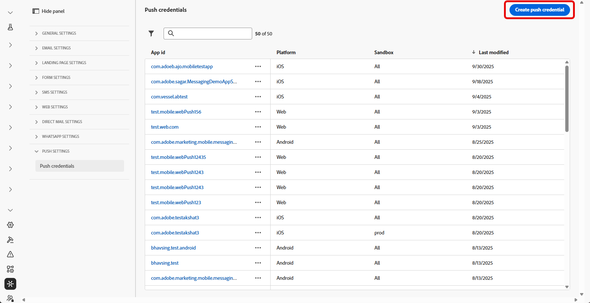
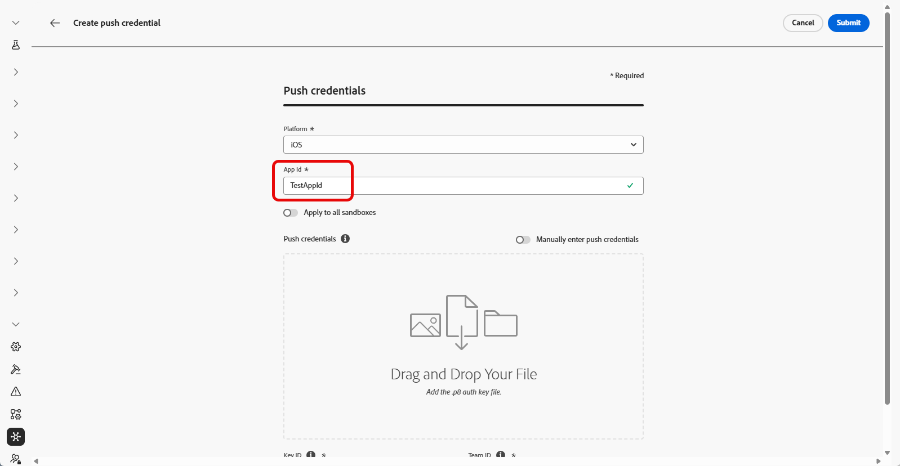
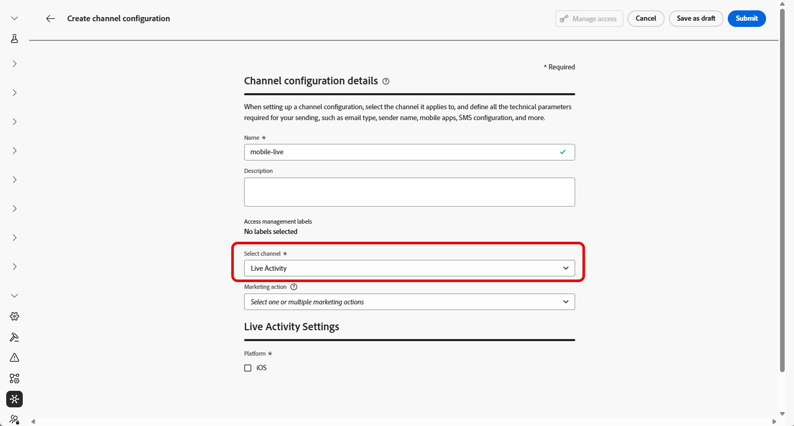
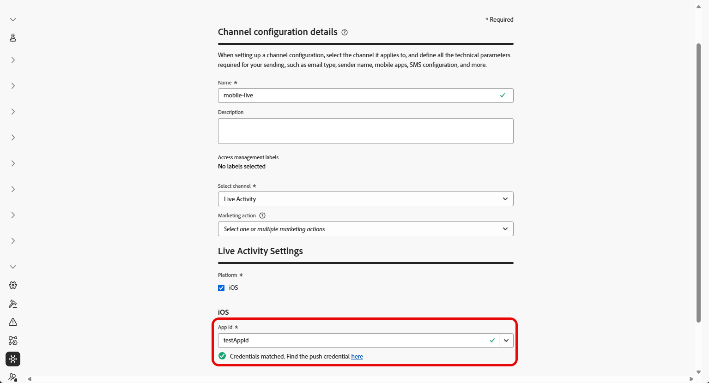

# Get started with Live activity configuration {#mobile-live-config}

>[!BEGINSHADEBOX]

* [Get started with Live activity](get-started-mobile-live.md)
* **[Live activity configuration](mobile-live-configuration.md)**
* [Live Activity integration with Adobe Experience Platform Mobile SDK](mobile-live-configuration-sdk.md)
* [Create a Live activity](create-mobile-live.md)
* [Frequently asked questions](mobile-live-faq.md)
* [Live activity campaign report](../reports/campaign-global-report-cja-activity.md)

>[!ENDSHADEBOX]

Before sending your Live activity, you must configure your Adobe Journey Optimizer environment. To perform this:

## Step 1: Add your app push credentials in Journey Optimizer (optional){#push-credentials-launch}

The mobile app push credential registration is required to authorize Adobe to send push notifications on your behalf. 

Step 1 is optional if your push credentials have already been configured, as these can be reused for the Live Activity channel configuration. If no credentials are defined, you must create new push credentials for your app. Refer to the steps detailed below:

1. Access the **[!UICONTROL Channels]** > **[!UICONTROL Push settings]** > **[!UICONTROL Push credentials]** menu.

1. Click **[!UICONTROL Create push credential]**.

    

1. From the **[!UICONTROL Platform]** drop-down, select the Operational system:

1. Enter the mobile app **[!UICONTROL App ID]**.

    

1. Enable the **[!UICONTROL Apply to all sandboxes]** option to make these Push credentials available across all sandboxes. If a specific sandbox has its own credentials for the same Platform and App ID pair, those sandbox-specific credentials will take precedence.

1. Switched on the **[!UICONTROL Manually enter push Credentials]** button to add your credentials.
        
1. Drag and drop your .p8 Apple Push Notification Authentication Key file. This key can be acquired from the **Certificates**, **Identifiers** and **Profiles** page.

1. Provide the **Key ID**. This is a 10 character string assigned during the creation of p8 auth key. It can be found under **Keys** tab in **Certificates**, **Identifiers** and **Profiles** page.
        
1. Provide the **Team ID**. This is a string value which can be found under the Membership tab.

1. Click **[!UICONTROL Submit]** to create your app configuration.

## Step 2: Create your Live activity configuration {#config-live-activity}

1. In the left rail, browse to **[!UICONTROL Administration]** > **[!UICONTROL Channels]** and select **[!UICONTROL General settings]** > **[!UICONTROL Channel configurations]**. Click the **[!UICONTROL Create channel configuration]** button.

    

1. Enter a name and a description (optional) for the configuration, then select the WhatsApp channel.

    >[!NOTE]
    >
    > Names must begin with a letter (A-Z). It can only contain alpha-numeric characters. You can also use underscore `_`, dot`.` and hyphen `-` characters.

1. Select **[!DNL Live activity]** as your channel.

    

1. Select **[!UICONTROL Marketing action(s)]** to associate consent policies to the messages using this configuration. All consent policies associated with the marketing action are leveraged in order to respect the preferences of your customers. Learn more

1. Choose iOS as your **[!UICONTROL Platform]**.

1. Select from the drop-down the same **[!UICONTROL App id]** as for your [push credential](#push-credentials-launch) configured above or choose an existing one.

    

1. Once all the parameters have been configured, click **[!UICONTROL Submit]** to confirm. You can also save the channel configuration as draft and resume its configuration later on.

1. Once the channel configuration has been created, it displays in the list with the **[!UICONTROL Processing]** status.

    >[!NOTE]
    >
    >If the checks are not successful, learn more on the possible failure reasons in [this section](../configuration/channel-surfaces.md).  

1. Once the checks are successful, the channel configuration gets the **[!UICONTROL Active]** status. It is ready to be used to deliver messages.

You can now start integration with Adobe Experience Platform Mobile SDK to enable real-time, dynamic updates on the Lock Screen and Dynamic Island. 

➡️ [Learn more on Adobe Experience Platform Mobile SDK integration](mobile-live-configuration-sdk.md)
