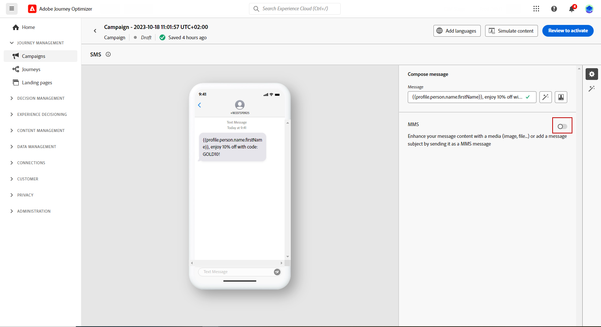

# Design a Mobile message {#design-mobile}

You can design and send text (SMS), rich communication (RCS), and multimedia (MMS) messages with Adobe Journey Optimizer. You first need to add a Mobile message action in a journey or a campaign, and then define the content of the Mobile message, as detailed below. Adobe Journey Optimizer also offers capabilities to test your Mobile messages before sending, so that you can check the rendering, personalization attributes, and all other settings.

In accordance with the industry standards and regulations, all SMS/MMS marketing messages must contain a way for the profiles to easily unsubscribe. To do this, SMS profiles can reply with opt-in and opt-out keywords. [Learn how to manage opt-out](../privacy/opt-out.md#opt-out-decision-management)

## Define your RCS content{#rcs-content}

RCS lets you send visually rich messages with images, videos, carousels, and interactive buttons, delivered through the native messaging app on supported devices. Messages are sent from a branded, verified sender. When a profile's device or carrier does not support RCS, Journey Optimizer automatically falls back to a standard SMS.

Every RCS message requires a **[!UICONTROL Default fallback text]**: a plain-text SMS version delivered to profiles whose device or carrier does not support RCS. A campaign cannot be activated without it.

Keep the following in mind when writing fallback text:

* **Keep it concise.** SMS messages are limited to 160 characters per segment; longer messages are split into multiple parts and may incur additional charges.
* **Include key URLs.** If your RCS message links to a URL via action buttons, add a shortened URL to the fallback text so SMS profiles can still reach the destination.
* **Avoid RCS-only references.** Do not mention visuals, carousels, or interactive features that are not available in plain SMS.
* **Personalization is supported.** You can use personalization tokens in fallback text to keep the message feel consistent across both versions.

To define your RCS message content, follow the steps below.

1. In the authoring panel, choose your **[!UICONTROL Content type]**:

    +++ Text

    A plain text body with optional interactive buttons. Best for notifications, alerts, reminders, and conversational flows where visuals are not needed.

    +++

    +++ Media

    A standalone image or video with optional text and interactive buttons. Use it when a single visual (a product image, banner, or video clip) is the focal point of your message.

    1. From the Header menu, enter a **[!UICONTROL Media URL]** pointing to the image or video to display.

    1. If the media is a video file, optionally enter a **[!UICONTROL Thumbnail URL]**.

    +++

    +++ Card

    A structured card combining an image or video, title, body text, and action buttons. Use it to present a product, offer, or content item in a branded format.

    1. Enter a **[!UICONTROL Title]** and **[!UICONTROL Description]**.

    1. Enter a **[!UICONTROL Media URL]** pointing to the image or video to display.

    1. If the media is a video file, optionally enter a **[!UICONTROL Thumbnail URL]**.

    +++

    +++ Carousel

    A horizontally scrollable series of rich cards in a single message, each with its own image, title, description, and buttons. Ideal for product catalogues or promotions. A minimum of 2 cards is required.

    1. Select a **[!UICONTROL Card width]** to control the display width of each card.
    1. For each card, enter a **[!UICONTROL Title]** and **[!UICONTROL Description]**.

    1. Enter a **[!UICONTROL Media URL]** pointing to the image or video for that card.

    1. Optionally, select a **[!UICONTROL Media height]** and add suggested action buttons.

    +++

    +++ Location

    Sends a map pin to a set of coordinates, displayed as an inline map preview in the profile's messaging thread. Use it to share a store address, event venue, or service area.

    1. Enter the decimal **[!UICONTROL Latitude]** and **[!UICONTROL Longitude]** of the location.

    1. Optionally, enter a **[!UICONTROL Location name]** to display as a label on the map pin.

    +++

1. In the **[!UICONTROL Message text]** field, enter your message content. You can use personalization to tailor the text to each profile. Note that character limits vary by message type: 3,072 characters for Rich Media (Single) and 160 for Basic RCS.

1. Use the **[!UICONTROL Personalization editor]** to define content, add personalization and dynamic content. You can use any attribute, such as the profile name or city for example. You can also define conditional rules.

1. Optionally, add **[!UICONTROL Suggested actions]**, interactive buttons that let profiles act with a single tap. 

1. Enter a **[!UICONTROL Label]** to your **[!UICONTROL Action]**.

1. Choose your **[!UICONTROL Action type]**:

    * **[!UICONTROL Reply]**: sends a predefined text reply back to the RCS agent on behalf of the profile. Use this to capture intent, drive conversational flows, or trigger downstream journey events. No additional fields are required, the reply text matches the button label.

    * **[!UICONTROL Open URL]**: redirects the profile to a web page, deep link, or In-App destination. Supports personalization tokens and UTM tracking parameters, e.g. `https://www.example.com/offers?id={{profile.userId}}`.

    * **[!UICONTROL Dial phone number]**: opens the device dialer with a specified phone number pre-filled, ready for the profile to call.

    * **[!UICONTROL View location]**: opens the device's default maps application at a specified location. Provide the decimal **[!UICONTROL Latitude]** and **[!UICONTROL Longitude]** of the location to display.

1. In the **[!UICONTROL Default fallback text]** field, enter the plain-text SMS version of your message. This is required and is delivered to profiles whose device or carrier does not support RCS.

1. From the **[!UICONTROL Webview]** drop-down, choose the size of your **[!UICONTROL Webview]** when sending an **[!UICONTROL Open URL]** action.

1. Click **[!UICONTROL Save]** and check your message in the preview. You can now test and check your message content as detailed in [this section](send-mobile-message.md).

## Define your SMS content{#sms-content}

>[!CONTEXTUALHELP]
>id="ajo_message_sms_content"
>title="Define your SMS content"
>abstract="Customize and personalize your Mobile message by using the personalization editor to define the content and incorporate dynamic elements."

To configure your message content, follow the steps below. Settings for MMS are detailed in [this section](#mms-content).

1. From the journey or campaign configuration screen, click the **[!UICONTROL Edit content]** button to configure the Mobile message content.

1. Click the **[!UICONTROL Message]** field to open the personalization editor.

    

1. Generate engaging Mobile messages tailored to your audience using [AI Assistant for text generation](../content-management/generative-text.md).

1. Use the personalization editor to define content, add personalization and dynamic content. You can use any attribute, such as the profile name or city for example. You can also define conditional rules. Browse to the following pages to learn more about [personalization](../personalization/personalize.md) and [dynamic content](../personalization/get-started-dynamic-content.md) in the personalization editor.

1. After defining your content, you can add tracked URLs to your message. To do this, access the **[!UICONTROL Helper functions]** menu and select **[!UICONTROL Helpers]**.

    To use the URL shortening function, you must first configure a subdomain that will then be linked to your configuration. [Learn more](mobile-subdomains.md)
    
    >[!NOTE]
    >
    > To access and edit SMS subdomains, you must have the **[!UICONTROL Manage SMS Subdomains]** permission on the production sandbox. Learn more about permissions in [this section](../administration/high-low-permissions.md).

    

1. Within the **[!UICONTROL Helper functions]** menu, click **[!UICONTROL URL function]** and then select **[!UICONTROL Add URL]**.

    

    <!--The URL shortening function cannot be used within a fragment. TBC-->

1. In the `originalUrl` field, paste the URL that you want to shorten and click **[!UICONTROL Save]**.

    >[!CAUTION]
    >
    > The lifespan of short URLs is set to 30 days. After this period, these short URLs will no longer be accessible and will display the message: `404 short-code not found`.

1. From the **[!UICONTROL Decisioning]** menu, you can personalize and optimize the content of your Mobile messages with **Decisioning**. This capability allows you to use Priority Scores, Formulas, or AI Models to dynamically select and display the best content to your customers.
  
    For more information on how to create and use decision policies in Mobile messages, refer to [this section](../experience-decisioning/create-decision.md).

1. Click **[!UICONTROL Save]** and check your message in the preview. You can now test and check your message content as detailed in [this section](send-mobile-message.md).

## Define your MMS content{#mms-content}

You can enhance your communication by sending Multimedia Message Service (MMS) messages, enabling the sharing of media such as videos, pictures, audio clips and GIFs, and more. Additionally, MMS allows for up to 1600 characters of text in your message.

>[!NOTE]
>
> MMS channel comes with a few limitations listed on [this page](../start/guardrails.md#sms-guardrails).

To create MMS content, follow these steps:

1. Create a Mobile message as described in [this section](#create-sms-journey-campaign).

1. Edit your SMS content as detailed in [this section](#sms-content).

1. Enable the MMS option to add media to your SMS content.

    

1. Add a **[!UICONTROL Title]** to your media.

1. Enter the URL of your media in the **[!UICONTROL Media]** field.

    

1. Click **[!UICONTROL Save]** and check your message in the preview. You can now test and check your message content as detailed below.

Once you have performed your tests and validated the content, you can send your Mobile message to your audience. These steps are detailed on [this page](send-mobile-message.md)
