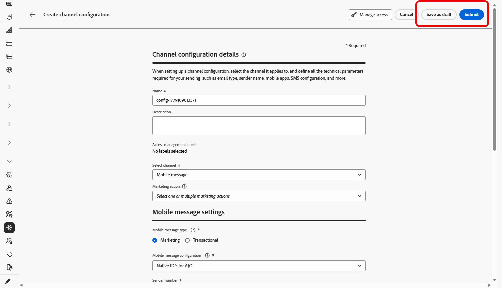

# Create a Mobile message configuration {#message-preset-sms}

>[!CONTEXTUALHELP]
>id="ajo_admin_surface_sms_type"
>title="Define the message category"
>abstract="Select the type of Mobile messages using this configuration: Marketing for promotional messages, which require user consent, or Transactional for non-commercial messages, such as password reset."
>additional-url="https://experienceleague.adobe.com/docs/journey-optimizer/using/privacy/consent/opt-out.html#sms-opt-out-management" text="Opt-out in marketing Mobile messages"

Once your Mobile message channel has been configured, you must create a channel configuration to be able to send SMS, RCS and MMS messages from **[!DNL Journey Optimizer]**.  

To create a channel configuration, follow these steps:

1. In the left rail, browse to **[!UICONTROL Administration]** > **[!UICONTROL Channels]** and select **[!UICONTROL General settings]** > **[!UICONTROL Channel configurations]**. Click the **[!UICONTROL Create channel configuration]** button.

    

1. Enter a name and a description (optional) for the configuration, then select the Mobile channel.

    

    >[!NOTE]
    >
    > Names must begin with a letter (A-Z). It can only contain alpha-numeric characters. You can also use underscore `_`, dot`.` and hyphen `-` characters.

1. Select the **[!UICONTROL SMS Type]** for this configuration:

    * **[!UICONTROL Marketing]**: for promotional messages that require user consent.
    * **[!UICONTROL Transactional]**: for non-commercial messages such as order confirmations, password resets, or delivery updates.

    >[!CAUTION]
    >
    >**Transactional** messages can be sent to profiles who have unsubscribed from marketing communications, but only in specific contexts.
  
    {width=80%}
    
1. Select the **[!UICONTROL Mobile configuration]** to associate with the configuration.
        
    For more on how to configure your environment to send Mobile messages, refer to [this section](#create-api).

1. Enter the **[!UICONTROL Sender number]** ​you want to use for your communications.

1. If you want to use the URL shortening function in your Mobile messages, select an item from the **[!UICONTROL Subdomain]** list.

    >[!NOTE]
    >
    >To be able to select a subdomain, make sure you have previously configured at least one SMS/RCS/MMS subdomain. [Learn how](mobile-subdomains.md)

1. In the **[!UICONTROL Execution dimension]** section, use the **[!UICONTROL SMS Execution Field]** to select amongst the profile attributes the phone number that you want to use in priority if several numbers are available in the database. [Learn more](../configuration/primary-email-addresses.md#override-execution-address-channel-config)

    >[!NOTE]
    >
    >By default, [!DNL Journey Optimizer] uses the phone number specified in the [general settings](../configuration/primary-email-addresses.md) at the sandbox level. Updating this field overrides the default value for the journeys and campaigns using this configuration.

1. Select **[!UICONTROL Use custom dataset for inbound]** to route this credential's inbound SMS to a pre-created dataset you choose from the dropdown. [Learn more about using a custom dataset for inbound keywords](custom-dataset-inbound-keywords.md)

    >[!NOTE]
    >
    >The dataset schema must be **[!UICONTROL XDM ExperienceEvent]** and include at least these field groups:
    >* Adobe CJM ExperienceEvent - Message interaction details
    >* Adobe CJM ExperienceEvent - Message Execution Details
    >* Adobe CJM ExperienceEvent - Message Profile Details
    >
    >The schema and dataset must be enabled for Profile.

1. Once all the parameters have been configured, click **[!UICONTROL Submit]** to confirm. You can also save the channel configuration as draft and resume its configuration later on.

    

1. Once the channel configuration has been created, it displays in the list with the **[!UICONTROL Processing]** status.

    >[!NOTE]
    >
    >If the checks are not successful, learn more on the possible failure reasons in [this section](../configuration/channel-surfaces.md).  

1. Once the checks are successful, the channel configuration gets the **[!UICONTROL Active]** status. It is ready to be used to deliver messages.

    

You are now ready to send Mobile messages with Journey Optimizer.
