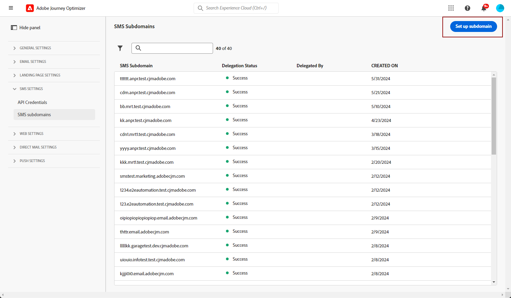
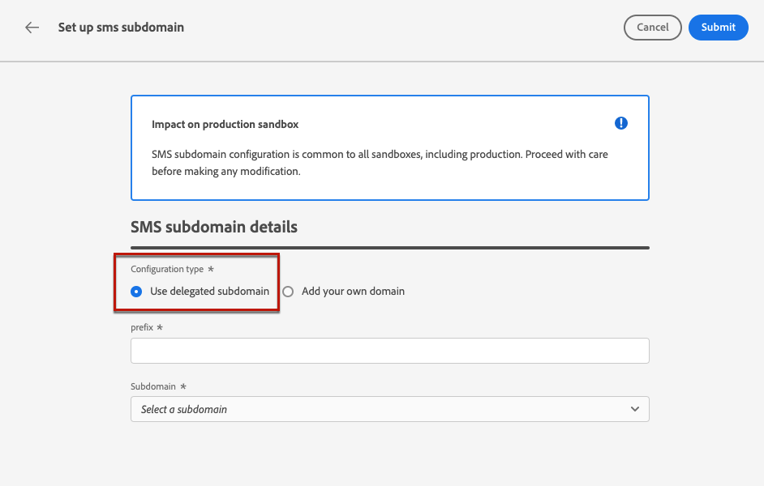
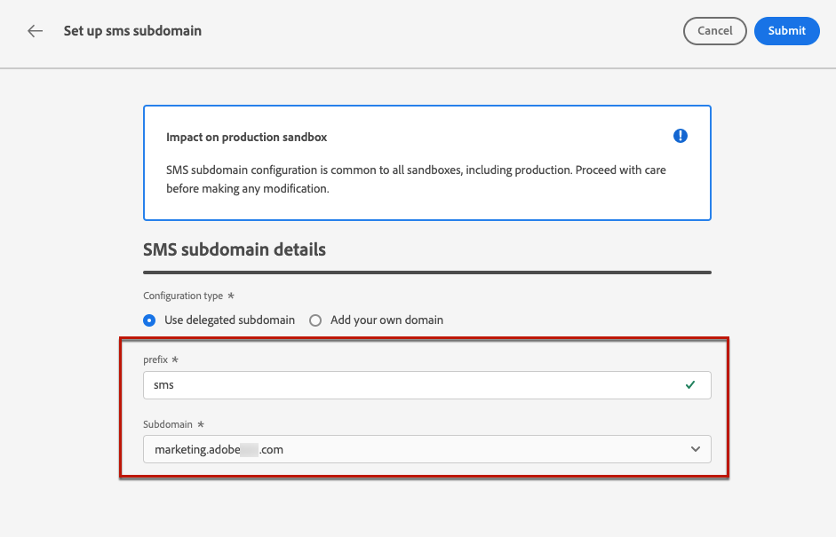
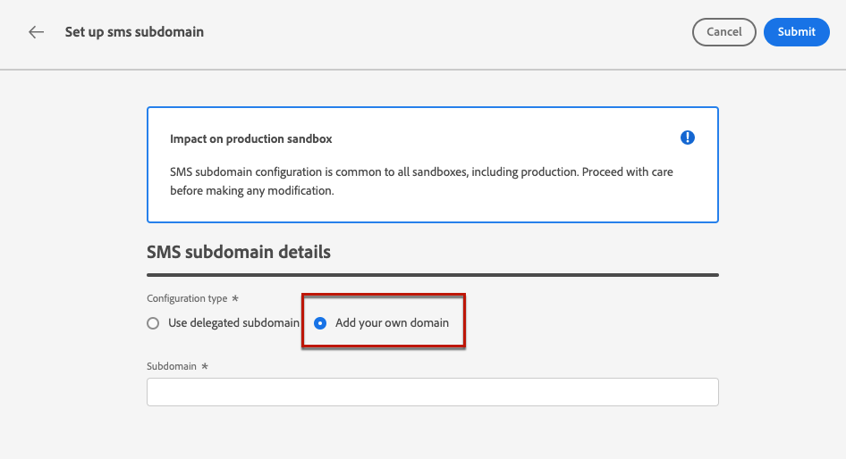

# Configure SMS subdomains {#sms-mms-subdomains}

>[!CONTEXTUALHELP]
>id="ajo_admin_subdomain_sms_header"
>title="Delegate a Mobile message subdomain"
>abstract="Set up your subdomain for Mobile messages. You can use a subdomain that is already delegated to Adobe, or configure a new subdomain."

>[!CONTEXTUALHELP]
>id="ajo_admin_subdomain_sms"
>title="Delegate a Mobile message subdomain"
>abstract="You must configure a subdomain to use for your Mobile messages, as you need this subdomain to create a SMS configuration. You can use a subdomain already delegated to Adobe, or configure a new subdomain."
>additional-url="https://experienceleague.adobe.com/en/docs/journey-optimizer/using/channels/sms/configure-sms/sms-configuration-surface" text="Create an SMS configuration"

>[!CONTEXTUALHELP]
>id="ajo_admin_config_sms_subdomain"
>title="Select a Mobile message subdomain"
>abstract="To be able to create a SMS configuration, make sure you have previously configured at least one SMS subdomain to pick from the Subdomain name list."
>additional-url="https://experienceleague.adobe.com/en/docs/journey-optimizer/using/channels/sms/configure-sms/sms-configuration-surface" text="Create an SMS configuration"

## Get started with SMS subdomains {#gs-sms-mms-subdomains}

To be able to shorten URLs added to your SMS/RCS/MMS messages, you must set up the subdomain you will select when [creating an SMS configuration](mobile-configuration.md#sms-prerequisites).

You can either use a subdomain that is already delegated to Adobe, or configure another subdomain. Learn more about delegating subdomains to Adobe in [this section](../configuration/delegate-subdomain.md).

SMS subdomain configuration is **shared between all environments**. Therefore, any modification to a SMS subdomain also impacts other production sandboxes.

>[!NOTE]
>
>To access and edit SMS subdomains, you must have the **[!UICONTROL Manage SMS Subdomains]** permission on the production sandbox. Learn more about permissions in [this section](../administration/high-low-permissions.md).

## Use an existing subdomain {#sms-use-existing-subdomain}

To use a subdomain that is already delegated to Adobe, follow the steps below.

1. Browse to the **[!UICONTROL Administration]** > **[!UICONTROL Channels]** menu, and select **[!UICONTROL SMS settings]** > **[!UICONTROL SMS subdomains]**.

1. Click **[!UICONTROL Set up subdomain]**.

    

1. Select **[!UICONTROL Use delegated subdomain]** from the **[!UICONTROL Configuration type]** section.

    

1. Enter the prefix that will display in your SMS URL.

    Only alpha-numeric characters and hyphens are allowed. 

    >[!CAUTION]
    >
    >Do not use `cdn` or `data` prefixes as these are reserved for internal use. Other restricted or reserved prefixes such as `dmarc` or `spf` should also be avoided.

1. Select a delegated subdomain from the list.

    You cannot select a subdomain that is already used as SMS subdomain.
    
    <!--Capital letters are not allowed in subdomains. TBC by PM-->

    

    <!--Note that you cannot use multiple delegated subdomains of the same parent domain. For example, if 'marketing1.yourcompany.com' is already delegated to Adobe for your SMS messages, you will not be able to use 'marketing2.yourcompany.com'. However, multi-level subdomains being supported for SMS, you may proceed using a subdomain of 'marketing1.yourcompany.com' (such as 'email.marketing1.yourcompany.com'), or a different parent domain.-->

    >[!CAUTION]
    >
    >If you select a domain that was delegated to Adobe using the [CNAME method](../configuration/delegate-subdomain.md#cname-subdomain-setup), you must create the DNS record on your hosting platform. To generate the DNS record, the process is the same as when you configure a new SMS subdomain. Learn how in [this section](#sms-configure-new-subdomain).

1. Click **[!UICONTROL Submit]**.

1. Once submitted, the subdomain displays in the list with the **[!UICONTROL Processing]** status. For more on subdomains' statuses, refer to [this section](../configuration/delegate-subdomain.md#access-delegated-subdomains).<!--Same statuses?-->

    Before being able to use that subdomain to send messages, you must wait until Adobe performs the required checks, which can take **up to 4 hours**.<!--Learn more in [this section](../configuration/delegate-subdomain.md#subdomain-validation).-->

1. Once the checks are successful, the subdomain gets the **[!UICONTROL Success]** status. It is ready to be used to create SMS channel configurations.

## Configure a new subdomain {#sms-configure-new-subdomain}

>[!CONTEXTUALHELP]
>id="ajo_admin_sms_subdomain_dns"
>title="Generate the matching DNS record"
>abstract="To configure a new SMS subdomain, you need to copy the Adobe nameserver information displayed in the Journey Optimizer interface and paste it into your domain-hosting solution to generate the matching DNS record. Once the checks are successful, the subdomain is ready to be used to create SMS configurations."

To configure a new subdomain, follow the steps below.

1. Browse to the **[!UICONTROL Administration]** > **[!UICONTROL Channels]** menu, then select **[!UICONTROL SMS settings]** > **[!UICONTROL SMS subdomains]**.

1. Click **[!UICONTROL Set up subdomain]**.

    

1. Select **[!UICONTROL Add your own domain]** from the **[!UICONTROL Configuration type]** section.

    

1. Specify the subdomain to delegate.

    >[!CAUTION]
    >
    >* You cannot use an existing SMS subdomain.
    >
    >* Capital letters are not allowed in subdomains.
    
    Delegating an invalid subdomain to Adobe is not allowed. Make sure you enter a valid subdomain which is owned by your organization, such as marketing.yourcompany.com.
    
    Multi-level subdomains (of the same parent domain) are supported. For example, you can use 'sms.marketing.yourcompany.com'.

1. The record to be placed in your DNS servers displays. Copy this record, or download a CSV file, then navigate to your domain-hosting solution to generate the matching DNS record.

1. Make sure that DNS record has been generated into your domain-hosting solution. If everything is configured properly, check the box "I confirm...", then click **[!UICONTROL Submit]**.

    

    When you configure a new SMS subdomain, it always points to a CNAME record.

1. Once the subdomain delegation has been submitted, the subdomain displays in the list with the **[!UICONTROL Processing]** status. For more on subdomains' statuses, refer to [this section](../configuration/delegate-subdomain.md#access-delegated-subdomains).<!--Same statuses?-->

Before using a subdomain to send SMS messages, you must wait until Adobe performs the required checks, which can take up to 4 hours.<!--Learn more in [this section](#subdomain-validation).--> Once the checks are successful, the subdomain gets the **[!UICONTROL Success]** status. It is ready to be used to create SMS channel configurations.

Note that the subdomain will be marked as **[!UICONTROL Failed]** if you fail to create the validation record on your hosting solution.

## Guardrails {#guardrails}

Currently, the [!DNL Journey Optimizer] user interface does not support the deletion or undelegation of SMS subdomains once they have been set up.

However, when testing features within [!DNL Journey Optimizer], it may be necessary to create an SMS subdomain. Once the testing is complete, this can lead to cluttered environments with unnecessary configurations as the UI does not allow for removing or undelegating SMS subdomains.

Here are some recommended steps and considerations:

<!--As an alternative action, create a new SMS subdomain for future use cases and avoid using the existing one if it is no longer needed.-->

* As a best practice, maintain a tidy environment by only creating necessary components and configurations.
* In situations where there is a business impact, contact your Adobe representative who may be able to assist with the removal/undelegation of the SMS subdomain. [Learn more](#undelegate-subdomain)
* If further assistance is required, reach out to Adobe for guidance on managing your instance effectively.

## Undelegate a subdomain {#undelegate-subdomain}

If you wish to undelegate a SMS subdomain, reach out to your Adobe representative with the subdomain you want to undelegate.

If the SMS subdomain points to a CNAME record, you can delete the CNAME DNS record that you created for the SMS subdomain from your hosting solution (but do not delete the original email subdomain if any).

>[!NOTE]
>
>A SMS subdomain can point to a CNAME record because it was either an [existing subdomain](#sms-use-existing-subdomain) delegated to Adobe using the [CNAME method](../configuration/delegate-subdomain.md#cname-subdomain-setup), or a [new SMS subdomain](#sms-configure-new-subdomain) that you configured.

After your request is handled by Adobe, the undelegated domain is no longer displayed on the subdomain inventory page.
