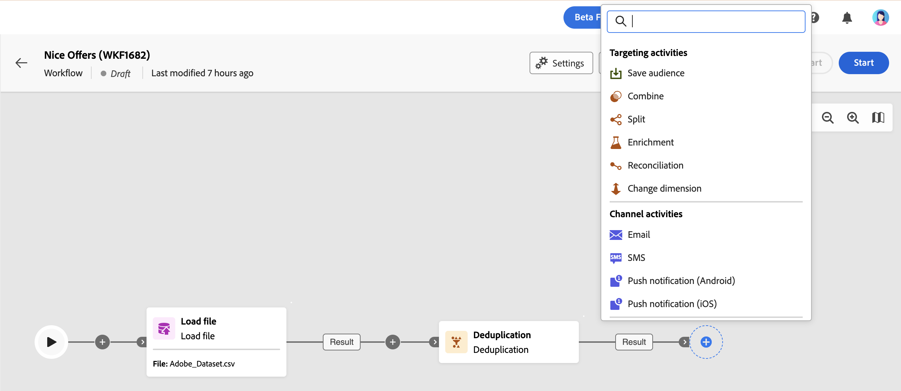

# About multi-step campaign activities {#ms-campaign-activities}

Multi-step campaign activities are grouped into three categories. Depending on the context, available activities may differ. 

All activities are detailed in the sections below:

* [Targeting and data management activities](#targeting)
* [Channel activities](#channel)
* [Flow control activities](#flow-control)

## Targeting activities {#targeting}

These activities are specific to targeting. They let you build one or more targets by defining an audience and splitting or combining these audiences using intersection, union or exclusion operations.

* [Build audience](build-audience.md): Define your target population. You can either select an existing audience or use the query modeler to define your own query.
* [Change dimension](change-dimension.md): Change the targeting dimension as you are building your multi-step campaign.
* [Combine](combine.md): Perform segmentation on your inbound population. You can use a union, an intersection or an exclusion.
* [Deduplication](deduplication.md): Delete duplicates in the result(s) of the inbound activities.
* [Enrichment](enrichment.md): Define additional data to process in your multi-step campaign. With this activity, you can leverage the inbound transition and configure the activity to complete the output transition with additional data.
* [Reconciliation](reconciliation.md): Define the link between the data in Journey Optimizer data and the data in a work table, for example data loaded from an external file.
* [Save audience](save-audience.md): Update an existing audience or create a new audience from the population computed upstream in a multi-step campaign.
* [Split](split.md): Segment incoming population into several subsets.

## Data management activities {#data}

These activities are specific to manipulating and enriching population data.

* [Load file](load-file.md): Work with profiles and data stored in an external file. 
* [Update data](update-data.md): Perform mass updates on fields in the database. Several options allow you to personalize the data update.

## Channel activities {#channel}

Adobe Journey Optimizer allows you to automate and execute marketing campaigns across multiple channels. You can combine channel activities into the canvas to create cross-channel multi-step campaign that can trigger actions based on customer behavior. The following **Channel** activities are available: Email, SMS, Android and iOS Push notifications. [Learn how to set up a delivery in the context of a multi-step campaign](channels.md).

## Flow control activities {#flow-control}

>[!CONTEXTUALHELP]
>id="ajo_orchestration_end"
>title="End activity"
>abstract="The **End** activity allows you to graphically mark the end of a multi-step campaign. This activity has no functional impact and is therefore optional."

The following activities are specific to organizing and executing multi-step campaigns. Their main task is to coordinate the other activities:

* [And-join](and-join.md): Synchronize multiple execution branches of a multi-step campaign.
* **End**: Graphically mark the end of a multi-step campaign. This activity has no functional impact and is therefore optional
* [Fork](fork.md): Create outbound transitions to start several activities at the same time.
* [Scheduler](scheduler.md): Schedule when the multi-step campaign gets started.
* [Test](test.md): Enable transitions based on specified conditions.
* [Wait](wait.md): Momentarily pause execution of a part of a multi-step campaign.
