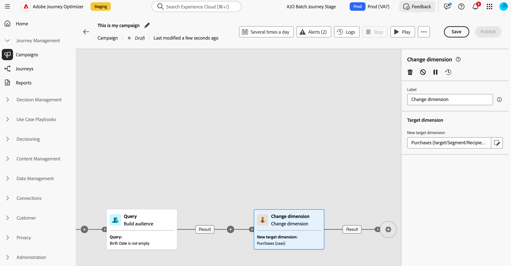
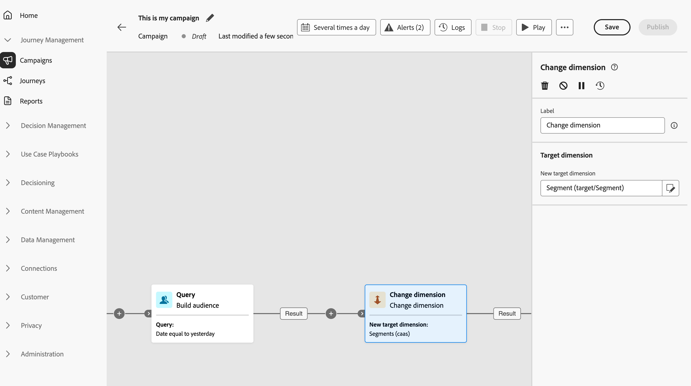

# Change dimension {#change-dimension}

>[!CONTEXTUALHELP]
>id="ajo_orchestration_dimension_complement"
>title="Generate a complement"
>abstract="You can generate an additional outbound transition with the remaining population, which was excluded as a duplicate. To do this, toggle on the **Generate complement** option"

>[!CONTEXTUALHELP]
>id="ajo_orchestration_change_dimension"
>title="Change dimension activity"
>abstract="This activity allows you to change the targeting dimension as you are building an audience. It shifts the axis depending on the data template and the input dimension. For example, you can switch from the "contracts" dimension to the "clients" dimension."

As a marketer, you can switch the targeting dimension from one entity to another linked entity within an orchestrated campaign, and refine your audience targeting based on different data sets, such as moving from profiling users to targeting their specific actions or bookings.    

To perform this, use the  **Change dimension** targeting activity. This activity allows you to change the targeting dimension as you are building your orchestrated campaign. It shifts the axis depending on the data template and the input dimension. 

For example, you can switch an orchestrated campaign's targeting dimension from "Profile" to "Contracts" in order to send messages to the targeted contract owner.

<!--
>[!IMPORTANT]
>
>Please note that the **[!UICONTROL Change Dimension]** and **[!UICONTROL Change Data source]** activities should not be added in one row. If you need to use both activities consecutively, make sure you include an **[!UICONTROL Enrichement]** activity in between them. This ensures proper execution and prevents potential conflicts or errors.-->

## Configure the Change dimension activity {#configure}

Follow these steps to configure the **Change dimension** activity:

1. Add a **Change dimension** activity to your orchestrated campaign.

   

1. Define the **New target dimension**. During dimension change, all records are kept. 

1. Execute the orchestrated campaign to view the result. Compare the data in the tables before and after the change dimension activity, and compare the structure of the orchestrated campaign tables.

## Example {#example}

In this example, we want to send an SMS delivery to all the profiles who have made a purchase. To do this, we first use a **[!UICONTROL Build audience]** activity linked to a custom "Purchase" targeting dimension to target all purchases that occurred.

We then use a **[!UICONTROL Change dimension]** activity to switch the orchestrated campaign targeting dimension to "Recipients". This allows us to be able to target the recipients who match the query.

