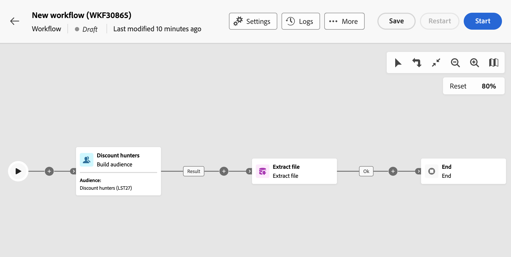

# Extract file {#extract-file}

>[!CONTEXTUALHELP]
>id="acw_orchestration_extractfile"
>title="Extract file"
>abstract="The **Extract file** activity allows you to export data from Adobe Campaign in the form of an external file. The data can then be exported to a server location such as SFTP, Cloud storage or your campaign server using a Transfer file activity."

The **Extract file** activity is a **Data management** activity. Use this activity to export data from Adobe Campaign in the form of an external file. The data can then be exported to a server location such as SFTP, Cloud storage or your campaign server using a Transfer file activity.

To configure the **Extract file** activity, add an **Extract file** activity into your workflow then follow the steps below.

## Configure the file to extract {#extract-configuration}

>[!CONTEXTUALHELP]
>id="acw_orchestration_extractfile_file"
>title="File to extract"
>abstract="Select the file to extract."

The **[!UICONTROL File to extract]** section allows you to configure the file properties and the data to include. 

1. In the **[!UICONTROL File name]** field, enter the desired name for the file to extract.

    You can personalize the file's name using event variables, conditions and date/time functions. To do this, click the **[!UICONTROL Open personalization dialog]** icon to open the expression editor. [Learn how to work with event variables and the expression editor](../event-variables.md) 

1. Specify the columns to present in the extracted file. To do this, follow these steps:

    1. Click the **[!UICONTROL Add output column]**.
    1. Choose the attribute to display in the column then confirm. Available attributes depend on the workflow's targeting dimension. [Learn how to select attributes and add them to favorites](../../get-started/attributes.md)
    1. Once the column is added, you can change its **[!UICONTROL Label]** and modify the associated **[!UICONTROL Attribute]**.
    1. If you want to apply a transformation to the column's values, select it from the drop-down list. For example, you can switch all values in the selected column to upper case.

1. Repeat these steps to add as many columns as needed in the extraction file. To change the position of a column, use the up and down arrows.

1. To remove all duplicate rows from the extracted file, toggle on the **[!UICONTROL Remove duplicate rows(Listing)]** option.

1. To sort the extracted file based on an attribute, toggle on the **[!UICONTROL Enable Sorting]** option then choose the attribute you want to sort the file by, along with the desired sorting method (ascending or descending). You can sort on any attribute from the current targeting dimension, regardless of wether it has been added to the file's columns or not.

## Configure the extracted file format {#file}

>[!CONTEXTUALHELP]
>id="acw_orchestration_extractfile_destinationformat"
>title="Destination format"
>abstract="Select the different options to configure how the extracted file is formatted."

The **[!UICONTROL Destination]** format section allows you to configure how the extracted file is formatted.

1. Choose the **[!UICONTROL Output format]** for the extracted file: **Text**, **Text using fixed with columns**, **CSV (Excel)** or **XML**. 

1. Click the **[!UICONTROL Extraction format]** button to access specific options related to the selected format. Expand the section to bellow for more information.

    +++ Available Extraction format options
    
    * **[!UICONTROL Use first line as column header]** (Text / CSV (Excel) format): Toggle this option on to use the first column as header.
    * **[!UICONTROL Column separator]** (Text format): Specify the character to use as column separator in the output file.
    * **[!UICONTROL String delimiter]** (Text format): Specify how to delimit strings in the ouput file.
    * **[!UICONTROL End of line]** (Text format): Specify how to delimit the end of lines in the output file.
    * **[!UICONTROL Encoding]**: Choose the encoding of the output file.
    * **[!UICONTROL Date format and separators]**: Specify how dates should be formatted in the output file.
    * **[!UICONTROL Number format]**: Specify how numbers should be formatted in the output file.
    * **[!UICONTROL Export labels instead of internal values of enumerations]**: Toggle this option on in case you export enumeration values and you want to retrieve columns labels, which are easier to understand, rather than internal IDs.

    +++
    
    

## Add a post-processing stage {#script}

>[!CONTEXTUALHELP]
>id="acw_orchestration_extractfile_postprocessing"
>title="Post processing"
>abstract="Define a post-processing step to apply like zipping or encryption."

The **[!UICONTROL Export modification script]** allows you to apply a processing stage to execute during the data extraction such as zipping or encryption. To do this, click the **[!UICONTROL Edit script]** button.

The expression editor opens, allowing you to enter the command to apply to the file. The left hand-side pane provides predefined syntaxes that you can leverage to build your script. [Learn how to work with event variables and the expression editor](../event-variables.md) 

## Additional options {#additiona-options}

>[!CONTEXTUALHELP]
>id="acw_orchestration_extractfile_outbound"
>title="Outbound transition"
>abstract="Toggle the **Generate an outbound transition** option to add an outbound transition after the current activity."

>[!CONTEXTUALHELP]
>id="acw_orchestration_extractfile_error"
>title="Process errors"
>abstract="Toggle the **Process errors** option to add an outbound transition containing errors."

Once the output file extraction has been configured, additional options related to transitions and error management are available: 

* **[!UICONTROL Generate outbound transition]**: Toggle this option on to add an outbound transition and configure its label.
* **[!UICONTROL Do not generate a file if the inbound transition is empty]**: Toggle this option on to skip the file extraction if the inbound transition contains no data.
* **[!UICONTROL Process error]**: Toggle this option on to add an outbound transition if any error is encountered during the file extraction.

## Example {#example}

In the following example, we are using a **Build audience** activity followed by an **Extract file** activity to extract all the targeted profiles into a CSV file.

* The **[!UICONTROL File name]** field is configured to include the date of the extraction.

    

* Columns are added to display the profiles' first and last names, their customer IDs and creation dates in the database.

    
