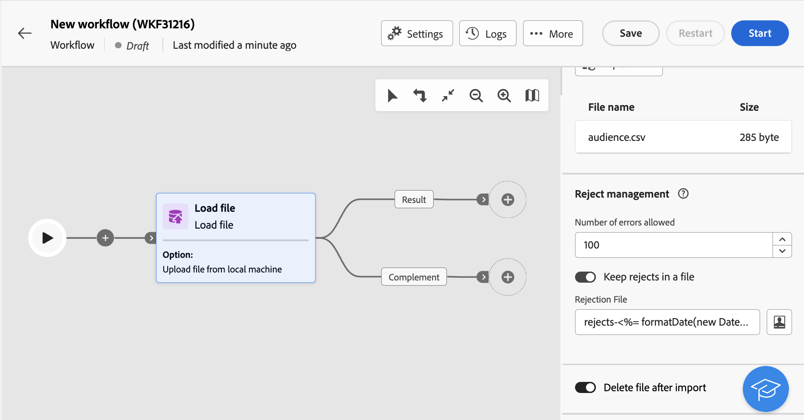

# Load file {#load-file}

>[!CONTEXTUALHELP]
>id="ajo_orchestration_loadfile"
>title="Load file activity"
>abstract="The **Load file** activity is a **Data management** activity. Use this activity to work with data stored in an external file. Profiles and data are not added to the database, but all fields in the input file are available for personalization, or to update profiles, or any other table. "

>[!CONTEXTUALHELP]
>id="ajo_orchestration_loadfile_outboundtransition"
>title="Reject management outbound transition"
>abstract="Reject management outbound transition"

>[!CONTEXTUALHELP]
>id="ajo_orchestration_loadfile_outboundtransition_reject"
>title="Reject management outbound transition for rejects"
>abstract="Reject management outbound transition for rejects"

The **Load file** activity is a **Data management** activity. Use this activity to work with profiles and data stored in an external file. Profiles and data are not added to the database, but all fields in the input file are available for personalization, or to update profiles, or any other table. 

>[!NOTE]
>Supported file formats are: text (TXT) and comma-separated value (CSV). You can load files with a maximum size of 50MB.

This activity can be used with a [Reconciliation](reconciliation.md) activity to link unidentified data to existing resources. For example, the **Load file** activity can be placed before a **Reconciliation** activity if you import non-standard data into the database. 

## Configure the Load file activity {#load-configuration}

The **Load file** activity configuration involves two steps. First, you need to define the expected file structure by uploading a sample file. Once this is done, you can specify the origin of the file whose data will be imported. Follow the steps below to configure the activity.

### Configure the sample file {#sample}

>[!CONTEXTUALHELP]
>id="ajo_orchestration_loadfile_samplefile"
>title="Sample file"
>abstract="Select the expected file structure by uploading a sample file."

>[!CONTEXTUALHELP]
>id="ajo_orchestration_loadfile_formatting"
>title="Formatting for Load File activity"
>abstract="In the **Formatting** section, specify how the file is formatted to ensure that data is correctly imported."

>[!CONTEXTUALHELP]
>id="ajo_orchestration_loadfile_valueremapping"
>title="Value remapping for Load File activity"
>abstract="Use this option to map specific values from the loaded files with new values. For example, if the column contains "True"/"False" values, you can add a mapping to automatically replace those values with "0"/"1" characters."

Follow these steps to configure the sample file used to define the expected file structure:

1. Add a **Load file** activity into your multi-step campaign.

1. Select the sample file to use to define the expected file structure. To do this, click the **Select file** button in the **[!UICONTROL Sample file]** section and select the local file to use.

1. A preview of the sample file is shown, displaying a maximum of 30 lines.

1. In the **[!UICONTROL File type]** drop-down list, specify if the file is using delimited columns or fixed width columns.

    

1. For delimited columns file types, use the **Columns** section to configure the properties of each column.

    +++Available options for file columns
    
    * **[!UICONTROL Label]**: Label to display for the column.
    * **[!UICONTROL Data type]**: Type of data contained in the column.
    * **[!UICONTROL Width]** (string data type): Maximum number of characters to display in the column.
    * **[!UICONTROL Data Transformation]** (string data type): Apply transformation to the values contained in the column.
    * **[!UICONTROL White space management]** (string data type): Specify how to manage spaces contained in the column.
    * **[!UICONTROL Separators]** (date, time, integer and number data types)*: Specify the characters to use as separators.
    * **[!UICONTROL Allow NULLs]**: Specify how to manage empty values in the column. 
    * **[!UICONTROL Error processing]** (string data type): Specify the behaviour in case of errors in one of the lines.
    * **[!UICONTROL Value remapping]**: This option allows you to map specific values with new ones. For example, if the column contains "True"/"False" values, you can add a mapping to automatically replace those values with "0"/"1" characters.

    +++

1. In the **Formatting** section, specify how the file is formatted to ensure that data is correctly imported.

### Define the target file to upload {#target}

>[!CONTEXTUALHELP]
>id="ajo_orchestration_loadfile_targetfile"
>title="Target file for Load File activity"
>abstract="In the **[!UICONTROL Target file]** section, specify how to retrieve the file to upload on the server."

>[!CONTEXTUALHELP]
>id="ajo_orchestration_loadfile_nameofthefile"
>title="Name of the file"
>abstract="Specify the name of the field to upload on the server. Click the **[!UICONTROL Open personalization dialog]** icon to leverage the expression editor, including event variables, to calculate the file name."

>[!CONTEXTUALHELP]
>id="ajo_orchestration_loadfile_targetdb"
>title="Target database"
>abstract="If you are accessing a **[!UICONTROL Load file]** activity that has already been setup, an additional **[!UICONTROL Target database]** section is available if you have configured the activity to upload the file to an external database."

>[!CONTEXTUALHELP]
>id="ajo_orchestration_loadfile_command"
>title="Load File Command"
>abstract="Allowing arbitrary command for pre-processing is a security concern, disable security option XtkSecurity_Disable_Preproc to force the use of a predefined list of commands."

>[!CAUTION]
>
>Before loading the target file, ensure it adheres to the sample file formatting. Any discrepancies in the file format, column structure, or number of columns may lead to errors during multi-step campaign execution.

To define the target file to upload, follow these steps:

1. In the **[!UICONTROL Target file]** section, specify the action to perform when retrieving the file to upload on the server.

    * **[!UICONTROL Upload file from local machine]**: Select the file to upload from your machine.

    * **[!UICONTROL Specified in the transition]**: Upload the file specified in the inbound transition upcoming from a previous activity such as **[!UICONTROL Transfer file]**.

    * **[!UICONTROL Pre-process the file]**: Upload the file specified in the previous transition and apply a pre-processing command to it such as **[!UICONTROL Decompression]** or **[!UICONTROL Decrypt]**.

    * **[!UICONTROL Calculated]**: Upload the file whose name is specified in the **[!UICONTROL File name]** field. Click the **[!UICONTROL Open personalization dialog]** icon to leverage the expression editor, including event variables, to calculate the file name.

    

    >[!NOTE]
    >
    >If you are accessing a **[!UICONTROL Load file]** activity that has already been setup, an additional **[!UICONTROL Target database]** section displays if you have configured the activity to upload the file to an external database. It allows you to specify if you want to upload the file on the Campaign server or on the external database.

### Additional options {#options}

>[!CONTEXTUALHELP]
>id="ajo_orchestration_loadfile_rejectmgt"
>title="Reject management for Load file activity"
>abstract="In the **Reject management** section, specify how the activity should behave in case of errors. You can define the maximum number of errors to allow, and toggle the **[!UICONTROL Keep rejects in a file]** option to download on the server a file containing the errors that occurred during the import."

>[!CONTEXTUALHELP]
>id="ajo_orchestration_loadfile_delete"
>title="Delete file after import"
>abstract="Toggle the **Delete file after import** to delete the original file from the server after the file is imported."

1. In the **Reject management** section, specify how the activity should behave in case of errors:

    * In the **[!UICONTROL Number of errors allowed]** field, specify the maximum number of errors that are authorized when processing the file to load. For example, if the value is set to "20", the multi-step campaign execution will fail if there are more than 20 errors when loading the file. 

    * To keep the errors that occurred when loading the file, toggle the **[!UICONTROL Keep rejects in a file]** option on and specify the desired name for the file in the **[!UICONTROL Rejection File]** field. 
    
      After activating this option, an additional output transition named "Complement" is added after the activity. Any error that will occur during the import will be stored in the specified file on the server.

1. To delete the uploaded file from the server after the multi-step campaign has been executed, toggle the **[!UICONTROL Delete file after import]** option.

    

1. Click **Confirm** once settings are correct.

## Example {#load-example}

A sample of an external file loading used with the **Reconciliation** activity is available in [this section](reconciliation.md#reconciliation-example).
