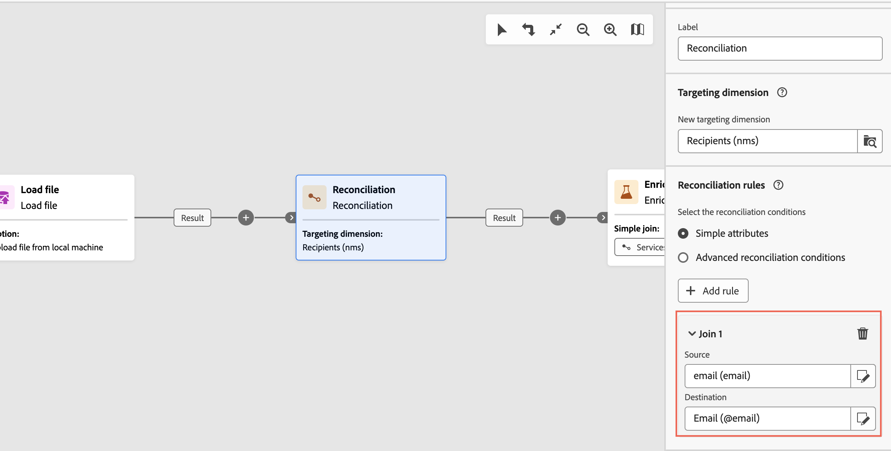

# Subscription services {#subscription-services}

>[!CONTEXTUALHELP]
>id="acw_orchestration_subscription"
>title="Subscription services activity"
>abstract="The Subscription services activity allows multiple profiles to be subscribed to or to be unsubscribed from a service in a single action."

>[!CONTEXTUALHELP]
>id="acw_orchestration_subscription_general"
>title="Subscription service general parameters"
>abstract="Choose the desired service and choose the action to perform (subscription or unsubscription). Toggle on the **Send confirmation message** option on to notify the population that they are subscribed or unsubscribed from the selected service."

>[!CONTEXTUALHELP]
>id="acw_orchestration_subscription_outboundtransition"
>title="Generate an outbound transition"
>abstract="Toggle the **Generate an outbound transition** option to add a transition after the activity."

>[!CONTEXTUALHELP]
>id="acw_orchestration_subscription_additionalinfo"
>title="Additional information"
>abstract="Specify the data and origin of the subscription for each record. You can leave this section empty, in which case no date or origin will be set when running the workflow. If the inbound data contain a column indicating the subscription date of the profile to the service, you can select it in the **[!UICONTROL Date]** field. In the **[!UICONTROL Origin path]** field, define the origin of the subscription. You can set it to one of the fields of the inbound data or to a constant value of your choice by checking the **[!UICONTROL Set a constant as origin]** option."

The **Subscription services** activity is a **Data Management** activity. It allows you to create or delete a subscription to an information service for the population specified in the transition.

## Configure the Subscription services activity {#subscription-services-configuration}

Follow these steps to configure the **Subscription services** activity:

1. Add a **Subscription services** activity into your workflow. You can use this activity after targeting profiles or importing a file with identified data.

1. Select the service for which you would like to manage the subscriptions using one of the following options:

    * **[!UICONTROL Select a specific service]**: Manually select a service using the **[!UICONTROL Service]** field.

    * **[!UICONTROL From inbound transition]**: Use the service specified in the inbound transition. For example, you can import a file which specifies the service to manage for each line. The service on which to perform the operation is then dynamically selected for each profile.

    

1. Select the operation to perform: **Subscribe** or **Unsubscribe**. 

    If the service is defined in the inbound transition, you can choose how to retrieve this operation:

    * **Select a specific operation type**: Manually select the operation to perform (**Subscribe** or **Unsubscribe**)

    * **Select an operation type from a path of inbound transition**: Select the column of the inbound data that specifies the operation to perform for each record. For example, you can import a file which specifies the operation to perform for each line in an "operation" column.

      Only boolean or integer fields can be selected here. Make sure that the data containing the operation to perform matches this format. For example, if you are loading data from a Load file activity, check that you have correctly set the format of the column containing the operation in the **[!UICONTROL Load file]** activity. An example is presented in [this section](#uc2).

      >[!CAUTION]
      >
      >By default, if you select this option, the **Subscription services** activity expects to have a link definition to the **Services (nms)** table set up in the workflow. To do this, ensure you have configured a reconciliation link in an **Enrichment activity** upwards in the workflow. An example showing how to use this option is available [here](#uc2).
      
    

1. To notify recipients that they are subscribed to or unsubscribed from the selected service, toggle the **[!UICONTROL Send a confirmation message]** option on. The content of this notification is defined in a delivery template associated to the information service.

1. If you are using data from an inbound transition, an **[!UICONTROL Additional information]** section displays, allowing you to specify the data and origin of the subscription for each record. You can leave this section empty, in which case no date or origin will be set when running the workflow.

    * If the inbound data contain a column indicating the subscription date of the profile to the service, you can select it in the **[!UICONTROL Date]** field.

    * In the **[!UICONTROL Origin path]** field, define the origin of the subscription. You can set it to one of the fields of the inbound data or to a constant value of your choice by checking the **[!UICONTROL Set a constant as origin]** option. 

    

1. To add an outbound transition after the activity, toggle the **[!UICONTROL Generate an outbound transition]** option on.

## Examples {#example}

### Subscribing an audience to a specific service {#uc1}

This workflow below shows how to subscribe an audience to an existing service.


* A **[!UICONTROL Build audience]** activity targets an existing audience.

* A **[!UICONTROL Subscription Services]** activity lets you select the service to which the profiles must be subscribed.

### Updating multiple subscription statuses from a file {#uc2}

The workflow below shows how to import a file containing profiles and update their subscription to several services specified in the file.


* A **[!UICONTROL Load file]** activity loads a CSV file containing the data and defines the structure of the imported columns. The "service" and "operation" columns specify the service to update and the operation to perform (subscription or unsubscription).

  ```
  Lastname,firstname,city,birthdate,email,service,operation
  Smith,Hayden,Paris,23/05/1985,hayden.smith@example.com,yoga,sub
  Mars,Daniel,London,17/11/1999,danny.mars@example.com,running,sub
  Smith,Clara,Roma,08/02/1979,clara.smith@example.com,running,unsub
  Durance,Allison,San Francisco,15/12/2000,allison.durance@example.com,yoga,sub
  Durance,Alison,San Francisco,15/12/2000,allison.durance@example.com,running,unsub
  ```

  As you may have noticed, the operation is specified in the file as "sub" or "unsub". The system expects a **Boolean** or **Integer** value to recognize the operation to perform: "0" to unsubscribe and "1" to subscribe. To match this requirement:
  * The **Data type** for the "operation" column is set to integer.
  * A **Value remapping** must be performed to match the the "sub" and "unsub" values with "1" and "0" values.

  

  If your file already uses "0" and "1" to identify the operation, you don't need to remap those values. Only make sure that the column is processed as a **Boolean** or **Integer** in the sample file columns.

* A **[!UICONTROL Reconciliation]** activity identifies the data from the file as belonging to the profile dimension of the Adobe Campaign database. The **email** field of the file is matched to the **email** field of the profile resource.

  

* An **[!UICONTROL Enrichment]** activity creates a reconciliation link to the "Services (nms)" table, with a simple join between the "service" column of the uploaded file, and the services "internal name" field in the database.

    
  
* A **[!UICONTROL Subscription Services]** identifies the services to update as coming from the transition.

  The **[!UICONTROL Operation type]** is identified as coming from the **operation** field of the file. Only Boolean or Integer fields can be selected here. If the column of your file that contains the operation to perform does not appear in the list, make sure that you have correctly set your column format in the **[!UICONTROL Load file]** activity, as explained earlier in this example.

  
