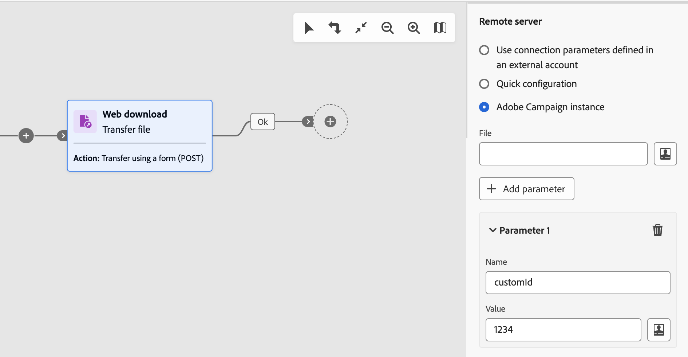

# Transfer file {#transfer-file}

>[!CONTEXTUALHELP]
>id="acw_orchestration_transferfile"
>title="Transfer file"
>abstract="The **Transfer file** activity allows you to receive or send files, test for file presence, or list files on a server. The protocol used can be either server-to-server protocol or HTTP protocol."

>[!CONTEXTUALHELP]
>id="acw_orchestration_transferfile_options"
>title="Transfer file options"
>abstract="Transfer file options"

>[!CONTEXTUALHELP]
>id="acw_orchestration_transferfile_activity"
>title="Transfer file activity"
>abstract="Transfer file activity"

>[!CONTEXTUALHELP]
>id="acw_orchestration_transferfile_remoteserver"
>title="Transfer file remote server"
>abstract="Specify the server to connect."

>[!CONTEXTUALHELP]
>id="acw_orchestration_transferfile_source"
>title="Transfer file source"
>abstract="Enter the desired file name."

The **Transfer file** activity is a **Data Management** activity. It allows you to receive or send files, test for file presence, or list files on a server. The protocol used can be either server-to-server protocol or HTTP protocol.

>[!NOTE]
>
>With the Campaign Web User Interface, we have consolidated two activities into one by merging both **File transfer** and **Web download** capabilities. This consolidation does not impact the functionality of the activity in any way.

Follow the steps detailed below to configure the **Transfer file** activity.

## Choose the transfer protocol and operation {#protocol}

1. Add a **Transfer file** activity into your multi-step campaign then specify the type of transfer to perform depending on the protocol that you want to use:

    * For HTTP protocol, select **[!UICONTROL Web Download]**. This allows you to perform a GET or POST download a file on an explicit URL, an external account, or an Adobe Campaign instance.
    * For other server-to-server protocols and related actions, select **[!UICONTROL File transfer]**.

1. Select the action to perform with the activity. Available actions depend on the type of transfer your have selected. Expand the sections below for more information.

    +++Actions available with **File transfer** type activities

    * **[!UICONTROL File download]**: Download a file from the server.
    * **[!UICONTROL File upload]**: Upload a file on the server.
    * **[!UICONTROL Test to see if file exists]**: Check if a given file is present on the server. Generates two outbound transitions after the activity: "File exists" and "File does not exist".
    * **[!UICONTROL File listing]**: List all the files available on the server.

    +++

    +++Actions available with **Web download** type activities

    * **[!UICONTROL Simple transfer (GET)]**: Retrieve a file.
    * **[!UICONTROL Transfer using a form (POST)]**: Upload a file and additional parameters.

    +++

    

1. By default, for file upload actions, the activity uses the file specified in the previous activity. To use a different file, toggle the **[!UICONTROL Use file from previous activity]** option off and click the **[!UICONTROL Add file]** button.

    In the **[!UICONTROL Source]** field, enter the desired file name, or use the expression editor to calculate the file name using event variables. [Learn how to work with event variables and the expression editor](../event-variables.md). Repeat the operation to add as many files as needed.

## Define the transfer destination {#destination}

1. In the **[!UICONTROL Remote server]** section, specify the server to connect by using one of these methods:

    * **[!UICONTROL Use connection parameters defined in an external account]**: Connect to a server using the connection parameters of an external account. In the **[!UICONTROL Server folder]** field, specify the path to the file (or to the folder for file listing actions).
    * **[!UICONTROL Quick configuration]**: Enter the URL of the file (or folder for file listing actions).
    * **[!UICONTROL Adobe Campaign instance]** (Web download type activities): Download a file from an Adobe Campaign instance server. 

    

1. For Web download POST actions, you can pass additional parameters with the operation. To do this, click the **[!UICONTROL Add parameter]** button then specify the name and value of the parameters. You can add as many parameters as needed.

1. By default, for file upload, the files uploaded on a server are automatically saved. If you do not want to keep this history, toggle the **[!UICONTROL Keep history of files sent]** option off.

## Historization settings {#historization}

>[!CONTEXTUALHELP]
>id="acw_orchestration_transferfile_historization"
>title="File historization"
>abstract="Every time a **[!UICONTROL Transfer file]** activity is executed, it stores the uploaded or downloaded files in a dedicated folder. One folder is created for each Transfer file activity of a multi-step campaign. By default, files are saved on the default storage directory of the Adobe Campaign installation folder (`/vars`) before being processed. To use a specific folder, toggle the **[!UICONTROL Use a default storage directory]** option off and enter the path of the directory."

Every time a **[!UICONTROL Transfer file]** activity is executed, it stores the uploaded or downloaded files in a dedicated folder. One folder is created for each Transfer file activity of a multi-step campaign. By default, files are saved on the default storage directory of the Adobe Campaign installation folder (`/vars`) before being processed. To use a specific folder, toggle the **[!UICONTROL Use a default storage directory]** option off and enter the path of the directory.

It is important to be able to limit the size of this folder in order to preserve physical space on the server. To do that, you can define a maximum number of files or total size for the activity's folder. By default, 100 files and 50 MB are authorized.

Every time the activity is executed, the folder is checked as follows:

* Only files created more than 24 hours before the execution of the activity are taken into account.
* If the number of files taken into account is greater than the value of the **[!UICONTROL Number of files]** field, the oldest files are deleted until the maximum number of files allowed is reached.
* If the total size of files taken into account is greater than the value of the **[!UICONTROL Maximum size (in MB)]** parameter, the oldest files are deleted until the Maximum size (in MB) allowed is reached.

>[!CAUTION]
>
>If the activity is not executed again, its folder will not be checked nor purged. With this in mind, be cautious when transferring large files.

## Advanced & error management options {#advanced}

>[!CONTEXTUALHELP]
>id="acw_orchestration_transferfile_advancedoptions_delete_file"
>title="Delete the source files after transfer"
>abstract="Erase the source files after a successfull transfer."

>[!CONTEXTUALHELP]
>id="acw_orchestration_transferfile_advancedoptions_display_logs"
>title="Display the session logs"
>abstract="Information related to the transfer operation are displayed in the multi-step campaign logs."

>[!CONTEXTUALHELP]
>id="acw_orchestration_transferfile_advancedoptions_list_files"
>title="List all files"
>abstract="This option indexes all the files present on the server in the **vars.filenames** event variable."

>[!CONTEXTUALHELP]
>id="acw_orchestration_transferfile_process_missing_file"
>title="Process missing files"
>abstract="This option allows you to activate a **No file** outbound transition after the activity."

>[!CONTEXTUALHELP]
>id="acw_orchestration_transferfile_process_errors"
>title="Process errors"
>abstract="This option allows you to activate an **Error** outbound transition after the activity."

1. In the **[!UICONTROL Advanced options]**, additional options are available based on the type of activity that you are configuring. Expand the sections below for more information.

    +++Additional options for **[!UICONTROL File transfer]** type activities

    * **[!UICONTROL Delete the source files after transfer]**: Erase the source files after a successfull transfer.
    * **[!UICONTROL Display the session logs]**: When this option is activated, information related to the transfer operation are displayed in the multi-step campaign logs once the multi-step campaign has been executed.
    * **[!UICONTROL List all files]** (File listing actions): This option indexes all the files present on the server in the `vars.filenames` event variable, in which the file names are separated by the `n` characters. [Learn how to work with event variables](../event-variables.md)

    +++

    +++Additional options for **[!UICONTROL Web download]** type activities

    * **[!UICONTROL Follow redirections]**: File redirection lets you use overrides to direct data input or output to a device of a different type.
    * **[!UICONTROL Add the HTTP headers to the file]**: In some cases, you may wish to add additional HTTP headers to a file. Most commonly, these headers will be used to provide additional information for troubleshooting purposes, for [Cross-Origin Resource Sharing (CORS)](https://developer.mozilla.org/docs/Web/HTTP/CORS), or to set specific caching directives.
    * **[!UICONTROL Ignore the HTTP return code]**: HTTP return codes, also known as HTTP status codes, indicate the outcome of an HTTP request.

1. The **[!UICONTROL Process errors]** option allows you to activate an "Error" outbound transition after the activity if any error occurs during the transfer.

    Additionally, for **File transfer** type activities, the **[!UICONTROL Process missing file]** option allows you to activate a "No file" outbound transition after the activity if the file is not available on the specified path.
