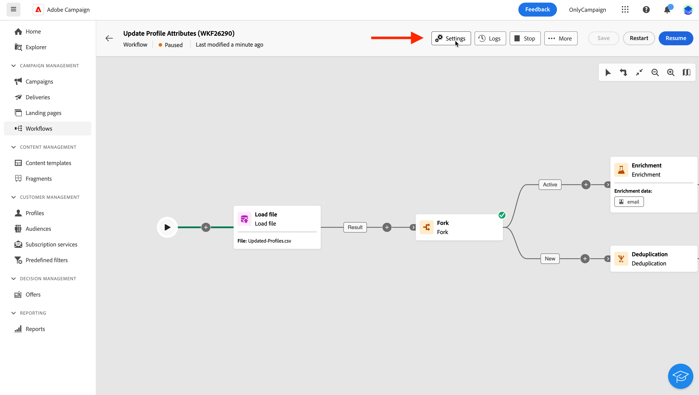

# Configure multi-step campaign settings {#workflow-settings}

>[!CONTEXTUALHELP]
>id="acw_workflow_creation_properties"
>title="Multi-step campaign properties"
>abstract="In this screen, choose the template to use to create the multi-step campaign and specify a label. Expand the **Additional options** section to configure more settings such as the multi-step campaign internal name, its folder, timezone, and supervisor group. It is highly recommended to select a supervisor group so that operators are alerted if an error occurs."

When creating a multi-step campaign or orchestrating multi-step campaign activities in the canvas, you can access advanced settings related to the multi-step campaign. For example, you can set a specific timezone for the multi-step campaign, manage how the multi-step campaign should behave in case of error, or manage the delay after which the multi-step campaign history should be purged.

These settings are pre-configured in the template selected when creating the multi-step campaign, but can be edited as needed for this specific multi-step campaign.

{zoomable="yes"}{width="70%" align="left"}

## Multi-step campaign properties {#properties}

>[!CONTEXTUALHELP]
>id="acw_workflow_settings_properties"
>title="Multi-step campaign properties"
>abstract="This section provides generic multi-step campaign properties that are also accessible when creating the multi-step campaign. You can choose the template to use to create the multi-step campaign and specify a label. Expand the Additional options section to configure specific settings such as the multi-step campaign storing folder or timezone."

The **[!UICONTROL Properties]** section provides generic settings which can be configured when creating a multi-step campaign. To access the properties of an existing multi-step campaign, click the **[!UICONTROL Settings]** button available in the actions bar above the multi-step campaign canvas.

{zoomable="yes"}{width="70%" align="left"}

These properties are:

* The **[!UICONTROL Label]** of the multi-step campaign that displays in the list.
* The **[!UICONTROL Internal name]** of the multi-step campaign.
* The **[!UICONTROL Folder]** where the multi-step campaign should be saved.
* The default **[!UICONTROL Timezone]** to use in all the multi-step campaign's activities. By default, the multi-step campaign's time zone is the one defined for the current Campaign operator.
    Possible values are:
    * **Server time zone** to use the time zone of the Adobe Campaign application server
    * **Operator time zone** to uses the time zone of the Adobe Campaign operator who executes the multi-step campaign, as defined in the operator's profile, in the client console
    * **Time zone of the database** to use the time zone of the database server
    * A specific time zone
* When a multi-step campaign fails, the operators belonging to the operators group selected in the **[!UICONTROL Supervisor(s)]** field are notified by email.
* You can also enter a **[!UICONTROL Description]** of your multi-step campaign.

When the multi-step campaign is [associated to a campaign](create-workflow.md), it is displayed in the **[!UICONTROL Linked campaign]** field. You can open the associated campaign from that field.

## Segmentation settings  {#segmentation-settings}

>[!CONTEXTUALHELP]
>id="acw_workflow_settings_segmentation"
>title="Segmentation settings"
>abstract="In this section, you can select the targeting dimension to target profiles in the multi-step campaign, and choose to keep the worklow results between two executions. This option should be used for testing purposes only and must never be enabled in a production multi-step campaign."

* **[!UICONTROL Targeting dimension]**: Select the targeting dimension to use to target profiles: recipients, contract beneficiaries, operator, subscribers, etc. [Learn more about targeting dimensions](../audience/targeting-dimensions.md)

* **[!UICONTROL Keep the result of interim populations between two executions]**: By default, only the working tables of the last execution of the multi-step campaign are kept. Working tables from previous executions are purged by a technical multi-step campaign, which runs on a daily basis.

    If this option is enabled, working tables will be kept even after the multi-step campaign has been executed. You can use it for testing purposes and hence must be used **only** on development or staging environments. It must never be checked in a production multi-step campaign.

## Execution settings  {#exec-settings}

>[!CONTEXTUALHELP]
>id="acw_workflow_settings_execution"
>title="Execution settings"
>abstract="In this section, you can configure settings related to the execution of the worklow, such the number of days the multi-step campaign history is kept."

* **[!UICONTROL History in days]**: Specifies the number of days after which the history must be purged. The history contains elements related to the multi-step campaign: logs, tasks, events (technical objects linked to the multi-step campaign operation). Default value is 30 days for out-of-the-box multi-step campaign templates. Purge of the history is performed by the Database cleanup technical multi-step campaign, which is executed by default everyday

    >[!IMPORTANT]
    >
    >If the **[!UICONTROL History in days]** field is left blank, its value will be considered as "1", meaning that the history will purged after 1 day.

* **[!UICONTROL Default affinity]**: If your installation includes several multi-step campaign servers, use this field to specify the server which the multi-step campaign will be executed on. This forces the execution of that multi-step campaign on a particular server. You can choose any existing affinity name, but make sure you do not use spaces or punctuation marks. If you use different servers, specify different names, separated by commas.

    >[!IMPORTANT]
    >
    >If the value defined in this field does not exist on any server, the multi-step campaign will remain pending.

    
* **[!UICONTROL Save SQL queries in log]**: Check this option to you to save the SQL queries from the workflmulti-step campaignow into the logs. This functionality is reserved for advanced users. It applies to multi-step campaigns that contain targeting activities like **[!UICONTROL Build audience]**. When this option is enabled, the SQL queries sent to the database during multi-step campaign execution are displayed in the multi-step campaign's logs, allowing you to analyze them to optimize queries or diagnose issues.

## Error management settings  {#error-settings}

>[!CONTEXTUALHELP]
>id="acw_workflow_settings_error"
>title="Error management settings"
>abstract="In this section, you can define how the multi-step campaign should manage errors during its execution. You can choose to pause the process, ignore a certain number of errors, or stop the multi-step campaign execution."

* **[!UICONTROL Error management]**: This field lets you define the actions to be taken if a multi-step campaign task has errors. There are three possible options:
    
    * **[!UICONTROL Suspend the process]**: The multi-step campaign is automatically paused and its status changes to **[!UICONTROL Failed]**. Once the issue is solved, resume the multi-step campaign using the **[!UICONTROL Resume]** buttons.
    * **[!UICONTROL Ignore]**: The status of the task that triggered the error changes to **[!UICONTROL Failed]**, but the multi-step campaign keeps the **[!UICONTROL Started]** status. <!-- TO ADD ONCE SCHEUDLER IS AVAILABLE This configuration is relevant for recurring tasks: if the branch includes a scheduler, it will start normally next time the workflow is executed.-->
    * **[!UICONTROL Abort the process]**: The multi-step campaign is automatically stopped and its status changes to **[!UICONTROL Failed]**. Once the issue is solved, restart the multi-step campaign using the **[!UICONTROL Start]** buttons.

* **[!UICONTROL Consecutive errors]**: This field becomes available when the **[!UICONTROL Ignore]** value is selected in the **[!UICONTROL In case of errors]** field. You can specify the number of errors that can be ignored before the process is stopped. Once this number is reached, the multi-step campaign status changes to **[!UICONTROL Failed]**. If the value of this field is 0, the multi-step campaign will never be stopped regardless of the number of errors.

## Initialization script {#initialization-script}

The **Initialization script** lets you initialize variables or modify activity properties. Click the **Edit code** button and type the snippet of code to execute. The script is called when the multi-step campaign executes. Refer to the section related to [event variables](event-variables.md).

