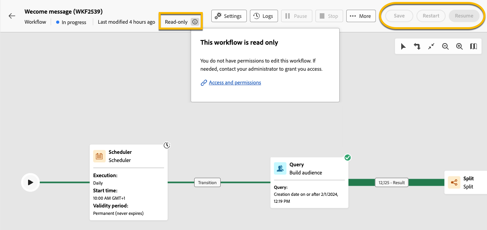

# About read-only workflows {#readonly-workflows}

>[!CONTEXTUALHELP]
>id="acw_wf_read_only_canvas"
>title="This workflow is read only"
>abstract="You cannot edit this workflow due to your rights or the type of the workflow."

Some workflows are in read-only. Built-in technical workflows are always read-only, but this restruction can also be activated on other types of workflow.

Campaign users may have restricted access to the Adobe Campaign data. A Campaign administrator can grant them the right to view some features, but not to edit or modify them. User permissions on data is key to ensure data and process security. Learn more about permissions management in Campaign in [this section](../get-started/permissions.md)

When a workflow is in read-only mode:

* The mention **[!UICONTROL Read-only]**  near the **[!UICONTROL Settings]** button
* The action buttons not accessible

{zoomable="yes"}

Users cannot edit anything in a read-only workflow. they are not allowed to change the settings of the activities.

{zoomable="yes"}

Users can neither delete the workflow.

{zoomable="yes"}

## Types of read-only workflows {#readonly-workflow-types}

According to the type of the workflow, the read-only mode may be different.

### Campaign workflows {#readonly-campaign-wf}

In the case of a read-only campaign workflow, the user cannot access the monitoring button. 

{zoomable="yes"}

### Technical workflows {#readonly-tech-wf}

Built-in technical workflows are read-only for all campaign users, even for the administator. However, users can **pause** or **stop** them if needed. Those are the only actions allowed. 

{zoomable="yes"}

Learn more about technical workflows in [this section](https://experienceleague.adobe.com/en/docs/campaign/automation/workflows/introduction/wf-type/technical-workflows)
