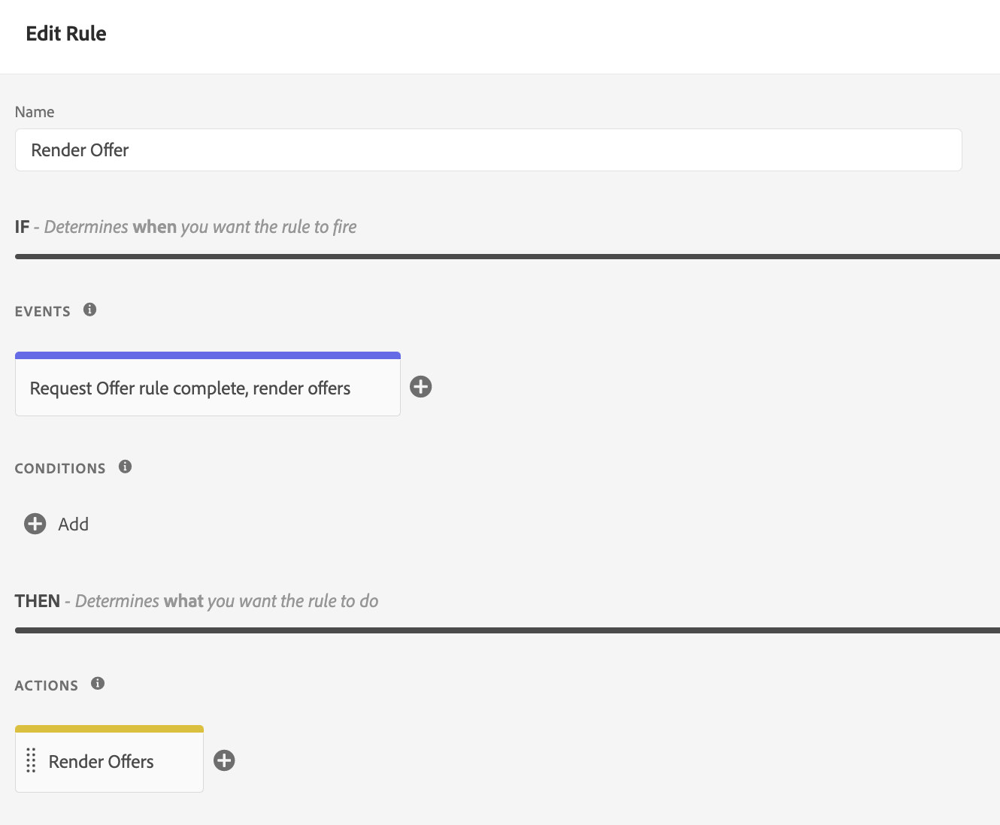

# Deliver offers using the Edge Decisioning API {#edge-decisioning-api}

## Getting started & prerequisites {#aep-web-sdk-overview-and-prerequisites}

The [Adobe Experience Platform Web SDK](https://experienceleague.adobe.com/docs/experience-platform/edge/home.html#video-overview) is a client-side JavaScript library that allows Adobe Experience Cloud customers to interact with the various services in the Experience Cloud through the Experience Platform Edge Network.

The Experience Platform Web SDK supports querying the personalization solutions at Adobe, including Decision Management, allowing you to retrieve and render personalized offers that you have created using APIs or the Offer Library. For more detailed instructions, refer to the documentation on [creating an offer](../../get-started/starting-offer-decisioning.md).  

There are two ways to implement Offer Decisioning with the [Platform Web SDK](https://experienceleague.adobe.com/docs/experience-platform/edge/home.html#video-overview). One way is geared towards developers and requires knowledge of websites and programming. The other way is using the Adobe Experience Platform user interface to set up offers which only requires a small script to be referenced in the header of the HTML page.

Refer to the documentation on [Offer Decisioning](https://experienceleague.adobe.com/docs/experience-platform/edge/personalization/offer-decisioning/offer-decisioning-overview.html?lang=en#enabling-offer-decisioning) for more information on how to deliver personalized offers using the Platform Web SDK.

>[!NOTE]
>
>The use of Decision Management in Adobe Experience Platform Web SDK is currently available in early access to select users. This functionality is not available to all IMS organizations.

## Adobe Experience Platform Web SDK  {#aep-web-sdk-overview-and-prerequisites}

Platform Web SDK replaces the following SDKs:

* Visitor.js
* AppMeasurement.js
* AT.js
* DIL.js

The SDK did not combine these libraries and is a new implementation from the ground up. To use it, you must first follow these steps:

1. Ensure your organization has the appropriate permissions to use the SDK and you have configured the permissions correctly. 

    <!-- For more detailed instructions, refer to the documentation on using the [Adobe Experience Platform Web SDK](). -->

1. [Configure your datastream](https://experienceleague.adobe.com/docs/experience-platform/edge/fundamentals/datastreams.html?lang=en) within the Data Collection tab in your account in the Adobe Experience Cloud.

1. Install the SDK. There are multiple methods of doing so, which are covered on the [Install the SDK page](https://experienceleague.adobe.com/docs/experience-platform/edge/fundamentals/installing-the-sdk.html?lang=en). This page will continue with each different method of implementation. 

In order to use the SDK, you must have a [schema](../../../start/get-started-schemas.md) and a [datastream](../../../start/get-started-datasets.md) defined.

<!-- ****TODO - Configure schema**** -->

To personalize offers, you must separately configure your personalization/profiles. 

<!-- Refer to the [doc](www.link.com) for detailed instructions.  -->

To configure the SDK for Offer Decisioning, follow either of two steps below:

## Option 1 - Install the Tag extension and implementation using Launch

This option is more user-friendly for people who may have less coding experience. 

1. [Create a tag property](https://experienceleague.adobe.com/docs/experience-platform/tags/admin/companies-and-properties.html?lang=en)

1. [Add the embed code](https://experienceleague.adobe.com/docs/core-services-learn/implementing-in-websites-with-launch/configure-launch/launch-add-embed.html?lang=en)

1. Install and configure the Platform Web SDK extension with the Datastream you created by selecting the configuration from the “Datastream” dropdown. See the documentation on [extensions](https://experienceleague.adobe.com/docs/experience-platform/tags/ui/extensions/overview.html?lang=en).

    

    

1. Create the necessary [Data Elements](https://experienceleague.adobe.com/docs/experience-platform/tags/ui/data-elements.html?lang=en). At the bare minimum, you must create a Platform Web SDK Identity Map and a Platform Web SDK XDM Object data element.

    

    

1. Create your [Rules](https://experienceleague.adobe.com/docs/experience-platform/tags/ui/rules.html?lang=en):

    Add a Platform Web SDK Send Event action and add the relevant decisionScopes to that action’s configuration

    

    

1. [Create and publish](https://experienceleague.adobe.com/docs/experience-platform/tags/publish/libraries.html?lang=en) a library containing all the relevant Rules, Data Elements, and Extensions you have configured.

## Option 2 - Manually implement using the pre-built stand  alone version

Here are the steps needed to use Offer Decisioning using the prebuilt standalone installation of the web SDK. This guide assumes this is your first time implementing the SDK, so all of the steps may not be applicable to you. This guide also assumes some development experience.

Include the following JavaScript snippet from Option 2: The Prebuilt Standalone Version on [this page](https://experienceleague.adobe.com/docs/experience-platform/edge/fundamentals/installing-the-sdk.html?lang=en) in the `<head>` section of your HTML page.

## Limitations

Some offer constraints are currently not supported with the mobile Experience Edge workflows, for example Capping. The Capping field value specifies the number of times an offer can be presented across all users. For more details, see [Add constraints to an offer](../../offer-library/add-constraints.md#capping).
