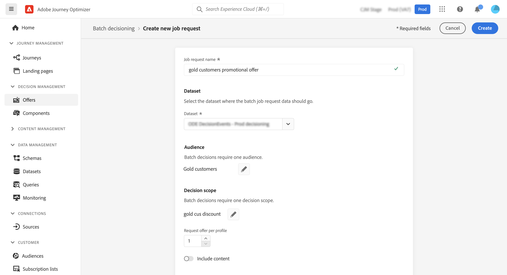
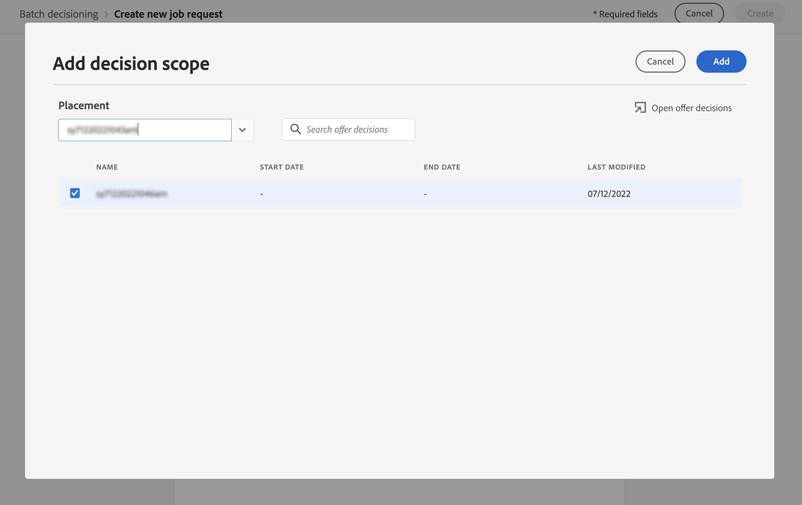
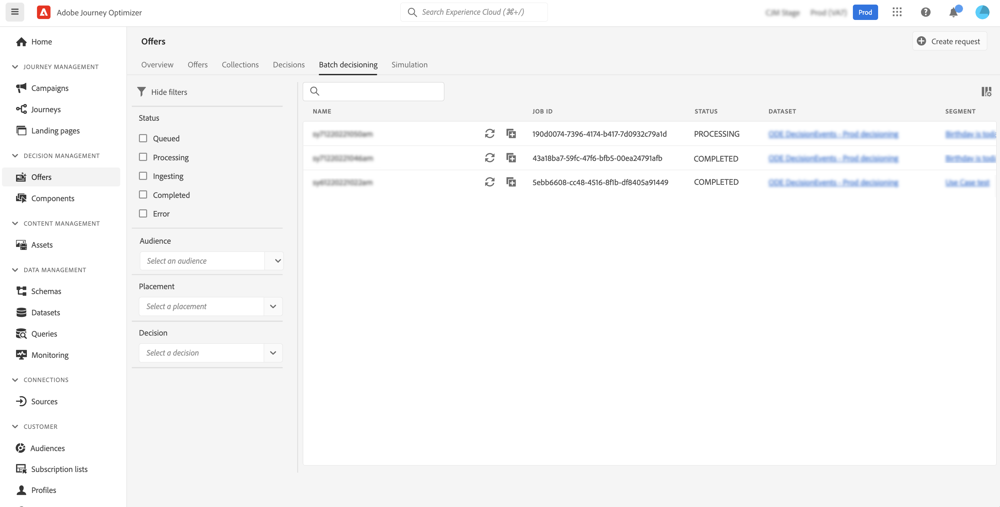
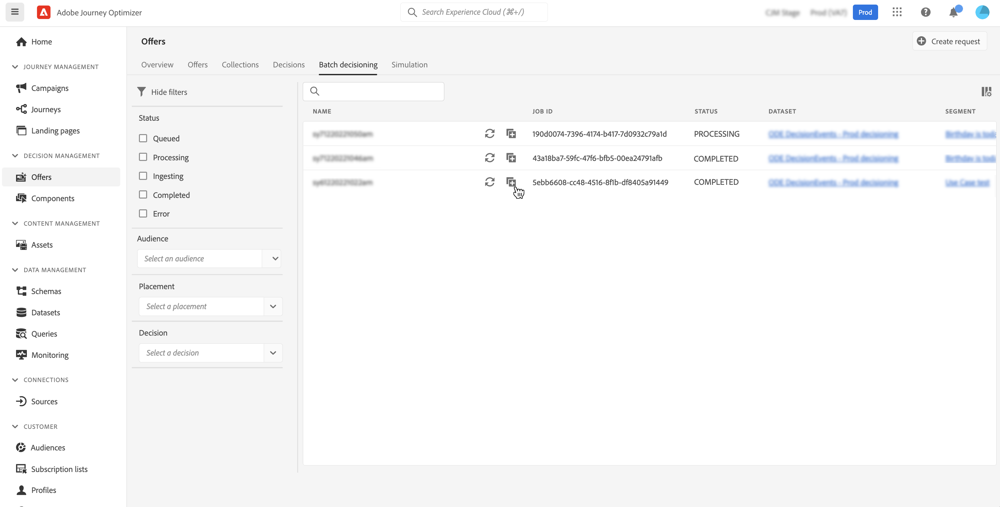

# Batch decisioning {#deliver}

## Get started with batch decisioning {#start}

Journey Optimizer allows you to deliver offer decisions to all profiles in a given Adobe Experience Platform segment.

To do this, you need to create a job request in Journey Optimizer that will contain information on the segment to target and the offer decision to use. The offer content for each profile in the segment is then placed in an Adobe Experience Platform dataset where it is available for custom batch workflows.

Batch delivery can also be performed using APIs. For more on this, refer to the [Batch Decisioning API documentation](api-reference/offer-delivery-api/batch-decisioning-api.md).

## Prerequisites {#prerequisites}

Before configuring a job request, make sure you have created:

* **A dataset** in Adobe Experience Platform. This dataset will be used to store the decision result using the "ODE DecisionEvents" schema. Learn more in the [Datasets documentation](https://experienceleague.adobe.com/docs/experience-platform/catalog/datasets/overview.html).

* **A segment** in Adobe Experience Platform. The segment should be evaluated and then updated. Learn how to update segment membership evaluation in the [Segmentation Service documentation](https://www.adobe.com/go/segmentation-overview-en)

    >[!NOTE]
    >
    >A batch job runs off of the profile snapshot that occurs once a day. Batch decisioning caps the frequency and always loads profiles from the most recent snapshot. Please expect to wait up to 24 hours after you create a segment before you try the batch decisioning API.

* **A decision** in Adobe Journey Optimizer. [Learn how to create a decision](offer-activities/create-offer-activities.md)

<!-- in API doc, remove these info and add ref here-->

## Create a job request

To create a new job request, follow the steps below. 

1. In the **[!UICONTROL Offers]** menu, open the **[!UICONTROL Batch decisioning]** tab then click **[!UICONTROL Create request]**.

    

1. Name your job request, then select the dataset where the job data should be sent into.

1. Select the Adobe Experience Platform segment to target.

1. Select one or multiple offer decision scopes that you want to use to deliver offers to the segment:
    1. Select a placement from the list.
    1. The decisions available for the selected placement display. Select the decision of your choice and click **[!UICONTROL Add]**.
    1. Repeat the operation to add as many decision scopes as desired.

    

1. By default, one offer of the decision scope is returned for each profile. You can adjust the number of returned offers using the **[!UICONTROL Request offer per profile]** option. For example, if you select 2, the best 2 offers will display for the selected decision scope.

    >[!NOTE]
    >
    >You can request up to 30 offers per decision scope.

1. If you want to include the offer content in the dataset, toggle the **[!UICONTROL Include content]** option on. This option is disabled by default.

1. Click **[!UICONTROL Create]** to execute the job request.

## Monitor batch jobs

All requested batch jobs are accessible from the **[!UICONTROL Batch decisioning]** tab. Additionally, search and filtering tools are available to help you refine the list.

### Job requests statuses

Once a job request has been created, the batch job goes through multiple statuses:

>[!NOTE]
>
>To make sure you are getting the latest information on a job request's status, use the ellipsis button next to the job to refresh it.

1. **[!UICONTROL Queued]**: The job request has been created and has entered the processing queue. Up to 5 batch jobs can be run at a time per dataset. Any other batch requests with the same output dataset are added to the queue. A queued job is picked up to process once the previous job has finished running. 
1. **[!UICONTROL Processing]**: The job request is being processed
1. **[!UICONTROL Ingesting]**: The job request has been executed, result data are being ingested in the selected dataset,
1. **[!UICONTROL Completed]**: The job request has been executed and the result data are now stored into the selected dataset.

    >[!NOTE]
    >
    >You can access the dataset where results of a job are stored by clicking its name in jobs list.

If an error occurs while the job request is being executed, it will get the **[!UICONTROL Error]** status. Try duplicating the batch job in order to create a new request. [Learn how to duplicate a batch job](#duplicate)

### Batch job processing time

The end-to-end time for every batch job is the duration from the time the workload is created to the time when the decision result is available in the output dataset.

The segment size is the main factor that affects the end-to-end batch decision time. If the eligible offer has a global frequency cap enabled, then batch decisioning takes additional time to complete. Below are some approximations of end-to-end processing time for their respective segment sizes, both with and without frequency capping for eligible offers:

With frequency cap enabled for eligible offers:

| Segment size | End-to-end processing time |
|--------------|----------------------------|
| 10 thousand profiles or less| 7 minutes|
| 1 million profiles or less| 30 minutes|
| 15 million profiles or less| 50 minutes|

Without frequency cap for eligible offers:

| Segment size | End-to-end processing time |
|--------------|----------------------------|
| 10 thousand profiles or less| 6 minutes|
| 1 million profiles or less| 8 minutes|
| 15 million profiles or less| 16 minutes|

## Duplicate a job request {#duplicate}

You can reuse information of an existing job to create a new request.

To do this, click the duplicate icon, edit the job information if necessary, then click **[!UICONTROL Create]** to create the new request. 

