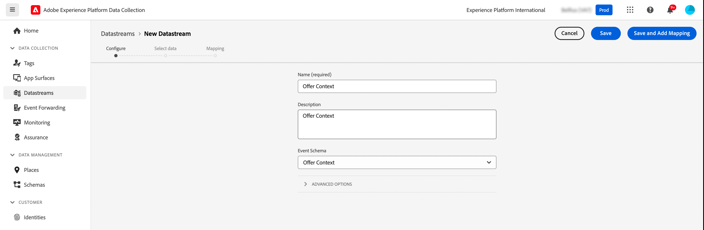
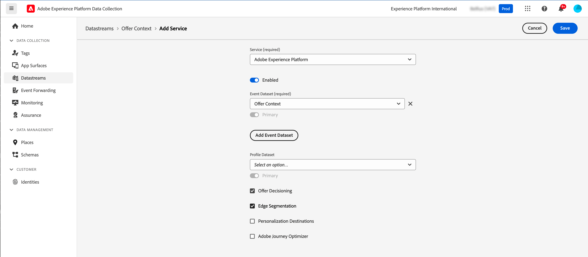
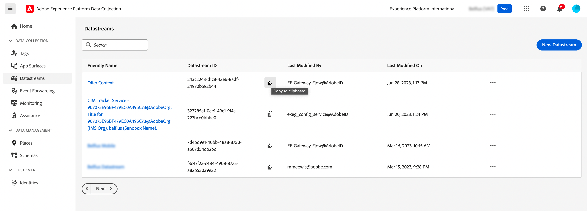
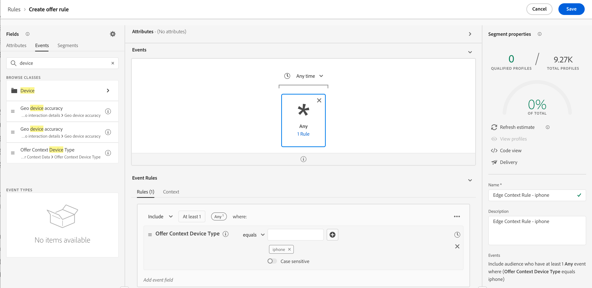
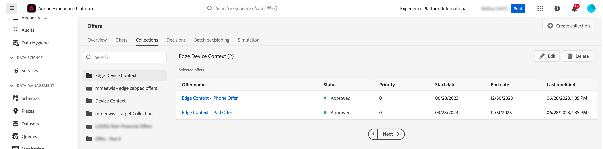
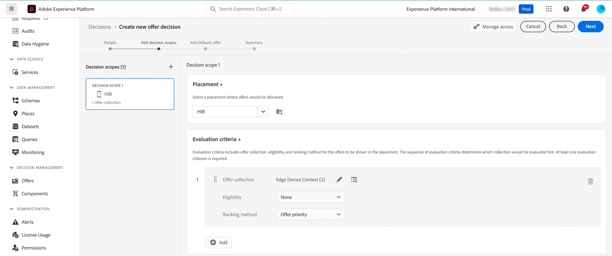

# Context data & Edge Decisioning requests {#edge}

This section guides you through passing context data in Edge Decisioning requests and using them in eligibility rules. We will explore an end-to-end use case that demonstrates how to deliver personalized offers based on the type of device customers are using. 

This use case involves several key steps:

1. [Set up prerequisites](#prerequisites): Ensure all necessary steps are completed to pass context data in your requests.
1. [Uee context data in eligibility rules](#rule): Create rules that determine which offers to show based on the user's device type.
1. [Design device-specific offers](#offers): Create tailored offers for each device type and link them to the corresponding rules.
1. [Create an offer collection](#collection): Group all offers together into a static collection.
1. [Configure a decision](#decision) : Create a new decision that leverages the Offer Decision Engine to pick the best offer to present to users based on their device type.
1. [Pass context data in the Edge Decisioning request](#request): Pass context data through your API request to retrieve and present the appropriate offers to users.

>[!BEGINSHADEBOX]

To go further, you can also leverage context data into **ranking formulas**, or to **personalize your offer representations** dynamically. For instance, you can create a single offer and use personalization fields to adapt its representation based on the context data. For example, display a given image if the user has an iphone, and another one for ipad users. For more information, refere to these sections:

* [Ranking formulas - Boost offers based on context data](../offers/ranking/create-ranking-formulas.md#context-data)
* [Personalize representations based on context data](../offers/offer-library/add-representations.md#context-data)

>[!ENDSHADEBOX]

## Prerequisites to pass context data in Edge Decisiong requests {#prerequisites}

As opposed to passing context in a rather free format using the Decisioning API, the Edge Decisioning context payload needs to be XDM Experience Event compliant. To do this, the context needs to be defined as part of the 'XDM Experience Event' that is used for data collection.

1. Define an experience event schema. For the purpose of this use case, an "Offer Context" schema is created and the offer context fields are part of an "Offer Context" field group. In reality, the fieldgroup would be added to the experience event schema used for data collection associated to the 'Edge Collection Network' datastream.

   >[!NOTE]
   >
   >The offer context experience event schema needs to be part of profile, with a 'CUSTOMER_ID' field used as the primary identity.

   In this example, the "Offer Context" field group has two properties: language and deviceType. These properties will be used in offer ranking and eligibility rules.

   {width="60%" align="center" zoomable="yes"}

   Learn how to work with schemas in Adobe Experience Platform [Experience Data Model (XDM) guide](https://experienceleague.adobe.com/en/docs/experience-platform/xdm/home){target="_blank"}

1. Create a dataset (here "Offer Context") and make sure it is enabled for profile.

1. Create a new datastream from the **[!UICONTROL Data Collection]** > **[!UICONTROL Datastreams]** menu. Learn how to create and configure datastream in Adobe Experience Platform [Datastreams guide](https://experienceleague.adobe.com/en/docs/experience-platform/datastreams/configure){target="_blank"}

   Here, we have created an "Offer Context" datastream, with the "Offer Content" event schema selected.

   

1. Edit the newly created datastream and select "Adobe Experience Platform" as the service and "Offer Context" as the event dataset.

   

1. Save the datastream and copy its ID. This ID will be used in your API request endpoint. [Learn how to build the API call](#request)

   

## Use context data in eligibility rules {#rules}

Create eligibility rules that determine which offers to show based on the user's device type:



* iphone device rule:

   * Rule name: "Edge Context Rule - iphone"
   * Configuration: deviceType = 'iphone'
   * PQL syntax:

      ```
      select _Any1 from xEvent where _Any1._experienceplatform.offerContextData.deviceType.equals("iphone", false)
      ```

* ipad device rule:

   * Rule name: "Edge Context Rule - ipad"
   * Configuration: deviceType = 'ipad'
   * PQL syntax

      ```
      select _Any1 from xEvent where _Any1._experienceplatform.offerContextData.deviceType.equals("ipad", false)
      ```

## Create offers {#offers}

Create an offer for each device type and link it to the corresponding eligibility rule created previously:

* Offer for iphone users:

   * Offer name : "Edge Context - iPhone Offer Content"
   * Associated rule: "Edge Context Rule - iphone"

* Offer for ipad users:

   * Offer name: Edge Context - iPad Offer Content :
   * Associated rule: "Edge Context Rule - ipad"

In addition, create a fallback offer (here "Context Fallback Content") to display if no specific device criteria are met.

## Add offers in a collection {#collection}

Add the offers created previously to a static collection named here "Edge Device Context". This collection will be where the offer decision will pick eligible offers to present to customers.



## Create offer decision {#decision}

Create a new decision that leverages the Offer Decision Engine to pick the best offer to present to users based on their device type with the "Context Fallback" offer selected as the fallback offer.



>[!NOTE]
>
>To go further, you can leverage context data into ranking formulas and assign them to your decision. ADD INFORMATION

## Pass context data in the Edge Decisioning request {#request}

### Endpoint

In the endpoint, use the ID of the [datastream](#prerequisites) created previously.

`https://edge.adobedc.net/ee/irl1/v1/interact?configId=f3c47f2a-c484-4908-87a5-a82b55039e22`

### Payload

Here is an example of a request passing context data.

* Information on the type of device is passed in the `xdm:ContextData` node. 
* In the `decisionScopes` node, copy-paste the decision scope of the [offer decision](#decision) configured previously.

   +++Where to retrieve the decision scope

   

   +++

```
{
	"events": [{
		"xdm": {
			"identityMap": {
				"customerId": [{
					"id": "0000158216",
					"authenticatedState": "authenticated",
					"primary": true
				}]
			},
			"_experienceplatform": {
				"identity": {
					"core": {
						"customerId": "0000158216"
					}
				},
                "offerContextData" : {
                    "language" : "NL",
                    "deviceType" : "iphone"
                }
			}
		}
	}],
	"query": {
		"personalization": {
			"decisionScopes": ["eyJ4ZG06YWN0aXZpdHlJZCI6Inhjb3JlOm9mZmVyLWFjdGl2aXR5OjE3M2I1MGM5Mjg0ZGQ4NzkiLCJ4ZG06cGxhY2VtZW50SWQiOiJ4Y29yZTpvZmZlci1wbGFjZW1lbnQ6MTZhMzQxZWQ4ZDYyMzc2MSJ9"]
		}
	}
}
```

### Response

Here is a sample response:

```
{
    "requestId": "14a2d3f5-a6fa-494e-b42c-cc65a845284a",
    "handle": [
        {
            "payload": [
                {
                    "id": "1eafc831-4819-4800-8e25-c9e9f0838e09",
                    "scope": "eyJ4ZG06YWN0aXZpdHlJZCI6Inhjb3JlOm9mZmVyLWFjdGl2aXR5OjE3M2I1MGM5Mjg0ZGQ4NzkiLCJ4ZG06cGxhY2VtZW50SWQiOiJ4Y29yZTpvZmZlci1wbGFjZW1lbnQ6MTZhMzQxZWQ4ZDYyMzc2MSJ9",
                    "activity": {
                        "id": "xcore:offer-activity:173b50c9284dd879",
                        "etag": "1",
                        "name": "Edge Device Context"
                    },
                    "placement": {
                        "id": "xcore:offer-placement:16a341ed8d623761",
                        "etag": "1",
                        "name": "HIB",
                        "channel": "https://ns.adobe.com/xdm/channel-types/mobile",
                        "componentType": "https://ns.adobe.com/experience/offer-management/content-component-json"
                    },
                    "items": [
                        {
                            "id": "xcore:personalized-offer:173b4e05676d87f5",
                            "etag": "3",
                            "name": "Edge Context - iPhone Offer",
                            "priority": 0,
                            "schema": "https://ns.adobe.com/experience/offer-management/content-component-json",
                            "data": {
                                "id": "xcore:personalized-offer:173b4e05676d87f5",
                                "format": "application/json",
                                "language": [
                                    "en-gb"
                                ],
                                "content": "{\n    \"name\" : \"iphone offer\"\n}"
                            }
                        }
                    ]
                }
            ],
            "type": "personalization:decisions",
            "eventIndex": 0
        },
        {
            "payload": [],
            "type": "activation:pull",
            "eventIndex": 0
        },
        {
            "payload": [],
            "type": "personalization:decisions",
            "eventIndex": 0
        },
        {
            "payload": [
                {
                    "scope": "Target",
                    "hint": "37",
                    "ttlSeconds": 1800
                },
                {
                    "scope": "AAM",
                    "hint": "6",
                    "ttlSeconds": 1800
                },
                {
                    "scope": "EdgeNetwork",
                    "hint": "irl1",
                    "ttlSeconds": 1800
                }
            ],
            "type": "locationHint:result"
        },
        {
            "payload": [
                {
                    "key": "kndctr_907075E95BF479EC0A495C73_AdobeOrg_identity",
                    "value": "CiY0MDAwMDgyMjMzNTEzNzU1OTcwMjQ0NDcyNjU1MTAyMDEwNDQ3MVIRCNnE4Y6QMRABGAEqBElSTDHwAdnE4Y6QMQ==",
                    "maxAge": 34128000
                },
                {
                    "key": "kndctr_907075E95BF479EC0A495C73_AdobeOrg_cluster",
                    "value": "irl1",
                    "maxAge": 1800
                }
            ],
            "type": "state:store"
        }
    ]
}
```
