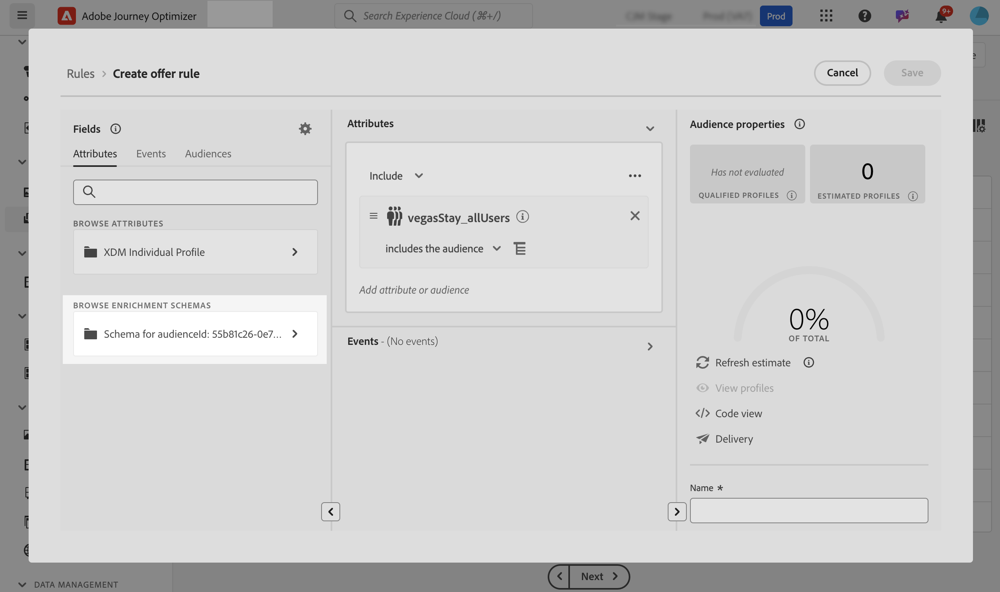
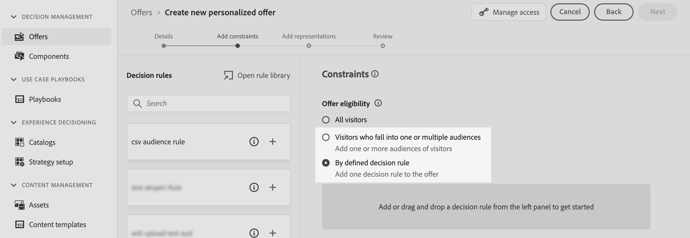
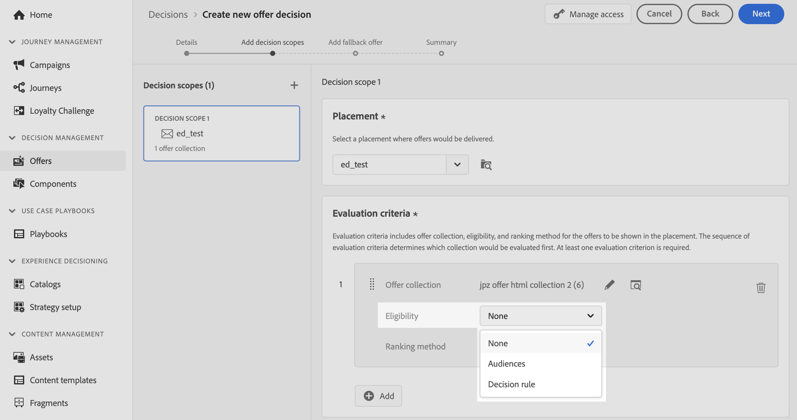
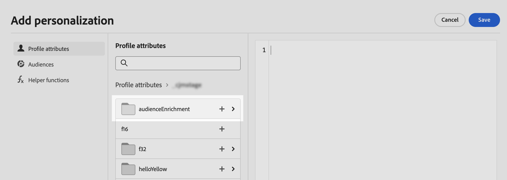

# Leverage Custom upload audiences for decisioning {#custom-upload-decisioning}

>[!TIP]
>
>Decisioning, [!DNL Adobe Journey Optimizer]'s new decisioning capability, is now available via the code-based experience and email channels! [Learn more](../experience-decisioning/gs-experience-decisioning.md)

With Journey Optimizer you can leverage data from audiences created using Custom upload (CSV file) into Adobe Experience Platform to support your Decision Management workflows. This is particularly useful when the data is not needed on the profile but is still essential for decisioning purposes.

Data from custom upload audiences can be leveraged in Decision Management for:

1. Eligibility criteria in offers and decisions.
2. Personalizing content in offer representations.

For more information on Custom upload audiences, refer to the sections:

* [Get started with audiences & Journey Optimizer](../audience/about-audiences.md)
* [Importing an audience in Adobe Experience Platform](https://experienceleague.adobe.com/en/docs/experience-platform/segmentation/ui/audience-portal#import-audience){target="_blank"}

## Must-read {#must-read}

* **Decision Management only** - This functionality is supported in Decision Management only, not in Decisioning (formerly known as "Experience Decisioning").
* **Decisioning API (Hub) only** - It is available exclusively through Decisioning API (Hub) requests and is not supported by Edge Decisioning API or batch decisioning.
* **Required API flag for enrichment data** - When using a Custom upload (CSV) audience and you want to retrieve enrichment data in the offer decision response, you must include `"xdm:enrichedAudience": true` in your API request payload. Without this flag, enrichment attributes from the CSV-uploaded audience will not be returned. [Learn more about the Decisioning API](api-reference/offer-delivery-api/decisioning-api.md)

## Use a custom upload audience as eligibility criteria {#eligibilty}

You can use a Custom upload audience as eligibility criteria at both the offer or decision level. Once added, these criteria can exclude offers or collections of offers from eligibility. Here are the various location where you can leverage Custom upload audiences to refine offers and deicsions eligibility:

* Create a decision rule using a Custom upload audience:

    1. When authoring a rule, access the **Audiences** tab and search for your CSV audience in the list. Drag and drop the audience into the rule canvas.
    1. Use the **Attributes** tab and navigate to enrichment schemas linked to the selected audience to access all data from the CSV file and use it in your rule. This allows you to use a field from the CSV file to refine your rule. [Learn how to create a decision rule](../offers/offer-library/creating-decision-rules.md)
    1. Save the rule. Once the rule is created, it can be used at both the offer and decision level to refine their eligibility.

    

* Use Custom upload audiences as offer constraint. [Learn how to add constraints to an offer](../offers/offer-library/add-constraints.md)

    When authoring an offer, at the **Add Constraints** step, you can either:

    * Use the Custom upload audience to define offer eligibility,
    * Apply a rule leveraging the Custom upload audience.

    

* Use Custom upload audiences at the decision level.

    When setting up a decision, at the **Add Decision Scope** step, you can use Custom upload audiences as evaluation criterion for a collection of offers. [Learn how to define decision scope](../offers/offer-activities/create-offer-activities.md#add-decision-scopes)

    

## Use a custom upload audience to personalize offer representations

Custom upload audiences can also be used to personalize the content of offer representations by referencing data from the CSV file. [Learn how to add representations to an offer](../offers/offer-library/add-representations.md)

In order to be able to leverage a Custom upload audience's attributes for perosnalization, you first need to add the custom audience as a constraint. To do this, while authoring an offer, in the **Add Constraints** step, add the audience as constraints or select a rule leveraging the Custom upload audience.

Once the audience is added as a constraint, you can use its attributes to personalize the representation content. To do so, access the **Profile Attributes** tab and search for the Custom upload audience. Select the relevant attributes from the audience to personalize the offer content.

