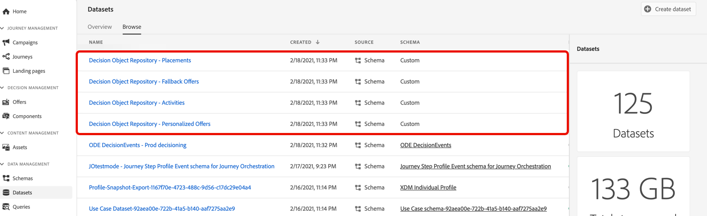
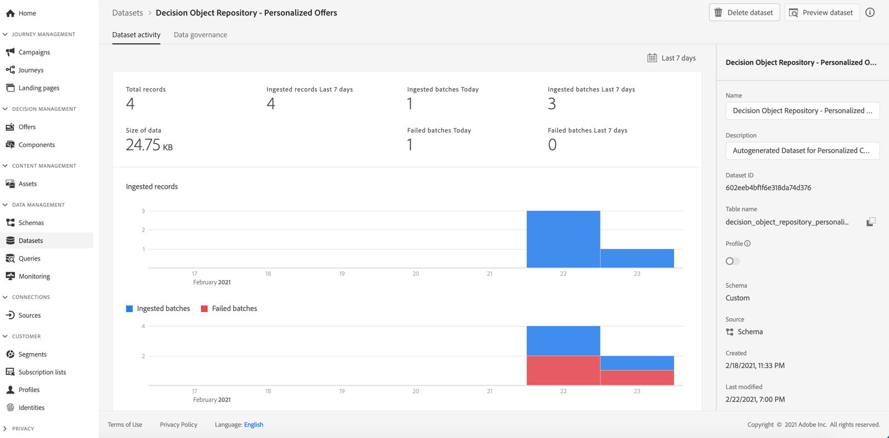

# Access the exported offer catalog {#access-exported-catalog}

>[!TIP]
>
>Decisioning, [!DNL Adobe Journey Optimizer]'s new decisioning capability, is now available via the code-based experience and email channels! [Learn more](../../experience-decisioning/gs-experience-decisioning.md)

The exported offer catalog is accessible in Adobe Experience Platform **[!UICONTROL Datasets]** menu. One dataset is created for each object of your Offer Library.

Click a dataset to access its details.

The **[!UICONTROL Preview dataset]** button allows you to display the most recent successful batch in the dataset.

For more information on how to browse and use datasets, refer to [this page](../../data/get-started-datasets.md).
