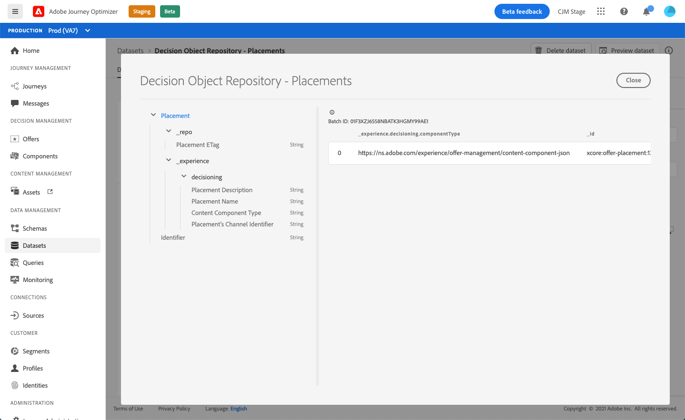

# Placements dataset {#placements-dataset}

>[!TIP]
>
>Decisioning, [!DNL Adobe Journey Optimizer]'s new decisioning capability, is now available via the code-based experience and email channels! [Learn more](../../experience-decisioning/gs-experience-decisioning.md)

Each time an offer is modified, the autogenerated dataset for placements is updated.

The most recent successful batch in the dataset is displayed on the right. The hierarchical view of the schema for the dataset displays on the left pane.

>[!NOTE]
>
>Learn how to access the exported datasets for each object of your Offer Library in [this section](../export-catalog/access-dataset.md).

Here is the list of all the fields that can be used in the **[!UICONTROL Decision Object Repository - Placements]** dataset.

<!--A placement describes a location or place in a personalized message. It is used to set technical constraints for content that the personalization decision supplies. The placement also represents a request to produce certain types of metrics when an experience event is produced where this placement is involved. For instance, the placement facilitates a personalized clickable image inside an email shown to an end-user. The placement may for instance request from the assembled experience that the click on its image gets reported in an experience event with a metric https://ns.adobe.com/xdm/data/metrics/web/linkclicks and a reference to this placement.-->
    
+++ Identifier
    
**Field:** _id
**Title:** Identifier
**Description:** A unique identifier for the record.
**Type:** string

+++

+++ _experience

**Field:** _experience
**Type:** object

+++

+++ _experience > decisioning

**Field:** decisioning
**Type:** object

+++

+++ _experience > decisioning > Placement's Channel Identifier

**Field:** channelID
**Title:** Placement's Channel Identifier
**Description:** The channel in which proposition was made. The value is a valid Channel URI. See https://ns.adobe.com/xdm/channels/channel.
**Type:** string

+++

+++ _experience > decisioning > Content Component Type

**Field:** componentType
**Title:** Content Component Type
**Description:** An enumerated set of URIs where each value maps to a type given to the content component. Some consumers of the content representations are expecting the @type value to be a reference to schema that describes additional properties of the content component.
**Type:** string

+++

+++ _experience > decisioning > contentTypes

**Field:** contentTypes
**Type:** array

+++

+++_experience > decisioning > contentTypes > MIME Media Type

**Title:** MIME Media Type
**Description:** A constraint for the media type of the components that is expected in that placement. There could be more than one media type possible for one component such as different image format.
**Type:** string

+++

+++ _experience > decisioning > Placement Description

**Field:** description
**Title:** Placement Description
**Description:** It is used to convey human readable intentions on how dynamic content is used in the overall message delivery. That a certain space is a \"Banner\" in a web page is often conveyed via the description and not by a formal method.
**Type:** string

+++

+++ _experience > decisioning > Placement Name

**Field:** name
**Title:** Placement Name
**Description:** An assigned name for the placement to refer to it in human interactions.
**Type:** string

+++

+++ _repo

**Field:** _repo
**Type:** object

+++

+++ _repo > Placement ETag

**Field:** etag
**Title:** Placement ETag
**Description:** The revision that the decision option object was at when the snapshot was taken.
**Type:** string

+++
