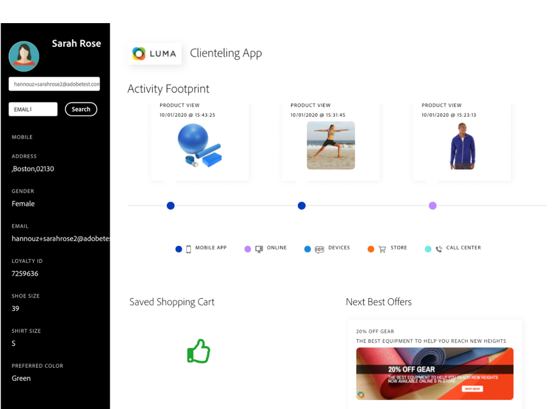

# About Decision Management {#about-offer-decision}

Use [!DNL Journey Optimizer] to deliver the best offer and experience to your customers across all touch points at the right time. Once designed, target your audiences with personalized offers. 

The Decision Management capability consists in two main components:

* The **Centralized Offer Library** which is the interface where you create and manage the different elements that compose your offers, and define their rules and constraints.
* The **Offer Decision Engine** which leverages Adobe Experience Platform data and Real-time Customer profiles, along with the Offer Library, in order to select the right time, customers and channels to which offers will be delivered.

 

Benefits include:

* Improved campaign performance by delivering personalized offers across multiple channels,
* Improved workflows: instead of creating multiple deliveries or campaigns, marketing teams can improve workflows by creating a single delivery and vary the offers in different parts of the template,
* Control over the number of times an offer is shown across campaigns and customers.

➡️ [Watch these tutorial videos](#tutorial-videos) for more on Decision Management.

## About offers and decisions {#offers-offer-activities}

An **Offer** is made up of content, eligibility rules and constraints that define the conditions under which it is presented to your customers.

It is created using the **Offer Library**, which provides a central offer catalog where you can associate eligibility rules and constraints with multiple pieces of content to create and publish offers (see [Offer Library user interface](../get-started/user-interface.md)).

 

Once the Offer Library has been enriched with offers, you can integrate your offers into **decisions** (previously known as 'offer activities').

Decisions are containers for your offers that will leverage the Offer Decision Engine in order to pick the best offer to deliver depending on the target of the delivery.

## Common use cases

Decision Management capabilities and integration with Adobe Experience Platform allow you to cover numerous use cases to help you increase customers' engagement and conversion.

* Display on your website homepage offers that will match the visiting customer's point of interest, based on data from Adobe Experience Platform.

     

* If customers walk near one of your stores, send them push notifications reminding them of available offers according to their attributes (loyalty level, gender, former purchases...).

     

* Decision Management also helps you enhance your customers' experience when contacting your support team. Decision Management APIs allow you to display in your call center agents' portal information about the customer's redeemed and next best offers.

    

## Glossary {#glossary}

You can find below the list of the main concepts you will work with when using Decision Management. 

* **Capping** or **Frequency Capping**: Capping is used as a constraint to define how many times an offer is presented. There are two types of caps, how many times an offer can be proposed across the combined target audience, also known as "Total caps" and how many times an offer can be proposed to the same end user, also known as "Profile Cap".

* **Collections**: Collections are subsets of offers based on predefined conditions defined by a marketer, such as category of the offer.

* **Decision** (previously known as Offer Activity): A decision contains the logic that informs the selection of an offer.

* **Decision Rule**: Decision rules are constraints added to a personalized offer and applied to a profile to determine eligibility.

* **Eligible Offer**: An eligible offer meets the constraints defined upstream that can be consistently offered to a profile.

* **Decision Management**: Allows you to create and deliver end-user personalized offer experiences across channels and applications using business logic and decision rules.

* **Fallback Offers**: A fallback offer is the default offer displayed when an end-user is not eligible for any of the personalized offers in the collection.

* **Offer**: An offer is a marketing message that may have rules associated with it that specify who is eligible to see the offer.

* **Offer Library**: The offer library is a central library used to manage personalized and fallback offers, decision rules and decisions.

* **Personalized Offers**: A personalized offer is a customizable marketing message based on eligibility rules and constraints.

* **Placements**: A placement is the location and or context in which an offer appears for an end-user.

* **Priority**: Priority is used to rank offers that meet all constraints, such as eligibility, calendar, and capping.

* **Representations**: A representation is information used by a channel, such as location or language to display an offer.

## Tutorial videos {#tutorial-videos}

>[!NOTE]
>
>These videos apply to the Offer Decisioning application service built on Adobe Experience Platform, and are not specific to [!DNL Adobe Journey Optimizer]. However, it provides generic guidance to use Decision Management in the context of [!DNL Journey Optimizer].

### What is Decision Management? {#what-is-offer-decisioning}

The video below provides an introduction to Decision Management key capabilities, architecture and use cases:

>[!VIDEO](https://video.tv.adobe.com/v/326961?quality=12&learn=on)

### Define and manage offers {#use-offer-decisioning}

The video below shows how to use Decision Management to define and manage your offers and leverage real-time customer data.

>[!VIDEO](https://video.tv.adobe.com/v/326841?quality=12&learn=on)
