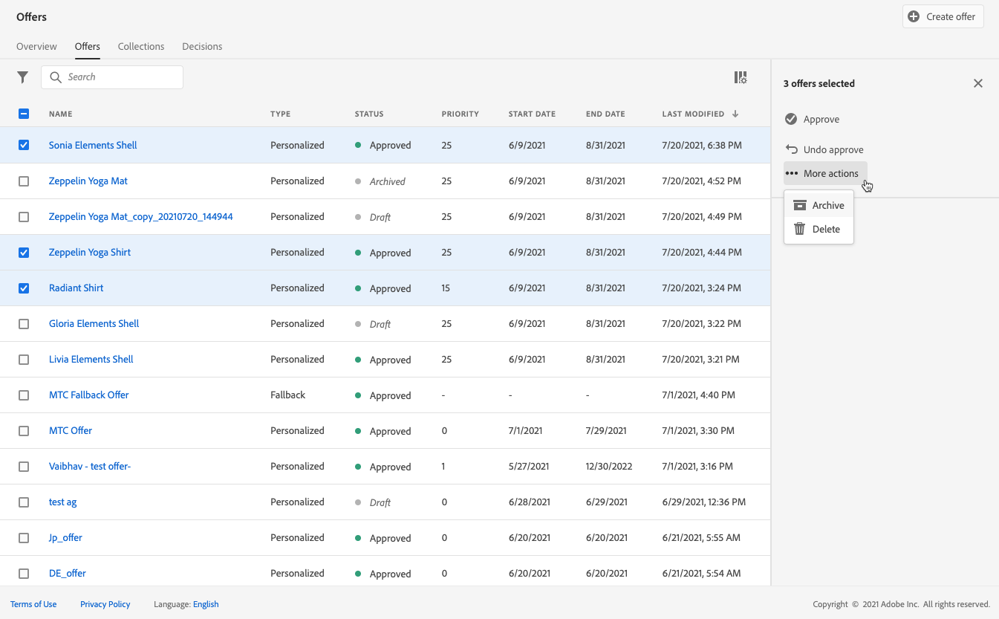

# Create personalized offers {#create-personalized-offers}

Before creating an offer, make sure that you created:

* A **placement** in which the offer will be displayed. See [Create placements](../offer-library/creating-placements.md)
* If you want to add an eligibility condition: a **decision rule** that will define the condition under which the offer will be presented. See [Create decision rules](../offer-library/creating-decision-rules.md).
* One or several **collection qualifiers** (previously known as "tags") that you may want to associate to the offer. See [Create collection qualifiers](../offer-library/creating-tags.md).

➡️ [Discover this feature in video](#video)

The list of personalized offers is accessible in the **[!UICONTROL Offers]** menu.

## Create an offer {#create-offer}

>[!CONTEXTUALHELP]
>id="od_offer_attributes"
>title="About offer attributes"
>abstract="With offer attributes, you can associate key value pairs with the offer for reporting and analysis purposes."

>[!CONTEXTUALHELP]
>id="ajo_decisioning_offer_attributes"
>title="Offer attributes"
>abstract="With offer attributes, you can associate key value pairs with the offer for reporting and analysis purposes."

To create an **offer**, follow these steps:

1. Click **[!UICONTROL Create offer]**, then select **[!UICONTROL Personalized offer]**.

    

1. Specify the offer's name as well as its start and end date and time. Outside of these dates, the offer won't be selected by the Decisioning engine.

    

    >[!CAUTION]
    >
    >Updating the start/end dates can have an impact on capping. [Learn more](add-constraints.md#capping-change-date)

1. You can also associate one or several existing **[!UICONTROL collection qualifiers]** to the offer, allowing you to search and organize the Offer Library more easily. [Learn more](creating-tags.md).

1. The **[!UICONTROL Offer attributes]** section allows you to associate key-value pairs with the offer for reporting and analysis purposes.

1. To assign custom or core data usage labels to the offer, select **[!UICONTROL Manage access]**. [Learn more on Object Level Access Control (OLAC)](../../administration/object-based-access.md)

    

1. Add representations to define where your offer will display in the message. [Learn more](add-representations.md)

    

1. Add constraints to set the conditions for the offer to be displayed. [Learn more](add-constraints.md)

    >[!NOTE]
    >
    >When you select audiences or decision rules, you can see information on the estimated qualified profiles. Click **[!UICONTROL Refresh]** to update data.
    >
    >Note that profile estimates are unavailable when rule parameters include data not in the profile such as context data. For example, an eligibility rule that requires the current weather to be ≥80 degrees.

    

1. Review and save the offer. [Learn more](#review)

## Review the offer {#review}

Once eligibility rules and constraints have been defined, a summary of the offer properties displays.

1. Make sure everything is configured properly.

1. You can display information on the estimated qualified profiles. Click **[!UICONTROL Refresh]** to update data.

    

1. When your offer is ready to be presented to users, click **[!UICONTROL Finish]**.

1. Select **[!UICONTROL Save and approve]**.

    

    You can also save the offer as a draft, in order to edit and approve it later on. 

The offer displays in the list with the **[!UICONTROL Approved]** or **[!UICONTROL Draft]** status, depending on whether you approved it or not in the previous step.

It is now ready to be delivered to users.

## Manage offers {#offer-list}
    
From the offer list, you can select the offer to display its properties. You can also edit it, change its status (**Draft**, **Approved**, **Archived**), duplicate the offer, or delete it.

Select the **[!UICONTROL Edit]** button to go back to the offer edition mode, where you can modify the offer's [details](#create-offer), [representations](#representations), as well as edit the [eligibility rules and constraints](#eligibility). 

Select an approved offer and click **[!UICONTROL Undo approve]** to set the offer status back to **[!UICONTROL Draft]**.

To set again the status to **[!UICONTROL Approved]**, select the corresponding button that is now displayed.

The **[!UICONTROL More actions]** button enables the actions described below.

* **[!UICONTROL Duplicate]**: creates an offer with the same properties, representations, eligibility rules and constraints. By default, the new offer has the **[!UICONTROL Draft]** status.
* **[!UICONTROL Delete]**: removes the offer from the list.

    >[!CAUTION]
    >
    >The offer and its content will not be accessible anymore. This action cannot be undone.
    >
    >If the offer is used in a collection or a decision, it cannot be deleted. You must remove the offer from any objects first.

* **[!UICONTROL Archive]**: sets the offer status to **[!UICONTROL Archived]**. The offer is still available from the list, but you cannot set its status back to **[!UICONTROL Draft]** or **[!UICONTROL Approved]**. You can only duplicate or delete it.

You can also delete or change the status of multiple offers at the same time by selecting the corresponding checkboxes.

If you want to change the status of several offers whith different statuses, only the relevant statuses will be changed.

Once an offer has been created, you can click its name from the list.

This enables you to access detailed information for that offer. Select the **[!UICONTROL Change log]** tab to [monitor all the changes](../get-started/user-interface.md#monitoring-changes) that have been made to the offer.

## Tutorial video {#video}

>[!VIDEO](https://video.tv.adobe.com/v/329375?quality=12)
