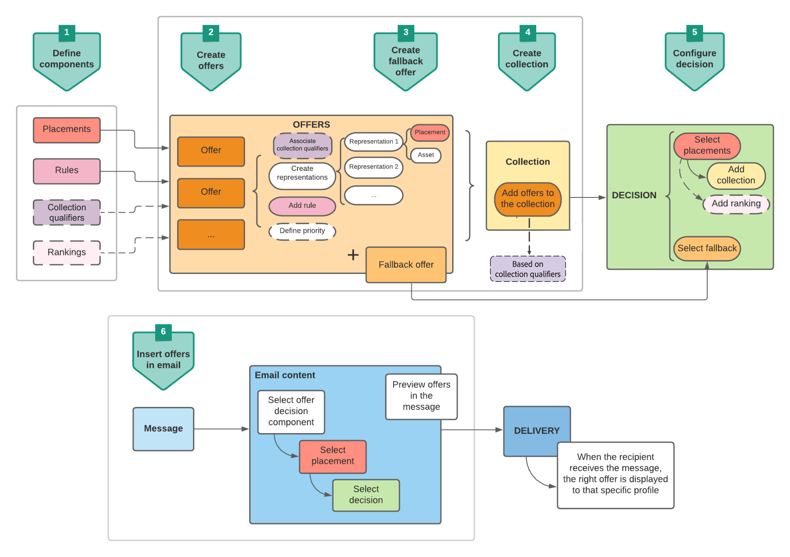
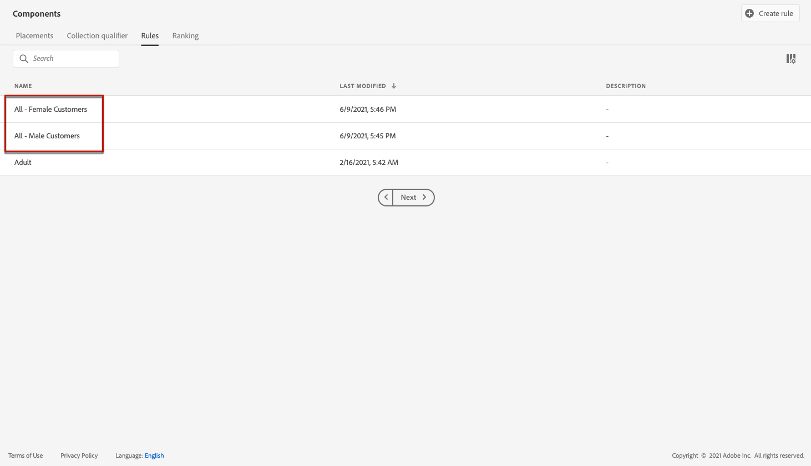
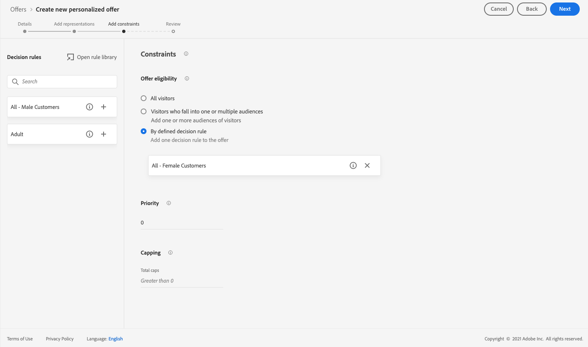

# Use case: Configure personalized offers to use them in an email {#configure-add-personalized-offers-email}

This section presents an end-to-end example to show how to configure offers and use them in a email, based on a decision you previously created.

## Main steps {#main-steps}

The key steps to configure offers, include them in a decision and leverage this decision in an email are listed below:

1. Before creating offers, [define your components](#define-components)
    
    * Create placements
    * Create decision rules
    * Create tags
    * Create rankings (optional)

1. [Configure the offers](#configure-offers)

    * Create offers
    * For each offer:
        
        * Create representations, and select a placement and an asset for each representation
        * Add a rule for each offer
        * Define a priority for each offer

1. [Create a fallback offer](#create-fallback)

1. [Create a collection](#create-collection) to include the personalized offers you created

1. [Configure the decision](#configure-decision)

    * Create a decision
    * Select the placements you created
    * For each placement, select the collection
    * For each placement, select a ranking (optional)
    * Select the fallback

1. [Insert the decision in an email](#insert-decision-in-email)

    * Select a placement matching the offers you want to display
    * Select the decision from the items compatible with the selected placement 
    * Preview your offers

The overall Decision Management process to use offers in an email can be described as follows:

## Define the components {#define-components}

Before starting to create offers, you must define several components that you will use in your offers.

You will find them under the **[!UICONTROL Decision Management]** > **[!UICONTROL Components menu]**.

1. Start by creating **placements** for your offers.

    You will use these placements to define where the resulting offer will appear when defining your offer decision.

    In this example, create three placements with the following channel and content types:

    * *Web - Image*
    * *Email - Image*
    * *Non-digital - Text*

    

    The detailed steps to create placements are described in [this section](../../using/offers/offer-library/creating-placements.md).

1. Create **decision rules**.

    Decision rules will provide the best offer to a profile in Adobe Experience Platform.
    
    Configure two simple rules by using the **[!UICONTROL XDM Individual Profile > Person > Gender]** attribute:

    * *Female Customers*
    * *Male Customers*

    

    The detailed steps to create rules are described in [this section](../../using/offers/offer-library/creating-decision-rules.md).

1. You can also create a **tag**.

    You will then be able to associate it to your offers and use this tag to group your offers together into a collection.

    In this example, create the *Yoga* tag.

    

    The detailed steps to create tags are described in [this section](../../using/offers/offer-library/creating-tags.md).

1. If you want to define rules that will determine which offer should be presented first for a given placement (rather than taking into account the offers' priority scores), you can create a **ranking formula**.

    The detailed steps to create ranking formulas are described in [this section](../../using/offers/ranking/create-ranking-formulas.md#create-ranking-formula).

    >[!NOTE]
    >
    >In this example, we will only use the priority scores. Learn more on [eligibility rules and constraints](../../using/offers/offer-library/creating-personalized-offers.md#eligibility).

## Configure offers {#configure-offers}

You can now create and configure your offers. In this example, you will create four offers that you want to display according to each specific profile.

1. Create an offer. Learn more in [this section](../../using/offers/offer-library/creating-personalized-offers.md#create-offer).

1. In this offer, create three representations. Each representation must be a combination of a placement that you created earlier and an asset:

    * One corresponding to the *Web - Image* placement
    * One corresponding to the *Email - Image* placement
    * One corresponding to the *Non-digital - Text* placement

    >[!NOTE]
    >
    >An offer can be displayed at different places in a message to create more opportunities to use the offer in different placement contexts.

    Learn more on representations in [this section](../../using/offers/offer-library/creating-personalized-offers.md#representations).

1. Select an appropriate image for the first two placements. Enter custom text for the *Non-digital - Text* placement.

    

1. In the **[!UICONTROL Offer eligibility]** section, select **[!UICONTROL By defined decision rule]** and drag and drop the rule of your choice.

    

1. Fill out the **[!UICONTROL Priority]**. In this example, add *25*.

1. Review your offer, then click **[!UICONTROL Save and approve]**.

    

1. In this example, create three more offers with the same representations, but different assets. Assign them with different rules and priorities, such as:

    * First offer - Decision rule: *Female Customers*, Priority: *25*
    * Second offer - Decision rule: *Female Customers*, Priority: *15*
    * Third offer - Decision rule: *Male Customers*, Priority: *25*
    * Fourth offer - Decision rule: *Male Customers*, Priority: *15*

    

The detailed steps to create and configure offers are described in [this section](../../using/offers/offer-library/creating-personalized-offers.md).

## Create a fallback offer {#create-fallback}

1. Create a fallback offer.

1. Define the same representations as for the offers, with appropriate assets (they should be different from the ones used in your offers).

    Each representation must be a combination of a placement that you created earlier and an asset:

    * One corresponding to the *Web - Image* placement
    * One corresponding to the *Email - Image* placement
    * One corresponding to the *Non-digital - Text* placement

    

1. Review your fallback offer, then click **[!UICONTROL Save and approve]**.

Your fallback offer is now ready to be used in a decision.

The detailed steps to create and configure a fallback offer are described in [this section](../../using/offers/offer-library/creating-fallback-offers.md).

## Create a collection {#create-collection}

When configuring the decision, you will need to add your personalized offers as part of a collection.

1. To speed up the decision process, create a dynamic collection.

1. Use the *Yoga* tag to select the four personalized offers you created earlier.

    

The detailed steps to create a collection are described in [this section](../../using/offers/offer-library/creating-collections.md).

## Configure the decision {#configure-decision}

Now you must create a decision that will combine placements with the personalized offers and the fallback offer you just created.

This combination will be used by the Offer Decisioning engine to find the best offer for a specific profile: in this example, it will be based on the priority and decision rule you assigned to each offer. 

To create and configure an offer decision, follow the main steps below:

1. Create a decision. Learn more in [this section](../../using/offers/offer-activities/create-offer-activities.md#create-activity).

1. Select the *Web - Image*, *Email - Image* and *Non-digital - Text* placements.

    

1. For each placement, add the collection you created.

    

1. If you defined a ranking when [building your components](#define-components), you can assign it to a placement in the decision. If multiple offers are eligible to be presented in this placement, the decision will use this formula to calculate which offer to deliver first.

    The detailed steps to assign a ranking formula to a placement are described in [this section](../../using/offers/offer-activities/configure-offer-selection.md#assign-ranking-formula).

1. Select the fallback offer that you created. It will be displayed as an available fallback offer for the three selected placements.

    

1. Review your decision, then click **[!UICONTROL Save and approve]**.

    

Your decision is now ready to be used to deliver optimized and personalized offers.

The detailed steps to create and configure a decision are described in [this section](../../using/offers/offer-activities/create-offer-activities.md).

## Insert the decision in an email {#insert-decision-in-email}

Now that your decision is live, you can insert it into an email message. To do so, follow the steps detailed in [this page](../../using/design/deliver-personalized-offers.md).

