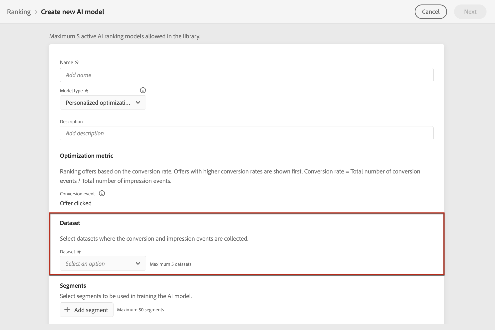

# Create AI models {#ai-rankings}

[!DNL Journey Optimizer] enables you to create **AI models** to rank offers based on your business goals.

>[!CAUTION]
>
>To create, edit, or delete AI models, you must have the **Manage Ranking Strategies** permission. [Learn more](../../administration/high-low-permissions.md#manage-ranking-strategies)

## Create an AI model {#create-ranking-strategy}

To create an AI model, follow the steps below:

1. In the **[!UICONTROL Components]** menu, access the **[!UICONTROL Ranking]** tab, then select **[!UICONTROL AI models]**.

    

    All the AI models created so far are listed.

1. Click the **[!UICONTROL Create AI model]** button.

1. Specify a unique name and a description for the AI model.
    
    <!--* **[!UICONTROL Auto-optimization]** optimizes offers based on past offer performance. [Learn more](auto-optimization-model.md)
    * **[!UICONTROL Personalized]** optimizes and personalizes offers based on segments and offer performance. [Learn more](personalized-optimization-model.md)-->

    

    >[!NOTE]
    >
    >The **[!UICONTROL Optimization metric]** section provides information on the conversion event used by the AI model to calculate offers' ranking.
    >
    >[!DNL Journey Optimizer] rank offers based on the **conversion rate** (Conversion rate = Total number of conversion events / Total number of impression events). The conversion rate is calculated using two types of metrics:
    >* **Impression events** (offers that are displayed)
    >* **Conversion events** (offers that result in clicks via email or web).
    >
    >These events are automatically captured using the Web SDK or the Mobile SDK that has been provided. Learn more on this in [Adobe Experience Platform Web SDK overview](https://experienceleague.adobe.com/docs/experience-platform/edge/home.html?lang=en).

1. Select the dataset(s) where the conversion and impression events are collected. Learn how to create such dataset in [this section](#create-dataset). <!--This dataset needs to be associated with a schema that must have the **[!UICONTROL Proposition Interactions]** field group (previously known as mixin) associated with it.-->

    
    
    >[!CAUTION]
    >
    >Only the datasets created from schemas associated with the **[!UICONTROL Experience Event - Proposition Interactions]** field group (previously known as mixin) are displayed in the drop-down list.

<!--1. If you are creating a **[!UICONTROL Personalization]** AI model, select the segment(s) to use to train the AI model.

    

    >[!NOTE]
    >
    >You can select up to 5 segments.-->

1. Save and activate the AI model.

    
