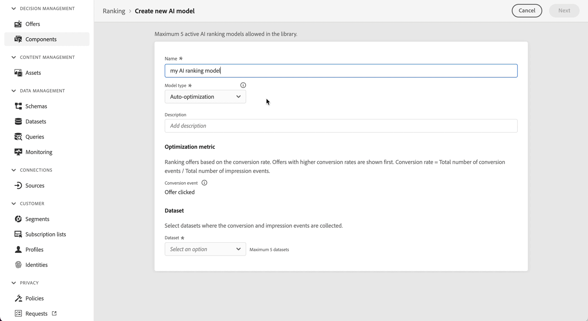
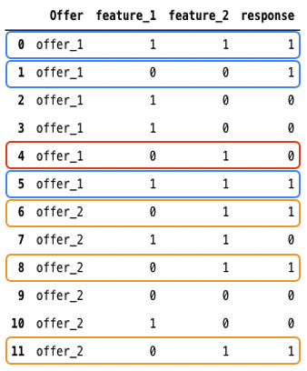

# Personalized optimization model {#personalized-optimization-model}

>[!TIP]
>
>Decisioning, [!DNL Adobe Journey Optimizer]'s new decisioning capability, is now available via the code-based experience and email channels! [Learn more](../../experience-decisioning/gs-experience-decisioning.md)

## Overview {#overview}

By leveraging the state-of-the-art technologies in supervised machine learning and deep learning, Personalized optimization allows a business user (marketer) to define business goals and utilize their customer data to train business-oriented models to serve personalized offers and maximize KPIs.

Unlike non-personalized ranking which optimizes based on the global performance of each offer, Personalized optimization learns the relationship between an individual customer's attributes and the offers most likely to drive the chosen KPI for that customer. The result is an offer selection tailored to each profile rather than a single best offer served to everyone.

## Use cases and benefits {#use-cases}

Personalized optimization is well suited to decisioning scenarios where different customers respond differently to the available offers and where the catalog of offers is meaningfully differentiated and doesn't change often. Common use cases include:

* **Next-best-offer selection**: choosing which of several competing offers or promotions to present to each customer in real time.
* **Content personalization**: choosing which piece of content (e.g. banner, creative) or message for each customer across web, mobile, email, and other channels.
* **Audience-aware personalization**: incorporating audience membership and contextual signals so that recommendations reflect who the customer is and the context of the interaction.
* **Revenue and value optimization**: optimizing toward continuous outcomes such as revenue or customer lifetime value, in addition to binary outcomes such as clicks and conversions.

Key benefits:

* Maximizes the business KPI you select by serving the offer each customer is most likely to respond to, rather than a single globally optimal offer.
* Continuously adapts as new interaction data arrives, balancing exploration of under-tested offers with exploitation of proven performers.
* Supports both binary and continuous optimization metrics, with ranking scores that can be used directly in AI Model Formula builder expressions.
* Reduces the manual effort of A/B testing and rules authoring by learning offer-to-customer fit automatically.

## Dataset requirements {#dataset}

To train a personalized optimization model, the dataset must have at least two offers with at least 250 display events (for example, impressions) and one success event (for example, click or conversion) within the last 30 days.

Offers with fewer than 250 display events and/or no success events within the last 30 days will remain eligible for inclusion in the exploration traffic. They will also be eligible for inclusion in the personalization traffic but will be treated as equivalent to the worst scoring predicted offer in decisioning, until they meet the required minimum display/success events and the model gets re-trained.

Until the first time a personalized optimization model is trained, offers within a selection strategy utilizing a personalized optimization model will be served at random.

## Key model assumptions and limitations {#key}

In order to maximize the advantage of using personalized optimization, there are some key assumptions and limitations to be aware of. 

* **Offers are different enough so that users will have different preferences among the offers in consideration**. If offers are too similar, a resulting model will have less impact as the responses are seemingly random.
For example if a bank has two credit cards offers with the only difference being color, then it may not matter which card is recommended, but if each card has different terms, this provides rationale for why certain customers would choose one and provide enough difference between offers to build a more impactful model.
* **User traffic composition is stable**. If user traffic composition changes dramatically during model training and predicting, model performance could degrade. For example, suppose in model training phase, only data for users in audience A is available, but the trained model is used to generate predictions for users in audience B, then model performance could be impacted.
* **Offers performances do not change dramatically over a short period of time** as this model updates weekly and changes to performance are conveyed as the model updates. For example, a product was very popular before, but a public report identifies the product to be harmful to our health, and this product becomes unpopular extremely fast. In this scenario, the model could continue to predict this product until the model updates with changes in user behavior.  

## How It Works {#how}

The model learns complex feature interactions between offers, users' information and contextual information to recommend personalized offers to end users. Features are inputs into the model.

There are 3 types of features:

| Feature types | How to add features to models |
|--------------|----------------------------|
| Decisioning objects (placementID, activityID, decisionScopeID)| Part of the decision management feedback Experience Events sent to AEP|
| Audiences| 0-50 audiences can be added as features when creating the Ranking AI model|
| Context data| Part of the decisioning feedback Experience Events sent to AEP. Available context data to add to schema: Commerce Details, Channel Details, Application Details, Web Details, Environment Details, Device Details, placeContext|

The model has two phases:

* In the **offline model training** phase, a model is trained by learning and memorizing feature interactions in historical data. 
* In the **online inference** phase, candidates offers are ranked based on real-time scores generated by the model. Unlike traditional collaborative filtering techniques, which is hard to include features for users and offers, personalized optimization is a deep learning based recommendation method, and is able to include and learn complex and nonlinear feature interaction patterns. 

Here is a simplified example to illustrate the basic idea behind personalized optimization. Consider a dataset of historical interactions between users and offers. Each row records an offer that was shown, two customer signals — loyalty tier (high = 1) and whether the customer opened a recent email (yes = 1) — and whether the customer converted (yes = 1).

For Offer A, conversion is more likely when both signals agree (both high or both low). For Offer B, conversion is more likely when the email was opened, regardless of loyalty tier. Based on the learned pattern, the model can predict the better offer for each customer based on their signals.

This is the essence of the approach: learning and memorizing historical feature interactions and applying them to generate personalized predictions for each customer.

The model supports optimization of continuous variables (such as revenue and customer lifetime value) in addition to binary variables (such as clicks and conversions). Predicted values for a binary metric such as clicks will always be between 0 and 1. Predicted values for a continuous metric such as order value will always be a number greater than or equal to zero. Ranking scores are normalized to ensure consistent behavior across both metric types when used in formulas or comparisons.

## Ensemble model components {#ensemble}

Personalized optimization is delivered as an ensemble model — several complementary model arms run together, and a supervisory layer decides how much live traffic each arm receives. This design lets the system pursue two goals at once: learning which offers perform best (exploration) and serving the offers already known to perform well (exploitation).

Every decisioning system faces a tradeoff between exploring under-tested offers to gather information and exploiting proven offers to maximize immediate return. Reserving too little traffic for exploration leaves high-potential offers undiscovered; reserving too much sacrifices lift on offers that are already performing. The ensemble manages this balance automatically by holding a minimum exploration floor while shifting the remaining traffic toward the better-performing personalized arms over time.

The ensemble is composed of four traffic arms:

### Uniform random (exploration arm) {#uniform-random}

The uniform random arm assigns offers to customers at random from among the eligible offers. Because it does not favor any offer, it produces unbiased data about how customers respond across the full catalog — the raw material the personalized arms learn from. It is the only arm active before the first model is trained, and afterward it continues to hold a minimum exploration floor so the system keeps learning.

* At initialization: 100% of traffic.
* After the first successful training run: a minimum of 5–20% of traffic depending on the number of observed impression and conversion events per offer, up to a maximum of 85%.

### Neural network (personalized arm) {#neural-network}

The neural network is a personalized arm that predicts the best offer for a given customer based on their attributes and audience memberships. It learns complex, nonlinear interactions among offers, customer features, and context, and is well suited to capturing subtle patterns across many features.

* At initialization: 0% of traffic.
* After the first successful training run: a minimum of 5% of traffic, up to a maximum of 85%.

### Contextual bandit (personalized arm) {#contextual-bandit}

The contextual bandit is a second personalized arm that also predicts the best offer for each customer based on their audience memberships, using a bandit approach that continually balances learning and performance as it serves. Running it alongside the neural network lets the ensemble draw on the strengths of two distinct personalized methods.

* At initialization: 0% of traffic.
* After the first successful training run: a minimum of 5% of traffic, up to a maximum of 85%.

### New offer booster (non-personalized arm) {#new-offer-booster}

The new offer booster is a non-personalized arm that makes optimistic assumptions about the performance of new offers — those with few recorded impression events within the model lookback period. This gives promising new offers the early exposure they need to prove themselves, addressing the cold-start issue for new offers.

* As true impression and conversion data is collected, each offer's estimated performance quickly approaches its true underlying performance, and the impact of the optimistic assumptions falls to near zero.
* When no offers are relatively new — for example, when all offers have a similar number of impressions, or all have more than 1,000 impressions — the optimistic effect is near zero and this arm behaves, in effect, as a non-personalized overall-winner model.
* At initialization: 0% of traffic.
* After the first successful training run: 5% of traffic.

## How traffic is allocated across the arms {#traffic-allocation}

At initialization, no model has trained yet, so 100% of traffic goes to the uniform random baseline. After the first successful training run, each arm receives a minimum traffic floor (5%), and the supervisory bandit allocates the remaining traffic based on observed performance. As the model trains across successive rounds, traffic converges toward the highest-performing arms with a maximum possible allocation of 85% traffic.

## Cold-start Problem {#cold-start}

Cold-start problems occur when there isn't enough data to make recommendations. For personalized optimization, there are four types of cold-start problems.

* **After creating a new AI model with no historical data**, offers will be randomly served for a period of time to collect the required data, which will then be used to train the first model.
* **After the first AI model is released**, a portion of total traffic is allocated for uniform random exploration while the remainder is used for model recommendations. The traffic distribution across the exploration and exploitation bandit components is tuned automatically based on factors such as the number of offers and their performance thresholds.
* **After new offers are added to the offer collection** selected in the strategy associated with the AI ranking model, those offers then become eligible candidates for exploration by both the uniform random and new offer booster model arms (within 60 minutes). During the next scheduled re-training run, the offer's estimated performance will be updated in the new offer booster model arm, and the offer will become eligible for inclusion in the personalized model arms if it met the impression and click threshold.
* **After new profiles are added to the existing audience set** associated with the selection strategy associated with the AI ranking model, they inherit personalization attributes from the audience set itself. Hence, they will start receiving personalized offers based on those attributes from the get-go, without any cold-start problem.

## Re-training {#re-training}

Models will be re-trained to learn latest feature interactions and mitigate model performance degradation weekly.
