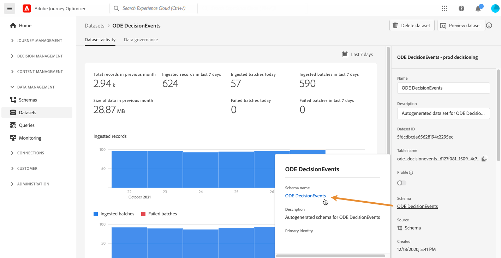
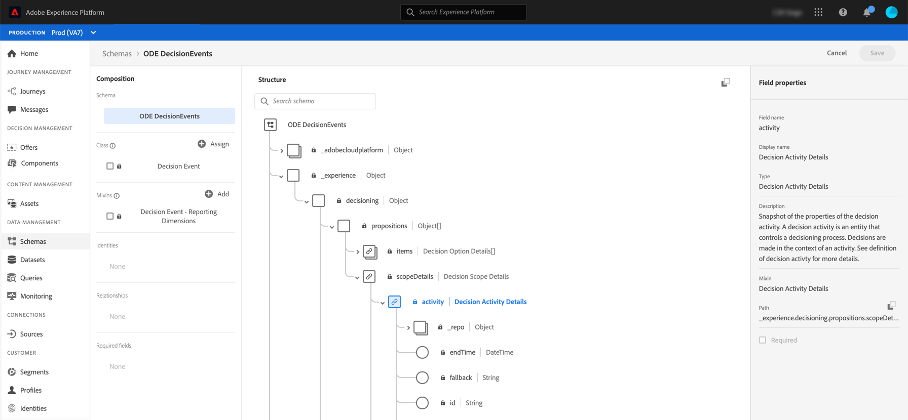

# Access events XDM fields {#decisioningevents-xdm-schema}

>[!TIP]
>
>Decisioning, [!DNL Adobe Journey Optimizer]'s new decisioning capability, is now available via the code-based experience and email channels! [Learn more](../../experience-decisioning/gs-experience-decisioning.md)

You can access the DecisioningEvents XDM schema directly from a dataset containing Decision Management events.

The schema contains all the fields that are required to send information from Decision Management to Adobe Experience Platform.

To get more information on a specific field, select it to display an information pane with the field's properties.

Detailed information on how to work with XDM schemas and fields is available in the Experience Data Model documentation:

* [XDM system overview](https://experienceleague.adobe.com/docs/experience-platform/xdm/home.html)
* [Explore XDM resources](https://experienceleague.adobe.com/docs/experience-platform/xdm/ui/explore.html)
