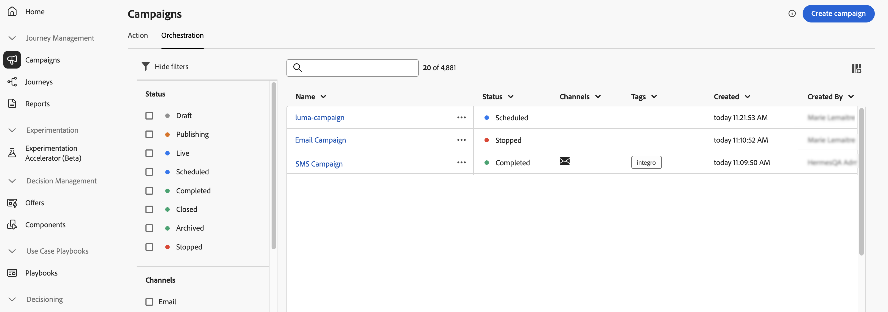
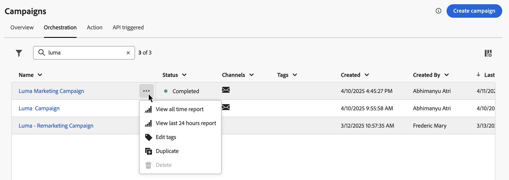
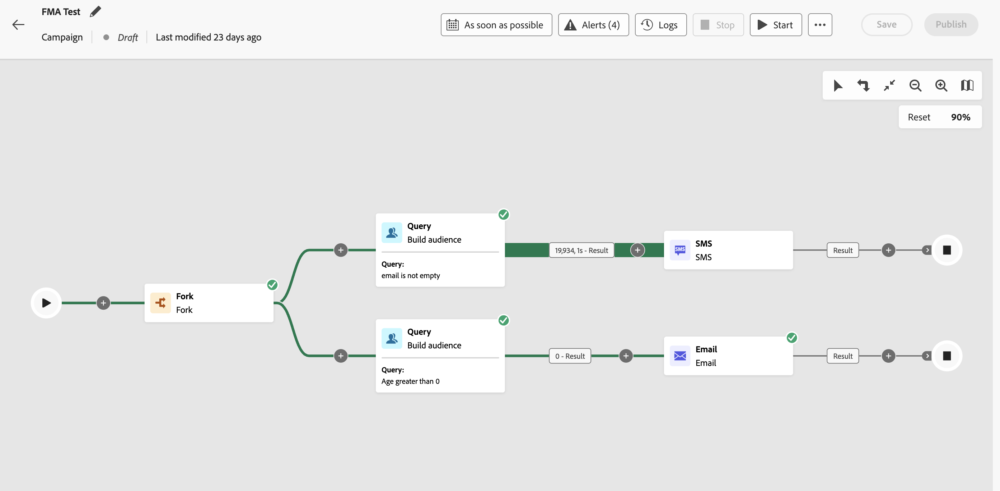

# Access and manage orchestrated campaign {#orchestrated-campaign-creation}

>[!CONTEXTUALHELP]
>id="ajo_targeting_workflow_list"
>title="Orchestrated campaign"
>abstract="In this screen, you can access the full list of orchestrated campaigns, check their current status, last/next execution dates, and create a new orchestrated campaign."

>[!CONTEXTUALHELP]
>id="ajo_orchestration_campaign_action"
>title="Action"
>abstract="This sections lists all the actions used inside the orchestrated campaign."

+++ Table of Contents

| Welcome to orchestrated campaigns | Launch your first orchestrated campaign | Query the database | Ochestrated campaigns activities|
|---|---|---|---|
|[Get started with orchestrated campaigns](gs-orchestrated-campaigns.md)  [Configuration steps](configuration-steps.md)  <b>[Access and manage orchestrated campaigns](access-manage-orchestrated-campaigns.md)</b>  [Key steps to create an orchestrated campaign](gs-campaign-creation.md)>|[Create and schedule the campaign](create-orchestrated-campaign.md)  [Orchestrate activities](orchestrate-activities.md)  [Start and monitor the campaign](start-monitor-campaigns.md)  [Reporting](reporting-campaigns.md)|[Work with the rule builder](orchestrated-rule-builder.md)  [Build your first query](build-query.md)  [Edit expressions](edit-expressions.md)  [Retargeting](retarget.md)|[Get started with activities](activities/about-activities.md)  Activities: [And-join](activities/and-join.md) - [Build audience](activities/build-audience.md) - [Change dimension](activities/change-dimension.md) - [Channel activities](activities/channels.md) - [Combine](activities/combine.md) - [Deduplication](activities/deduplication.md) - [Enrichment](activities/enrichment.md) - [Fork](activities/fork.md) - [Reconciliation](activities/reconciliation.md) - [Save audience](activities/save-audience.md) - [Split](activities/split.md) - [Wait](activities/wait.md)|

{style="table-layout:fixed"}

+++

 

## Access orchestrated campaigns

Navigate to the **[!UICONTROL Campaigns]** menu and select the **[!UICONTROL Orchestration]** tab to access the full list of orchestrated campaigns. 

{zoomable="yes"}{zoomable="yes"}

Each orchestrated campaign in the list displays information such as the campaign's  current [status](#status), the associated channel and tags, or the last time it was modified. You can customize the displayed columns by clicking the  button.

In addition, a search bar and filters are available to facilitate easy searching within the list. For example, you can filter the orchestrated campaigns to display only those associated to a given channel or tag, or those created during a specific date range.

The  button in the campaigns inventory allows you to perform various operations detailed below.

* **[!UICONTROL View all time report]** / **[!UICONTROL View last 24 hours report]** - Access reports to measure and visualize the impact and performances of your orchestrated campaigs. [Learn more on orchestrated campaigns reporting](../orchestrated/reporting-campaigns.md)
* **[!UICONTROL Edit tags]** - Edit the tags associated to the campaign.
* **[!UICONTROL Duplicate]** - In some cases, you may need to duplicate an orchestrated campaign, for example to execute a campaign that has been stopped, or to change the execution frequency of a scheduled campaign.
* **[!UICONTROL Delete]** - Delete the campaign. This actions is available for **[!UICONTROL Draft]** campaigns only.
* **[!UICONTROL Archive]** - Archive the campaign. All archived campaigns are deleted on a rolling reschedule 30 days after their last modified date. This action is available for all campaigns except for **[!UICONTROL Draft]** campaigns.

## What's inside an orchestrated campaign? {#gs-ms-campaign-inside}

The orchestrated campaign canvas is a representation of what is supposed to happen. It describes the various tasks to be performed and how they are linked together. 

Each orchestrated campaign contains:

* **Activities**: An activity is a task to be performed. The various activities are represented on the diagram by icons. Each activity has specific properties and other properties that are common to all activities.

    In an orchestrated campaign diagram, a given activity can produce multiple tasks, in particular when there is a loop or recurrent actions.

* **Transitions**: Transitions link a source activity to a destination activity and define their sequence. 

* **Worktables**: The worktable contains all the information carried by the transition. Each orchestrated campaign uses several worktables. The data conveyed in these tables can be used throughout the orchestrated campaign's life cycle.

## Campaigns statuses {#status}

Orchestrated campaigns can have multiple statuses:

* **[!UICONTROL Draft]**: The orchestrated campaign has been created. It has not been published yet.
* **[!UICONTROL Publishing]**: The orchestrated campaign is being published.
* **[!UICONTROL Live]**: The orchestrated campaign has been published and is being executed.
* **[!UICONTROL Scheduled]**: The orchestrated campaign execution has been scheduled.
* **[!UICONTROL Completed]**: The orchestrated campaign execution is complete. The Completed status is assigned automatically up to 3 days after a campaign has completed messages sending without error.
* **[!UICONTROL Closed]**: This status displays when a recurring campaign has been closed. The campaign continues its execution until all its activities have been completed, but no more profiles can enter the campaign.
* **[!UICONTROL Archived]**: The orchestrated campaign has been archived. All archived campaigns are deleted on a rolling reschedule 30 days after last modified date. You may duplicate an archived campaign if necessary to continue working on it.
* **[!UICONTROL Stopped]**: The orchestrated campaign execution has been stopped. To start the campaign again, you need to duplicate it. si erreur ,restera avec triangle 
